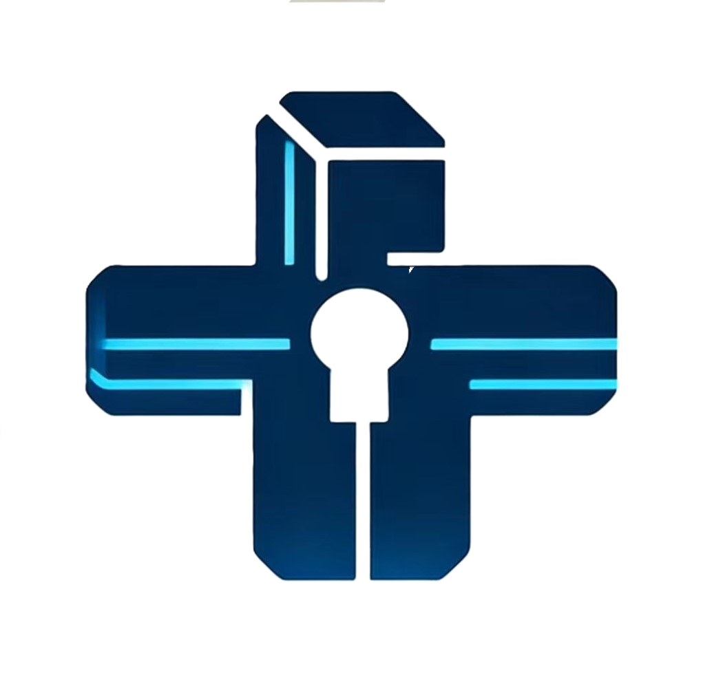

# Vaultly

<p align="center">
  
</p>

<p align="center">
  <strong>跨平台密码与敏感信息管理器</strong>
</p>

<p align="center">
  <a href="https://github.com/morning-start/vaultly/releases">
    
  </a>
  <a href="https://github.com/morning-start/vaultly/actions">
    
  </a>
  <a href="LICENSE">
    
  </a>
</p>

---

## 功能特性

### 核心功能

- **保险库管理** - 安全存储密码、银行卡、笔记等敏感信息
- **TOTP 双因素认证** - 支持二维码扫描和手动添加 2FA
- **密码生成器** - 生成高强度随机密码
- **自动锁定** - 离开应用后自动锁定保护隐私

### 同步与备份

- **WebDAV 同步** - 通过 WebDAV 协议在多设备间同步数据
- **加密存储** - 所有数据使用 AES-256 加密
- **本地安全** - 敏感信息存储在系统安全区域

### 跨平台支持

| 平台 | 支持状态 | 下载 |
|------|---------|------|
| Android | ✅ 完全支持 | [Releases](https://github.com/morning-start/vaultly/releases) |
| iOS | 🚧 开发中 | - |
| Windows | 🚧 开发中 | - |
| macOS | 🚧 开发中 | - |
| Linux | 🚧 开发中 | - |

---

## 下载安装

### Android

1. 访问 [Releases 页面](https://github.com/morning-start/vaultly/releases)
2. 根据设备架构下载对应 APK：
   - **arm64** - 现代 Android 设备（推荐）
   - **arm** - 旧 Android 设备
   - **x86_64** - Android 模拟器
3. 在设备上安装 APK

> **提示**: 首次安装可能需要在设置中允许"未知来源"应用安装

### 系统要求

- **Android**: 6.0 (API 23) 或更高版本
- **存储空间**: 至少 50MB 可用空间
- **权限**: 相机（用于二维码扫描）

---

## 快速开始

### 首次使用

1. **设置主密码** - 创建强密码保护您的保险库
2. **添加条目** - 点击"+"添加密码或其他敏感信息
3. **配置同步** - 可选，设置 WebDAV 同步实现多设备备份

### 添加 TOTP

1. 进入添加条目页面
2. 选择"TOTP"类型
3. 扫描二维码或手动输入密钥
4. 验证码将自动生成

---

## 技术栈

- **框架**: [Flutter](https://flutter.dev/) 3.38.9
- **状态管理**: [Riverpod](https://riverpod.dev/)
- **路由**: [Go Router](https://pub.dev/packages/go_router)
- **本地存储**: [Shared Preferences](https://pub.dev/packages/shared_preferences) + [Flutter Secure Storage](https://pub.dev/packages/flutter_secure_storage) + JSON 文件存储
- **加密**: [encrypt](https://pub.dev/packages/encrypt) + [crypto](https://pub.dev/packages/crypto)
- **二维码**: [mobile_scanner](https://pub.dev/packages/mobile_scanner)
- **WebDAV 同步**: [webdav_client](https://pub.dev/packages/webdav_client)

---

## 开发

### 环境要求

- Flutter SDK 3.38.9+
- Dart SDK 3.10.8+
- Android SDK (用于 Android 构建)
- Xcode (用于 iOS 构建)

### 本地运行

```bash
# 克隆仓库
git clone https://github.com/morning-start/vaultly.git
cd vaultly

# 获取依赖
flutter pub get

# 运行应用
flutter run
```

### 构建发布版本

```bash
# Android APK
flutter build apk --release --split-per-abi

# Android App Bundle
flutter build appbundle --release
```

---

## 项目结构

```
vaultly/
├── android/              # Android 平台代码
├── ios/                  # iOS 平台代码
├── lib/                  # Dart 源代码
│   ├── core/             # 核心功能
│   │   ├── crypto/       # 加密服务
│   │   ├── models/       # 数据模型
│   │   ├── providers/    # 状态管理
│   │   ├── repositories/ # 数据仓库
│   │   ├── routes/       # 路由配置
│   │   ├── services/     # 业务服务
│   │   └── utils/        # 工具类
│   ├── ui/               # 用户界面
│   │   ├── pages/        # 页面
│   │   ├── theme/        # 主题
│   │   └── widgets/      # 组件
│   └── main.dart         # 入口文件
├── test/                 # 测试代码
├── wiki/                 # 项目文档
├── .github/workflows/    # CI/CD 配置
└── pubspec.yaml          # 项目配置
```

---

## 文档

- [CI/CD 流程](CICD.md) - 自动化构建和发布说明
- [CHANGELOG](CHANGELOG.md) - 版本变更记录
- [项目 Wiki](https://github.com/morning-start/vaultly/wiki) - 详细文档

---

## 安全说明

### 数据加密

- 主密码使用 Argon2id 密钥派生
- 保险库数据使用 AES-256-GCM 加密
- 密钥存储在系统安全区域（Android Keystore / iOS Keychain）

### 隐私保护

- 所有数据本地存储，不上传至第三方服务器
- WebDAV 同步使用 HTTPS 加密传输
- 剪贴板自动清理防止密码泄露

### 安全建议

1. 设置强主密码（至少 12 位，包含大小写字母、数字和符号）
2. 定期通过 WebDAV 备份数据
3. 不要在公共设备上保存主密码

---

## 贡献

欢迎提交 Issue 和 Pull Request！

### 提交规范

- 使用 [Conventional Commits](https://www.conventionalcommits.org/) 规范
- 提交前运行 `flutter analyze` 和 `flutter test`
- 确保代码通过 CI/CD 检查

---

## 许可证

本项目采用 [MIT 许可证](LICENSE) 开源。

---

## 致谢

感谢所有为 Vaultly 做出贡献的开发者！

---

<p align="center">
  Made with ❤️ by <a href="https://github.com/morning-start">Morning Start</a>
</p>
