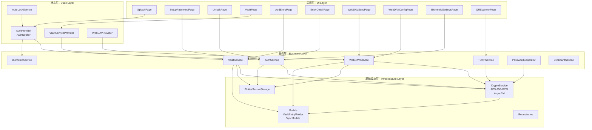
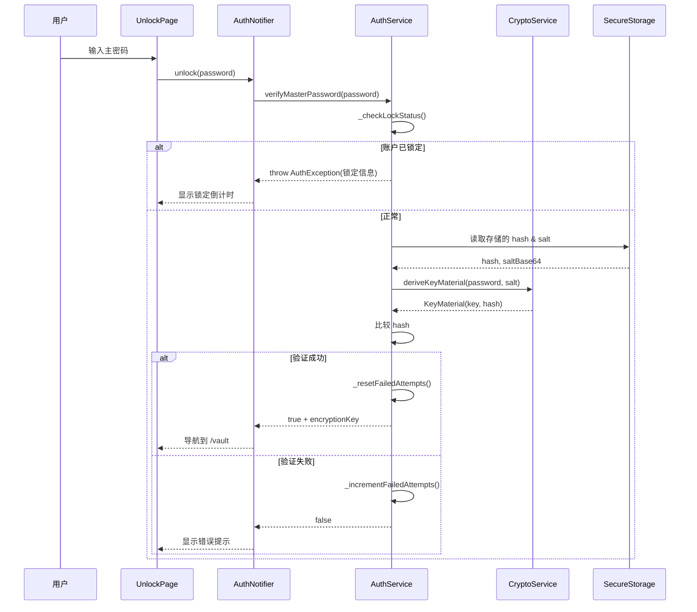
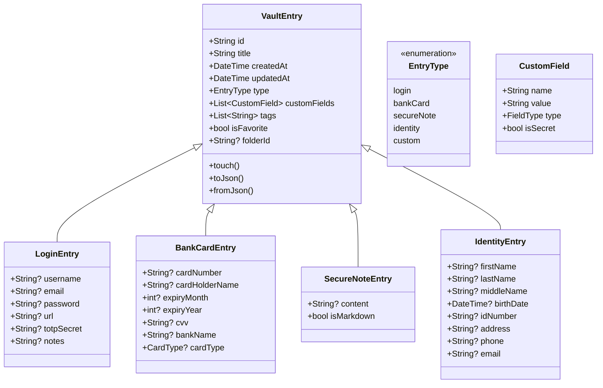
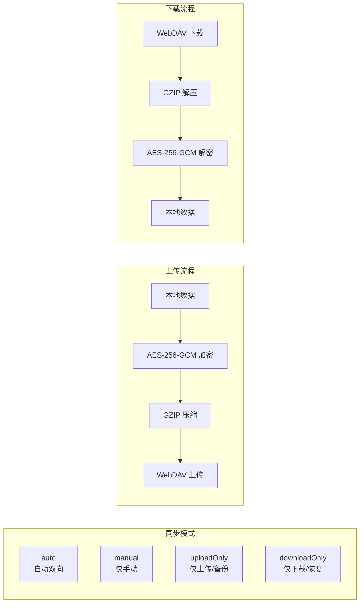
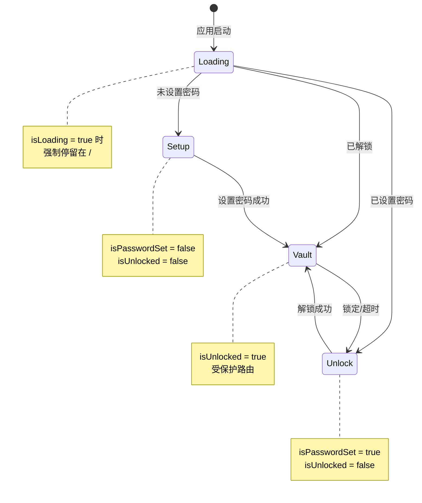
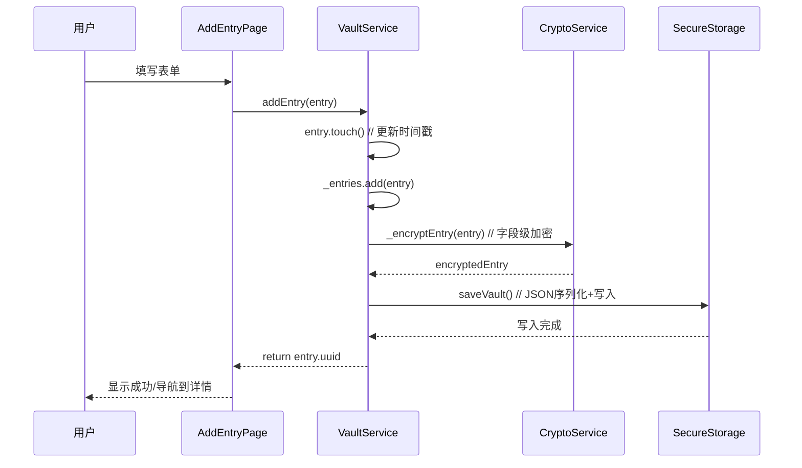
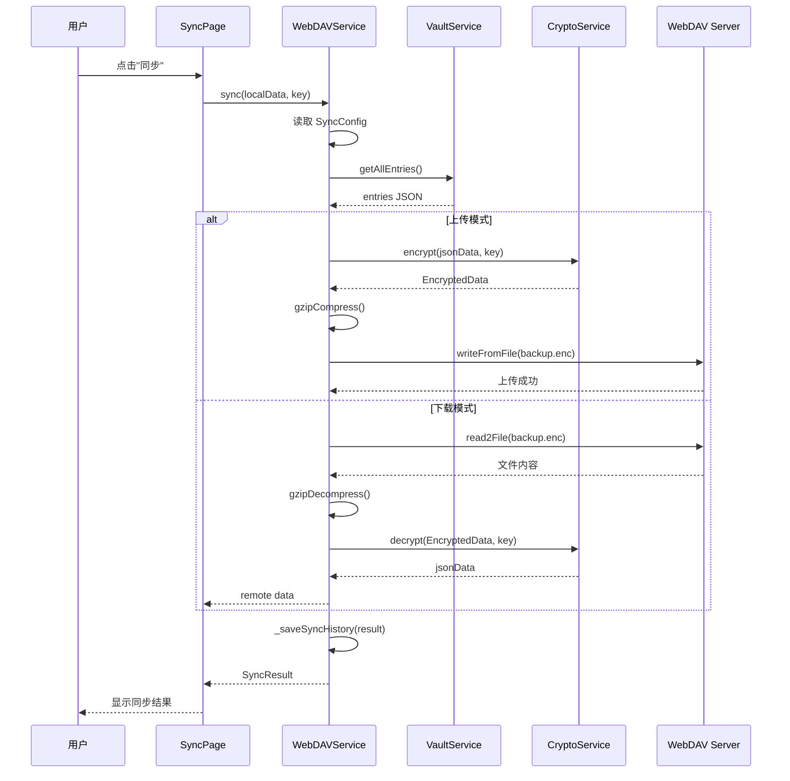

# Vaultly - 系统架构设计文档

## 1. 架构概览

Vaultly 采用**分层架构**设计，遵循关注点分离原则，将应用分为四个核心层次：

```
┌──────────────────────────────────────────────────────────────────┐
│                         表现层 (Presentation)                      │
│   Pages (10) │ Widgets (12) │ Theme │ Router Guard               │
├──────────────────────────────────────────────────────────────────┤
│                         状态层 (State)                             │
│   Riverpod Providers │ AuthNotifier │ AutoLockService             │
├──────────────────────────────────────────────────────────────────┤
│                         业务层 (Business)                          │
│   AuthService │ VaultService │ WebDAVService │ TOTPService        │
│   BiometricService │ PasswordGenerator │ ClipboardService          │
├──────────────────────────────────────────────────────────────────┤
│                         基础设施层 (Infrastructure)                 │
│   CryptoService │ SecureStorage │ Models │ Repositories           │
└──────────────────────────────────────────────────────────────────┘
```

## 2. 系统架构图



## 3. 核心模块说明

### 3.1 认证模块 (Auth Module)

**职责**: 用户身份验证、会话管理、安全锁定

**核心类**:
- [AuthService](../lib/core/crypto/services/auth_service.dart): 认证核心服务
- [AuthNotifier](../lib/core/providers/auth_provider.dart): Riverpod 状态管理
- [BiometricService](../lib/core/services/biometric_service.dart): 生物识别封装
- [AutoLockService](../lib/core/services/auto_lock_service.dart): 自动锁定监控

**关键流程**:



### 3.2 加密模块 (Crypto Module)

**职责**: 数据加密解密、密钥派生与管理

**核心类**: [CryptoService](../lib/core/crypto/services/crypto_service.dart)

**算法参数**:

| 参数 | 值 | 说明 |
|------|-----|------|
| 对称加密算法 | AES-256-GCM | 认证加密，含完整性校验 |
| 密钥长度 | 256 bits (32 bytes) | |
| IV 长度 | 96 bits (12 bytes) | GCM 标准 IV 长度 |
| 盐值长度 | 256 bits (32 bytes) | |
| KDF 算法 | Argon2id v1.3 | 抗 GPU/ASIC 攻击 |
| 内存成本 | 64 MB (2^16 KB) | |
| 迭代次数 | 3 | |
| 并行度 | 4 lanes | |
| 输出长度 | 256 bits | |

**加密数据结构**:
```dart
class EncryptedData {
  String cipherText;  // Base64 编码密文
  String iv;          // Base64 编码初始向量
  String authTag;     // Base64 编码认证标签
  int version;        // 加密版本号
}
```

### 3.3 保险库模块 (Vault Module)

**职责**: 敏感信息的增删改查、加密存储、搜索索引

**核心类**: [VaultService](../lib/core/services/vault_service.dart)

**条目类型继承体系**:



**字段级加密策略**:

| 条目类型 | 加密字段 | 明文字段 |
|----------|----------|----------|
| LoginEntry | password, username, email, totpSecret, notes | title, tags, url |
| BankCardEntry | cardNumber, cvv | cardHolderName, bankName, cardType |
| SecureNoteEntry | content | title, tags |
| IdentityEntry | idNumber, phone, email, address | firstName, lastName |

### 3.4 同步模块 (Sync Module)

**职责**: 通过 WebDAV 协议实现跨设备数据同步

**核心类**: [WebDAVService](../lib/core/services/webdav_service.dart)

**同步模式**:



**同步配置参数**:

| 参数 | 默认值 | 说明 |
|------|--------|------|
| syncMode | manual | 同步模式 |
| enableEncryption | true | 启用 AES-256-GCM 加密 |
| enableCompression | true | 启用 GZIP 压缩 |
| autoSyncInterval | 30 min | 自动同步间隔 |
| remotePath | /vaultly/ | 远程目录路径 |

### 3.5 TOTP 模块

**职责**: 基于 RFC 6238 的 TOTP 验证码生成与验证

**核心类**: [TOTPService](../lib/core/services/totp_service.dart)

**实现细节**:
- 算法: HMAC-SHA1
- 码长: 6 位数字 (可配置)
- 时间步长: 30 秒 (可配置)
- 验证窗口: ±1 步 (容错)
- 支持 OTP Auth URI 格式解析与生成

## 4. 状态管理架构

采用 **Riverpod** 进行响应式状态管理，核心 Provider 结构：

```
authServiceProvider → AuthService (单例)
    ↓
authNotifierProvider → AuthNotifier (StateNotifier)
    ↓
AuthState { isUnlocked, isPasswordSet, isLoading, error, biometricAvailable... }

vaultServiceProvider → VaultService (单例)
webdavServiceProvider → WebDAVService (单例)
biometricServiceProvider → BiometricService (单例)
autoLockServiceProvider → AutoLockService (ChangeNotifier)
autoLockDurationProvider → int (State)
autoLockEnabledProvider → bool (State)
```

## 5. 路由守卫机制

GoRouter 的 redirect 函数实现三级路由守卫：



## 6. 数据流图

### 6.1 添加条目数据流



### 6.2 WebDAV 同步数据流



## 7. 设计原则与决策

### 7.1 采用的设计模式

| 模式 | 应用位置 | 目的 |
|------|----------|------|
| 单例模式 | VaultService, AuthService | 确保全局唯一实例 |
| 观察者模式 | Riverpod StateNotifier | 响应式状态更新 |
| 工厂方法 | VaultEntry._entryFromJson() | 多态对象创建 |
| 策略模式 | SyncMode, ConflictResolution | 可扩展的同步策略 |
| 模板方法 | AutoLockService + Listener | 通用活动监控 |

### 7.2 关键技术决策

1. **选择 FlutterSecureStorage 而非 SQLite/Isar**
   - 原因: 利用操作系统级安全存储 (Keychain/Keystore)，避免数据库文件被提取攻击

2. **字段级加密而非全库加密**
   - 原因: 允许对非敏感字段（如标题）进行搜索和显示，无需全量解密

3. **Argon2id 替代 PBKDF2**
   - 原因: 更高的内存硬度，有效抵抗 GPU/ASIC 暴力破解

4. **Riverpod 替代 Provider/Bloc**
   - 原因: 编译安全、测试友好、自动依赖追踪
