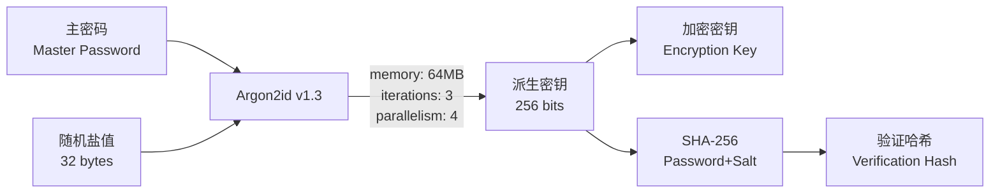
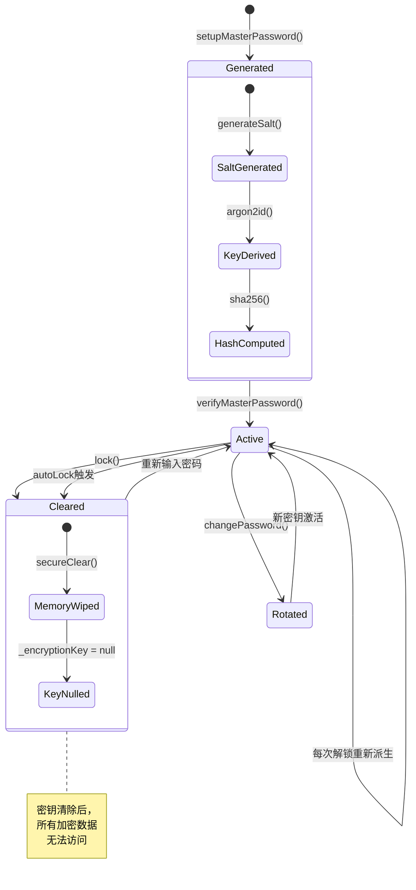
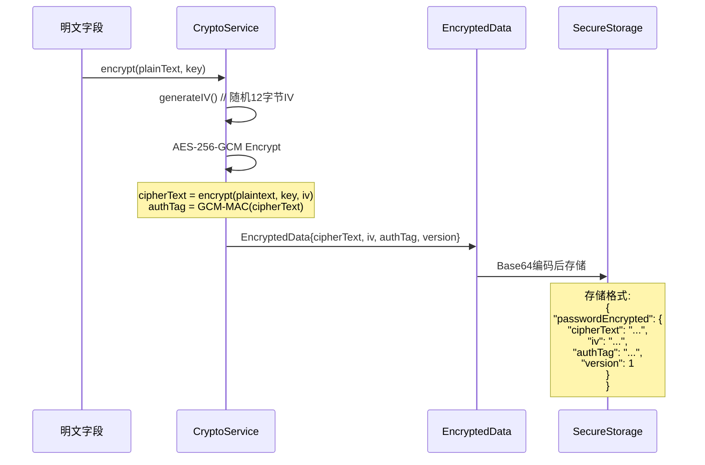
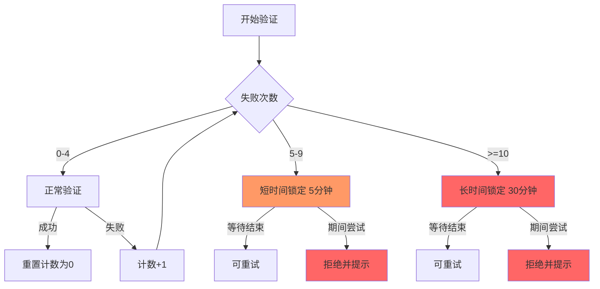
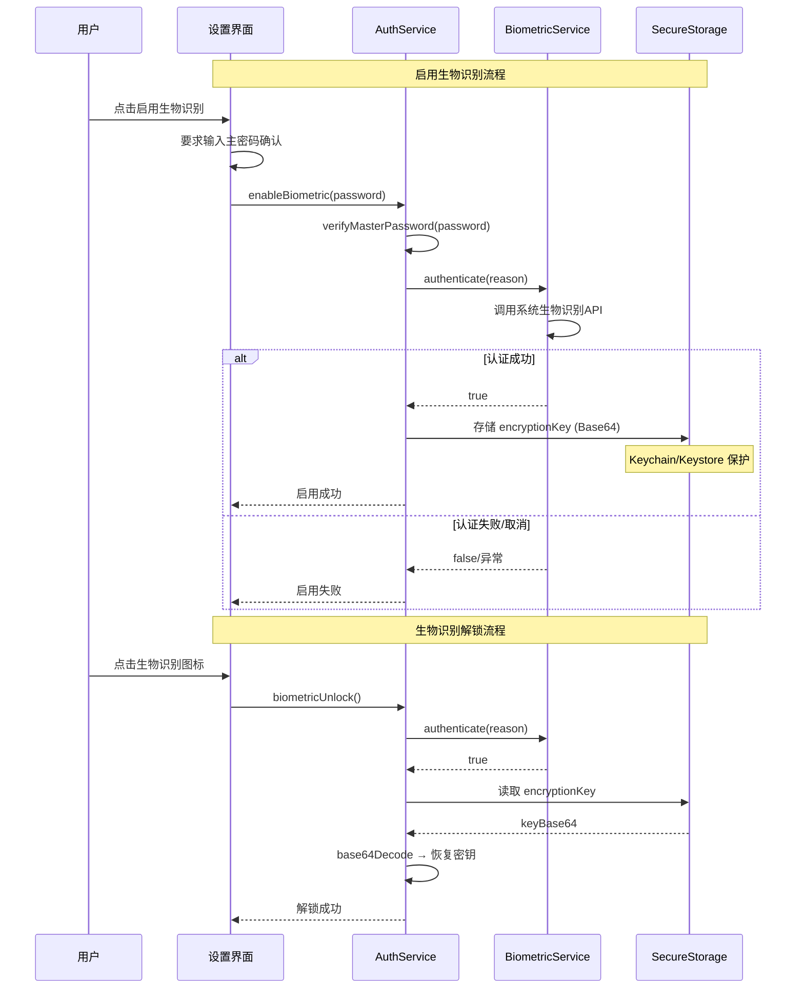

# Vaultly - 安全架构设计文档

## 1. 安全目标

| 目标 | 描述 | 优先级 |
|------|------|--------|
| 机密性 | 用户数据仅在解密状态下存在于内存 | P0 |
| 完整性 | 使用 AEAD (GCM) 防止数据篡改 | P0 |
| 可用性 | 合理的锁定策略防止 DoS | P1 |
| 前向安全 | 密钥变更后旧数据不可解密 | P1 |

## 2. 威胁模型

```
┌─────────────────────────────────────────────────────────┐
│                      攻击面分析                           │
├──────────┬──────────────────────┬────────────────────────┤
│ 威胁源   │ 攻击向量              │ 缓解措施                │
├──────────┼──────────────────────┼────────────────────────┤
│ 设备丢失 │ 提取本地存储文件       │ OS 级安全存储(Keychain) │
│          │ 内存转储               │ secureClear() 清除密钥  │
├──────────┼──────────────────────┼────────────────────────┤
│ 恶意App  │ 读取应用沙盒文件       │ FlutterSecureStorage    │
│          │ 剪贴板嗅探             │ 自动清除剪贴板          │
├──────────┼──────────────────────┼────────────────────────┤
│ 网络截获 │ WebDAV 传输窃听        │ AES-256-GCM 端到端加密  │
│          │ 中间人攻击             │ 服务器仅存密文           │
├──────────┼──────────────────────┼────────────────────────┤
│ 暴力破解 │ 离线字典攻击           │ Argon2id 高内存成本     │
│          │ 在线暴力尝试           │ 渐进式账户锁定           │
├──────────┼──────────────────────┼────────────────────────┤
│ 物理获取 │ Root/Jailbreak 提取    │ 依赖硬件安全模块(HSM)   │
│          │ 侧信道攻击             │ (超出应用控制范围)       │
└──────────┴──────────────────────┴────────────────────────┘
```

## 3. 密钥派生体系

### 3.1 Argon2id 参数配置



**参数详解**:

| 参数 | 值 | OWASP 建议 | 安全评级 |
|------|-----|------------|----------|
| 内存成本 | 64 MB (2^16 KB) | ≥ 64 MB | 符合 |
| 迭代次数 | 3 | ≥ 3 | 符合 |
| 并行度 | 4 | ≥ 4 | 符合 |
| 输出长度 | 256 bits | ≥ 256 bits | 符合 |
| 盐值长度 | 256 bits | ≥ 128 bits | 超出 |
| Argon2 版本 | 1.3 (0x13) | v1.3 | 最新 |

### 3.2 密钥生命周期



## 4. 数据加密方案

### 4.1 加密流程



### 4.2 各条目类型加密矩阵

| 字段 | LoginEntry | BankCardEntry | SecureNoteEntry | IdentityEntry |
|------|-----------|---------------|-----------------|---------------|
| title | - | - | - | - |
| username | AES-GCM | - | - | - |
| password | AES-GCM | - | - | - |
| email | AES-GCM | - | - | AES-GCM |
| totpSecret | AES-GCM | - | - | - |
| notes | AES-GCM | - | - | - |
| url | - | - | - | - |
| cardNumber | - | AES-GCM | - | - |
| cardHolderName | - | - | - | - |
| cvv | - | AES-GCM | - | - |
| bankName | - | - | - | - |
| content | - | - | AES-GCM | - |
| firstName | - | - | - | - |
| lastName | - | - | - | - |
| idNumber | - | - | - | AES-GCM |
| phone | - | - | - | AES-GCM |
| address | - | - | - | AES-GCM |

> **注**: `-` 表示明文存储（非敏感或需要搜索的字段）

### 4.3 WebDAV 传输加密

```
本地保险库数据 (JSON)
       │
       ▼
┌──────────────────────┐
│  AES-256-GCM 加密     │  ← 使用主密码派生的密钥
│  (整包加密)           │
└──────────┬───────────┘
           │ EncryptedData JSON
           ▼
┌──────────────────────┐
│  GZIP 压缩            │  ← 减少传输体积 ~60-80%
└──────────┬───────────┘
           │ Compressed Bytes
           ▼
┌──────────────────────┐
│  WebDAV 上传          │  → vaultly/vaultly_backup.enc
│  (服务器仅存储密文)    │
└──────────────────────┘
```

## 5. 认证安全机制

### 5.1 账户锁定策略



### 5.2 生物识别安全流程



### 5.3 自动锁定机制

| 配置项 | 可选值 | 默认值 |
|--------|--------|--------|
| 锁定延迟 | 5 / 15 / 30 分钟 | 5 分钟 |
| 监控范围 | 全局触摸事件 | - |
| 后台行为 | 暂停计时 | - |
| 锁定动作 | 清除内存密钥 | - |

## 6. 安全存储映射

### 6.1 FlutterSecureStorage 键值表

| 键名 | 数据类型 | 内容描述 | 是否敏感 |
|------|----------|----------|----------|
| `master_password_hash` | String | Argon2id 派生哈希 | 否 (单向) |
| `master_salt` | String (Base64) | 密钥派生盐值 | 是 (配合密码使用) |
| `biometric_encryption_key` | String (Base64) | 加密密钥副本 | **高度敏感** |
| `failed_attempts` | String (int) | 失败尝试计数 | 否 |
| `locked_until` | String (ISO8601) | 锁定截止时间 | 否 |
| `vault_data` | String (JSON) | 加密的保险库数据 | **高度敏感** |
| `webdav_url` | String | WebDAV 服务器地址 | 否 |
| `webdav_username` | String | WebDAV 用户名 | 否 |
| `webdav_password` | String | WebDAV 密码 | 是 |
| `webdav_last_sync` | String (ISO8601) | 最后同步时间 | 否 |
| `webdav_sync_history` | String (JSON) | 同步历史记录 | 否 |

### 6.2 iOS Keychain 配置

```dart
IOSOptions(
  accessibility: KeychainAccessibility.first_unlock_this_device,
  accountName: 'vaultly_auth',
)
```

- `first_unlock_this_device`: 设备首次解锁后可用，设备重启后需重新输入设备密码

## 7. 安全注意事项与限制

### 7.1 已知限制

| 限制 | 影响 | 缓解建议 |
|------|------|----------|
| 无硬件-backed Keystore集成 | Root后可提取密钥 | 引入 Android KeyStore/iOS Secure Enclave |
| TOTP 密钥以加密形式存储 | 解密后存在内存风险 | 尽快使用后清除 |
| 双向同步未完全实现 | 冲突处理不完善 | TODO: 实现 merge 策略 |
| 无远程擦除功能 | 设备丢失后无法远程清除 | 未来版本考虑 |

### 7.2 安全最佳实践遵循情况

| OWASP MASVS | 要求 | Vaultly 实现 | 状态 |
|-------------|------|-------------|------|
| MSTG-STORE-2 | 不在非安全位置存储敏感数据 | FlutterSecureStorage | 通过 |
| MSTG-CRYPTO-3 | 使用 approved 算法 | AES-256-GCM + Argon2id | 通过 |
| MSTG-CRYPTO-5 | 使用足够强度的 KDF | Argon2id (64MB/3it/4p) | 通过 |
| MSTG-CRYPTO-6 | 使用足够长度的密钥 | 256-bit | 通过 |
| MSTG-AUTH-3 | 实现账户锁定策略 | 渐进式锁定 (5min/30min) | 通过 |
| MSTG-AUTH-4 | 支持生物识别 | Face ID / Fingerprint | 通过 |
| MSTG-NETWORK-3 | 加密网络传输 | AES-256-GCM + HTTPS | 通过 |
