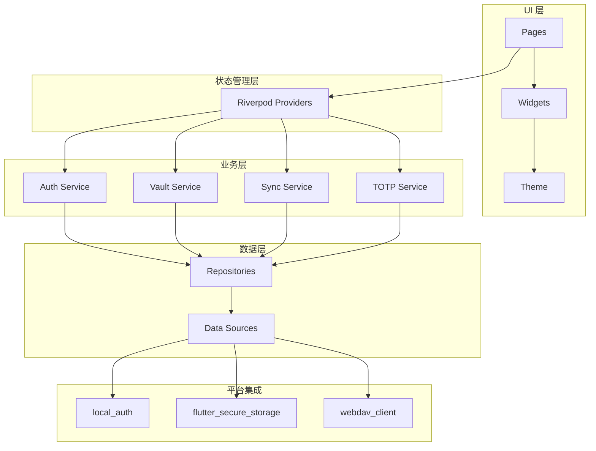

# 技术栈

## 一、核心技术选型

### 1.1 框架与语言

| 技术 | 版本 | 说明 |
|------|------|------|
| **Flutter** | 3.27+ | 跨平台 UI 框架 |
| **Dart** | 3.x | Flutter 编程语言 |
| **状态管理** | Riverpod | 轻量、类型安全、易测试 |

### 1.2 本地存储

| 技术 | 用途 | 备选方案 |
|------|------|----------|
| **Isar** | 本地 NoSQL 数据库 | Hive |
| **flutter_secure_storage** | 安全密钥存储 | Keychain (iOS) / Keystore (Android) |

### 1.3 加密与安全

| 技术 | 用途 | 说明 |
|------|------|------|
| **encrypt** | AES 加密 | AES-256-GCM |
| **pointycastle** | 密码学库 | 底层加密实现 |
| **argon2** | 密钥派生 | Argon2id 算法 |
| **crypto** | 哈希计算 | SHA-256 |

### 1.4 同步与网络

| 技术 | 用途 | 说明 |
|------|------|------|
| **webdav_client** | WebDAV 同步 | 兼容 Nextcloud/Synology |
| **http** | HTTP 请求 | Dio 备选 |

### 1.5 身份认证

| 技术 | 用途 | 说明 |
|------|------|------|
| **local_auth** | 生物识别 | Face ID / Touch ID / Fingerprint |
| **otp** | TOTP 生成 | RFC 6238 实现 |

### 1.6 浏览器插件

| 技术 | 用途 | 说明 |
|------|------|------|
| **WXT** | 插件框架 | Modern Manifest V3 |
| **TypeScript** | 插件语言 | - |

---

## 二、依赖清单

### 2.1 生产依赖 (pubspec.yaml)

```yaml
dependencies:
  flutter:
    sdk: flutter

  # 状态管理
  flutter_riverpod: ^2.5.0
  riverpod_annotation: ^2.3.0

  # 本地数据库
  isar: ^3.1.0
  isar_flutter_libs: ^3.1.0
  path_provider: ^2.1.0

  # 加密
  encrypt: ^5.0.0
  pointycastle: ^3.7.0
  crypto: ^3.0.0

  # 密钥派生
  argon2: ^0.1.0

  # WebDAV
  webdav_client: ^3.0.0

  # TOTP
  otp: ^3.1.0

  # 生物识别
  local_auth: ^2.1.0

  # 安全存储
  flutter_secure_storage: ^9.0.0

  # 剪贴板
  super_clipboard: ^0.8.0

  # QR 码
  mobile_scanner: ^5.0.0

  # UUID
  uuid: ^4.0.0

  # URL Launcher
  url_launcher: ^6.2.0

  # JSON
  json_annotation: ^4.8.0

  # 国际化
  flutter_localizations:
    sdk: flutter
  intl: ^0.19.0
```

### 2.2 开发依赖

```yaml
dev_dependencies:
  flutter_test:
    sdk: flutter
  build_runner: ^2.4.0
  riverpod_generator: ^2.3.0
  isar_generator: ^3.1.0
  json_serializable: ^6.7.0
  flutter_lints: ^3.0.0
```

---

## 三、项目结构

### 3.1 整体目录结构

```
vaultly/
├── lib/
│   ├── main.dart
│   ├── app.dart
│   ├── core/                    # 核心模块
│   │   ├── crypto/             # 加密服务
│   │   ├── models/            # 数据模型
│   │   └── utils/             # 工具类
│   ├── data/                   # 数据层
│   │   ├── repositories/      # 仓储实现
│   │   ├── datasources/       # 数据源
│   │   └── providers/         # Riverpod Providers
│   ├── domain/                 # 业务层
│   │   ├── services/          # 业务服务
│   │   └── entities/         # 实体
│   ├── features/              # 功能模块
│   │   ├── auth/             # 认证模块
│   │   ├── vault/            # 保险库模块
│   │   ├── sync/             # 同步模块
│   │   └── totp/             # TOTP 模块
│   └── ui/                    # UI 层
│       ├── pages/             # 页面
│       ├── widgets/           # 组件
│       └── theme/             # 主题
├── test/                       # 测试
├── wiki/                       # 项目文档
└── extensions/                # 扩展
    └── browser/               # 浏览器插件
```

### 3.2 核心模块说明

| 模块 | 职责 | 关键类 |
|------|------|--------|
| **crypto** | 加密/解密、密钥派生 | CryptoService, KeyDeriver |
| **auth** | 主密码验证 | AuthService |
| **vault** | 条目管理、搜索 | VaultService, EntryRepository |
| **sync** | WebDAV 同步 | SyncService, WebDAVClient |
| **totp** | TOTP 生成 | TOTPService, OTPGenerator |

---

## 四、技术架构图

### 4.1 分层架构



---

## 五、平台特性

### 5.1 平台支持矩阵

| 平台 | 支持 | 特性 |
|------|------|------|
| iOS | ✅ | AutoFill |
| Android | ✅ | Autofill、FLAG_SECURE |
| Windows | ✅ | - |
| macOS | ✅ | - |
| Linux | ✅ | - |
| Web | ✅ | Flutter Web |
| Browser | WXT | Chrome/Firefox/Edge |

### 5.2 平台特定实现

```dart

```

---

## 六、相关文档

- [项目简介](./项目简介.md) - 项目背景与目标
- [整体架构](../02-架构设计/整体架构.md) - 系统架构
- [安全架构](../02-架构设计/安全架构.md) - 安全设计
- [数据字典](../04-数据模型/数据字典.md) - 数据结构
