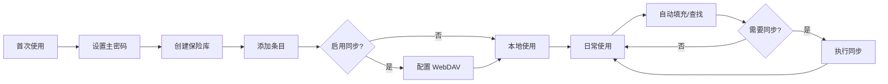

# 项目简介

## 一、项目概述

### 1.1 项目背景

Vaultly 是一款跨平台密码与敏感信息管理器，采用端到端加密设计，支持多设备同步。项目定位为安全、私密、易用的个人保险库，适用于管理账号密码、银行卡片、身份信息及自定义敏感数据。

### 1.2 核心目标

| 目标 | 描述 |
|------|------|
| **多平台覆盖** | iOS、Android、Desktop (Windows/macOS/Linux)、Web |
| **浏览器扩展** | 支持 Chrome、Firefox、Edge 等主流浏览器 |
| **端到端加密** | 零知识架构，服务器无法解密用户数据 |
| **WebDAV 同步** | 支持自建 NAS (Nextcloud、Synology、ownCloud) |

### 1.3 核心功能

#### 1.3.1 账号密码管理

- 存储网站/应用登录凭证
- 用户名、密码、URL 自动填充
- 强密码生成器
- 密码安全检测（重复、弱密码提醒）

#### 1.3.2 多因素认证 (TOTP)

- 内置 TOTP 生成器（基于 RFC 6238）
- 扫码添加（otpauth:// URI）
- 时间同步容错（±1 窗口）
- 与登录条目关联显示

#### 1.3.3 银行卡信息

- 卡号、持卡人、有效期、CVV
- 银行名称、自动识别卡类型
- CVV 安全隐藏
- 快速复制卡号

#### 1.3.4 自定义信息

- 安全笔记（支持 Markdown）
- 身份信息（身份证、护照、驾照等）
- 自定义键值字段
- 标签分类

#### 1.3.5 WebDAV 同步

- 端到端加密同步
- 支持 Nextcloud、Synology、ownCloud
- 冲突检测与解决
- 手动/自动同步

---

## 二、非功能性需求

### 2.1 安全性要求

| 需求项 | 要求 | 优先级 |
|--------|------|--------|
| 加密算法 | AES-256-GCM | P0 |
| 密钥派生 | Argon2id (memory=64MB) | P0 |
| 生物识别 | Face ID / Touch ID / Fingerprint | P0 |
| 零知识架构 | 服务器不存储明文 | P0 |
| 剪贴板保护 | 复制后 30 秒自动清除 | P1 |
| 自动锁定 | 5/15/30 分钟无操作自动锁定 | P1 |
| 防截图 | Android FLAG_SECURE | P1 |

### 2.2 性能要求

| 指标 | 目标 |
|------|------|
| 启动时间 | < 2s |
| 加密操作 | < 100ms |
| 解密操作 | < 200ms |
| 搜索响应 | < 50ms |
| 同步上传 | < 5s (1MB 数据) |

### 2.3 可用性要求

| 指标 | 目标 |
|------|------|
| 可用性 | 99.9% |
| 离线支持 | 完全离线可用 |
| 多语言 | 中文、英文（可扩展） |

---

## 三、目标用户

### 3.1 用户画像

| 用户类型 | 需求场景 |
|---------|---------|
| **个人用户** | 管理个人账号、银行卡、隐私信息 |
| **家庭用户** | 家庭成员共享部分密码（安全分享） |
| **技术用户** | 自建 NAS、WebDAV 同步 |
| **安全敏感用户** | 高安全要求、零信任架构 |

### 3.2 用户旅程

---

## 四、竞品分析

### 4.1 主流密码管理器对比

| 特性 | Vaultly | 1Password | Bitwarden | LastPass |
|------|---------|-----------|-----------|----------|
| 开源 | ✅ | ❌ | ✅ | ❌ |
| 自建服务端 | ✅ (WebDAV) | ❌ | ✅ (Vaultwarden) | ❌ |
| 端到端加密 | ✅ | ✅ | ✅ | ✅ |
| TOTP | ✅ | ✅ | ✅ | ✅ |
| 浏览器插件 | WXT | 原生 | 原生 | 原生 |
| 移动端 | Flutter | 原生 | 原生 | 原生 |

### 4.2 竞争优势

1. **完全开源**：代码透明，可自行审计
2. **WebDAV 支持**：无需专用服务器，复用现有 NAS
3. **Flutter 跨平台**：一套代码覆盖全平台
4. **WXT 插件**：轻量、现代的浏览器扩展方案

---

## 五、项目里程碑

| 阶段 | 版本 | 时间 | 交付物 |
|------|------|------|--------|
| **Phase 1** | v0.1.0 | 1-2 个月 | MVP - 基础密码管理 |
| **Phase 2** | v0.2.0 | 3-4 个月 | 银行卡、笔记、生物识别 |
| **Phase 3** | v1.0.0 | 5-6 个月 | 正式发布版 |

---

## 六、相关文档

- [技术栈](./技术栈.md) - 完整技术选型
- [架构设计](../02-架构设计/整体架构.md) - 系统架构
- [安全架构](../02-架构设计/安全架构.md) - 安全设计
- [版本规划](../06-开发计划/版本规划.md) - 开发路线图
