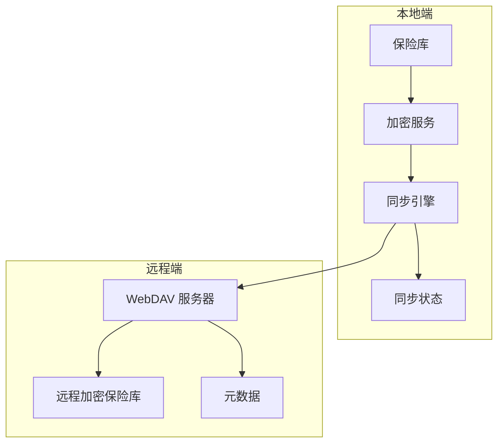
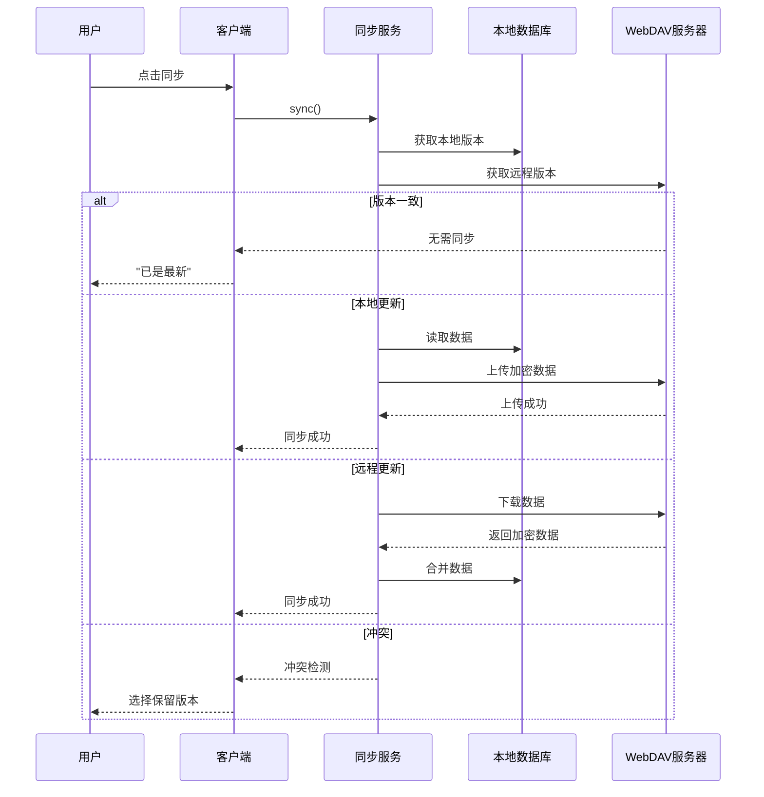

# 同步架构

## 一、同步概述

### 1.1 同步目标

| 目标 | 描述 |
|------|------|
| **多设备同步** | iOS、Android、Desktop、Web 数据一致 |
| **端到端加密** | 服务器仅存储密文 |
| **冲突解决** | 自动检测与解决同步冲突 |
| **离线支持** | 网络断开时正常工作 |

### 1.2 支持的 WebDAV 服务

| 服务 | 状态 | 说明 |
|------|------|------|
| Nextcloud | ✅ 支持 | 广泛使用 |
| Synology NAS | ✅ 支持 | 本地 NAS |
| ownCloud | ✅ 支持 | 开源方案 |
| custom WebDAV | ✅ 支持 | 通用协议 |

---

## 二、同步架构

### 2.1 架构图



### 2.2 同步组件

```
┌─────────────────────────────────────────────────────────────────────────────┐
│                           WebDAV 同步架构                                    │
├─────────────────────────────────────────────────────────────────────────────┤
│                                                                             │
│   ┌─────────────┐         ┌─────────────┐         ┌─────────────┐          │
│   │   Local     │         │    Sync     │         │   Remote    │          │
│   │   Vault     │◄───────►│   Engine    │◄───────►│   WebDAV    │          │
│   │   (Isar)   │         │             │         │   Server    │          │
│   └─────────────┘         └──────┬──────┘         └─────────────┘          │
│                                  │                                           │
│                                  ▼                                           │
│                          ┌───────────────┐                                   │
│                          │  Sync State  │                                   │
│                          │  - lastSync   │                                   │
│                          │  - localHash  │                                   │
│                          │  - remoteHash │                                   │
│                          │  - conflict   │                                   │
│                          └───────────────┘                                   │
│                                                                             │
└─────────────────────────────────────────────────────────────────────────────┘
```

---

## 三、同步流程

### 3.1 完整同步流程

```dart
class SyncService {
  Future<SyncResult> sync() async {
    // 1. 获取远程 vault 元数据
    final remoteMeta = await webdav.getMetadata();
    
    // 2. 比较哈希值
    if (localHash == remoteHash) {
      return SyncResult(success: true); // 无需同步
    }
    
    // 3. 检测冲突
    if (_hasConflict(localMeta, remoteMeta)) {
      return await resolveConflict();
    }
    
    // 4. 拉取远程变更
    if (remoteMeta.updatedAt > localMeta.updatedAt) {
      await downloadAndMerge();
    }
    
    // 5. 上传本地变更
    if (localMeta.updatedAt > remoteMeta.updatedAt) {
      await uploadChanges();
    }
    
    // 6. 更新同步状态
    await _updateSyncState();
    
    return SyncResult(success: true);
  }
}
```

### 3.2 同步时序图



---

## 四、同步策略

### 4.1 同步模式

| 模式 | 描述 | 适用场景 |
|------|------|----------|
| **完整同步** | 上传/下载整个 vault | 首次同步、网络不稳定 |
| **增量同步** | 仅同步变更部分 | 日常同步、节省流量 |

### 4.2 同步触发

| 触发方式 | 描述 |
|---------|------|
| **手动触发** | 用户点击同步按钮 |
| **自动触发** | 应用启动/进入后台 |
| **定时触发** | 设置同步间隔 |
| **变更触发** | 条目变更后立即同步 |

### 4.3 冲突检测

```dart
class ConflictDetector {
  ConflictType detectConflict(LocalEntry local, RemoteEntry remote) {
    // 同一字段在本地和远程都修改
    if (local.updatedAt > lastSyncTime && 
        remote.updatedAt > lastSyncTime) {
      return ConflictType.sameField;
    }
    
    // 条目在本地删除但在远程修改
    if (local.isDeleted && !remote.isDeleted) {
      return ConflictType.deleteVsModify;
    }
    
    return ConflictType.none;
  }
}
```

### 4.4 冲突解决策略

| 场景 | 策略 | 用户操作 |
|------|------|---------|
| 仅远程修改 | 自动合并 | 无需 |
| 仅本地修改 | 自动上传 | 无需 |
| 同一字段都修改 | 提示用户选择 | 保留本地 / 保留远程 |
| 删除 vs 修改 | 提示用户选择 | 恢复 / 确认删除 |

---

## 五、WebDAV 集成

### 5.1 WebDAV 客户端

```dart
class WebDAVClient {
  final String baseUrl;
  final String username;
  final String password;
  
  Future<void> upload(String path, List<int> data) async {
    final client = WebDAVClient(
      baseUrl: baseUrl,
      credentials: WebDAVCredentials(username, password),
    );
    
    await client.upload(
      path,
      Stream.value(data),
      contentLength: data.length,
    );
  }
  
  Future<List<int>> download(String path) async {
    final client = WebDAVClient(/* ... */);
    return await client.download(path).first;
  }
  
  Future<FileStat> getMetadata(String path) async {
    final client = WebDAVClient(/* ... */);
    return await client.stat(path);
  }
}
```

### 5.2 同步数据结构

```dart
class SyncData {
  String vaultId;
  int version;
  String checksum;
  DateTime lastModified;
  List<EntryChange> changes;
}

class EntryChange {
  String entryId;
  ChangeType type; // add, update, delete
  String? encryptedData;
  DateTime timestamp;
}
```

---

## 六、同步状态管理

### 6.1 同步状态

```dart
enum SyncStatus {
  idle,         // 空闲
  syncing,      // 同步中
  success,      // 同步成功
  failed,       // 同步失败
  conflict,     // 冲突待解决
}

class SyncState {
  SyncStatus status;
  DateTime? lastSyncTime;
  String? localHash;
  String? remoteHash;
  List<Conflict> conflicts;
  String? errorMessage;
}
```

### 6.2 同步状态 UI

| 状态 | 显示 |
|------|------|
| idle | 显示最后同步时间 |
| syncing | 显示加载动画 |
| success | 显示成功提示 |
| failed | 显示错误信息 + 重试按钮 |
| conflict | 显示冲突解决弹窗 |

---

## 七、相关文档

- [整体架构](./整体架构.md) - 系统架构
- [安全架构](./安全架构.md) - 加密设计
- [模块设计](../03-模块设计/同步模块.md) - 同步模块详细设计
- [版本规划](../06-开发计划/版本规划.md) - 开发计划
