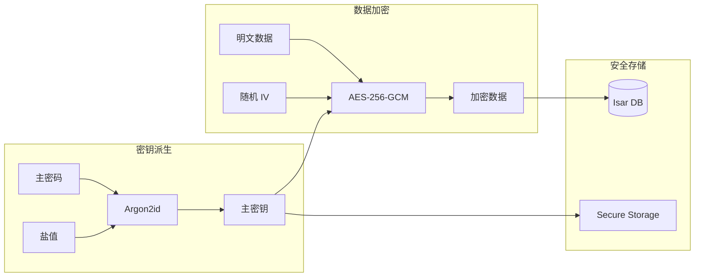

# 安全架构

## 一、安全设计原则

### 1.1 核心安全原则

| 原则 | 描述 | 实现方式 |
|------|------|----------|
| **零知识架构** | 服务器无法解密用户数据 | 端到端加密，主密码永不上传 |
| **本地优先** | 敏感数据存储在本地 | 离线可用，本地加密 |
| **内存安全** | 敏感数据及时清除 | Uint8List 覆写 |
| **最小权限** | 仅请求必要权限 | 权限分离，安全存储 |

---

## 二、密码学设计

### 2.1 加密体系



### 2.2 加密参数

| 参数 | 值 | 说明 |
|------|-----|------|
| **算法** | AES-256-GCM | 对称加密 |
| **密钥派生** | Argon2id | 抗暴力破解 |
| **Argon2 memory** | 64 MB | 内存 hardness |
| **Argon2 iterations** | 3 | 时间 hardness |
| **Argon2 parallelism** | 4 | 并行度 |
| **IV 长度** | 12 bytes | GCM 标准 |
| **Auth Tag** | 16 bytes | 完整性验证 |

### 2.3 加密流程

```dart
// 加密流程
class CryptoService {
  Future<EncryptedData> encrypt(String plainText, Uint8List key) async {
    // 1. 生成随机 IV
    final iv = AES.generateIV();
    
    // 2. 创建加密器
    final encrypter = Encrypter(AES(key, mode: AESMode.gcm));
    
    // 3. 加密
    final encrypted = encrypter.encrypt(plainText, iv: iv);
    
    // 4. 返回加密数据（含 IV 和 Auth Tag）
    return EncryptedData(
      cipherText: encrypted.base64,
      iv: iv.base64,
      authTag: encrypted.bytes.last(16).base64, // GCM auth tag
      version: 1,
    );
  }
}
```

### 2.4 密钥派生流程

```dart
// 密钥派生流程
class KeyDerivationService {
  Future<KeyMaterial> deriveKey(String password, Uint8List salt) async {
    // Argon2id 参数
    final params = Argon2Parameters(
      memory: 65536, // 64 MB
      iterations: 3,
      parallelism: 4,
      salt: salt,
    );
    
    // 派生密钥
    final argon2 = Argon2Algorithm();
    final result = argon2.hashPasswordBytes(
      password.codeUnits,
      params,
    );
    
    return KeyMaterial(
      key: Uint8List.fromList(result.hashBytes),
      salt: salt,
      hash: result.toString(),
    );
  }
}
```

---

## 三、安全特性

### 3.1 安全特性清单

| 安全特性 | 实现方式 | 优先级 | 状态 |
|---------|---------|--------|------|
| 主密码派生 | Argon2id (memory=64MB) | P0 | 📋 |
| 对称加密 | AES-256-GCM | P0 | 📋 |
| 敏感字段加密 | 全部敏感字段加密存储 | P0 | 📋 |
| 生物识别解锁 | local_auth + SecureKeyStore | P0 | 📋 |
| 零知识同步 | 端到端加密 | P0 | 📋 |
| 剪贴板保护 | 复制后 30 秒自动清除 | P1 | 📋 |
| 自动锁定 | 5/15/30 分钟可选 | P1 | 📋 |
| 防截图 | Android FLAG_SECURE | P1 | 📋 |
| 内存安全 | Uint8List 使用后覆写 | P2 | 📋 |
| 审计日志 | 记录访问时间、操作类型 | P2 | 📋 |

### 3.2 生物识别

```dart
class BiometricService {
  Future<bool> isAvailable() async {
    final localAuth = LocalAuthentication();
    return await localAuth.canCheckBiometrics;
  }
  
  Future<bool> authenticate({String reason = '解锁保险库'}) async {
    final localAuth = LocalAuthentication();
    return await localAuth.authenticate(
      localizedReason: reason,
      options: const AuthenticationOptions(
        stickyAuth: true,
        biometricOnly: true,
      ),
    );
  }
}
```

### 3.3 剪贴板保护

```dart
class ClipboardService {
  Future<void> copyWithAutoClear(String text, {int clearAfterSeconds = 30}) async {
    await Clipboard.setData(ClipboardData(text: text));
    
    // 延迟清除
    Future.delayed(Duration(seconds: clearAfterSeconds), () {
      Clipboard.setData(const ClipboardData(text: ''));
    });
  }
}
```

---

## 四、安全存储

### 4.1 存储层级

| 数据类型 | 存储位置 | 加密方式 |
|---------|---------|----------|
| 加密密钥 | Secure Storage | 平台安全芯片 |
| 密码哈希 | Isar DB | - |
| 盐值 | Isar DB | - |
| 敏感字段 | Isar DB | AES-256-GCM |
| 应用设置 | SharedPreferences | - |

### 4.2 平台安全集成

```dart
// iOS Keychain
final storage = FlutterSecureStorage(
  iOptions: IOSOptions(
    accessibility: KeychainAccessibility.first_unlock_this_device,
  ),
);

// Android Keystore
final storage = FlutterSecureStorage(
  aOptions: AndroidOptions(
    encryptedSharedPreferences: true,
  ),
);

// Windows
// 使用 DPAPI 或 Windows Hello
```

---

## 五、WebDAV 同步安全

### 5.1 零知识同步

```mermaid
graph LR
    subgraph Client["客户端"]
        PlainData[明文数据] --> Encrypt[AES-256-GCM]
        MasterKey[主密钥] --> Encrypt
    end
    
    subgraph Network["传输"]
        EncryptedData[加密数据] --> HTTPS[HTTPS]
    end
    
    subgraph Server["WebDAV 服务器"]
        HTTPS --> Storage[仅存储密文]
    end
    
    Server -.-> "无法解密" .-> X[❌]
```

### 5.2 同步安全要求

| 要求 | 实现 |
|------|------|
| 传输加密 | HTTPS (TLS 1.3) |
| 存储加密 | 始终存储密文 |
| 密钥保护 | 密钥不传输、不存储在服务器 |
| 完整性校验 | SHA-256 哈希验证 |

---

## 六、安全检查清单

### 6.1 开发安全检查

- [ ] 主密码不通过网络传输
- [ ] 加密密钥不存储在纯文本
- [ ] 敏感数据不在日志中输出
- [ ] 剪贴板自动清除计时器正常
- [ ] 自动锁定功能正常
- [ ] 生物识别失败有回退机制

### 6.2 安全测试

| 测试项 | 方法 |
|--------|------|
| 加密强度 | 验证 AES-256-GCM 实现 |
| 密钥派生 | 验证 Argon2id 参数 |
| 内存安全 | 验证敏感数据清除 |
| 剪贴板 | 验证自动清除 |
| 生物识别 | 验证失败回退 |

---

## 七、相关文档

- [整体架构](./整体架构.md) - 系统架构
- [同步架构](./同步架构.md) - WebDAV 同步设计
- [数据模型](../04-数据模型/数据字典.md) - 数据结构
- [安全检查清单](../07-检查清单/安全检查清单.md) - 安全检查项
