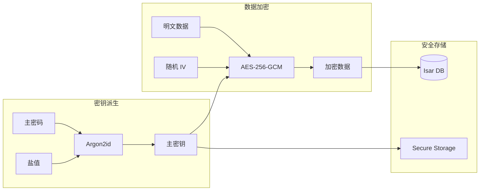
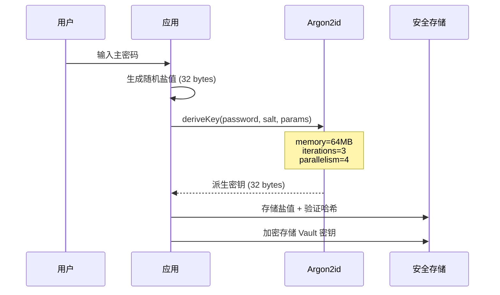
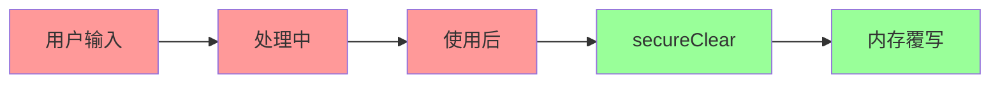
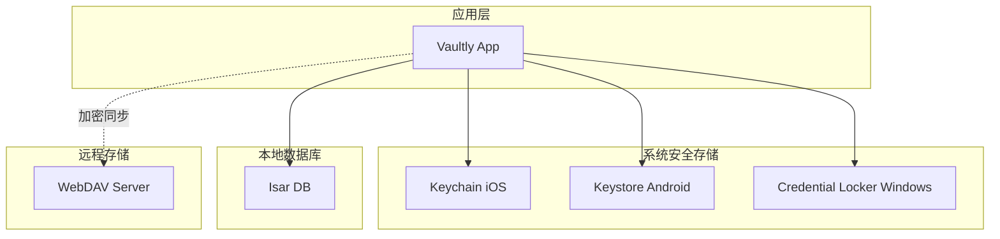
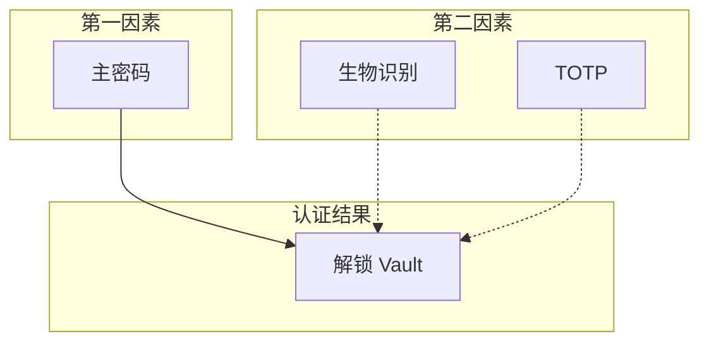
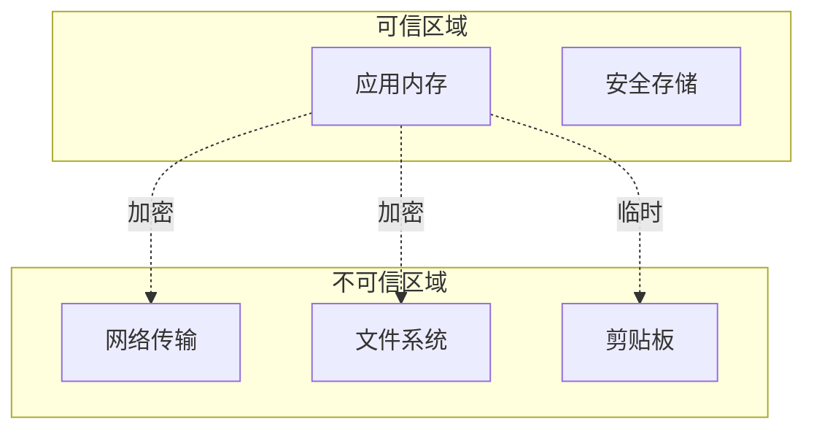

# 安全架构

> **版本**: v1.2.0  
> **更新日期**: 2026-02-20  
> **作者**: Vaultly Team  
> **文档体系**: 渐进式文档（project-wiki）

---

## 版本历史

| 版本 | 日期 | 修改内容 | 作者 |
|------|------|----------|------|
| v1.0.0 | 2026-02-15 | 初始版本 | Vaultly Team |
| v1.1.0 | 2026-02-20 | 更新 Argon2id 实现细节，添加 AutoLockService 实现状态 | Vaultly Team |
| v1.2.0 | 2026-02-20 | 补充完整密码学设计、内存安全、代码实现映射 | Vaultly Team |

---

## 一、安全设计原则

### 1.1 核心安全原则

| 原则 | 描述 | 实现方式 |
|------|------|----------|
| **零知识架构** | 服务器无法解密用户数据 | 端到端加密，主密码永不上传 |
| **本地优先** | 敏感数据存储在本地 | 离线可用，本地加密 |
| **内存安全** | 敏感数据及时清除 | Uint8List 覆写 |
| **最小权限** | 仅请求必要权限 | 权限分离，安全存储 |

### 1.2 安全目标

| 目标 | 威胁防护 | 实现策略 |
|------|----------|----------|
| **数据机密性** | 数据泄露 | AES-256-GCM 加密 |
| **数据完整性** | 数据篡改 | GCM 认证标签 |
| **认证安全** | 密码破解 | Argon2id 慢哈希 |
| **内存安全** | 内存转储攻击 | 敏感数据使用后清除 |
| **会话安全** | 会话劫持 | 自动锁定、超时机制 |

---

## 二、密码学设计

### 2.1 加密体系



### 2.2 密钥派生（Argon2id）

#### 2.2.1 算法选择

| 算法 | 安全性 | 性能 | 选择 |
|------|--------|------|------|
| **Argon2id** | 高（抵抗 GPU/ASIC） | 慢（有意设计） | ✅ 采用 |
| PBKDF2 | 中 | 快 | ❌ 不推荐 |
| bcrypt | 中 | 中等 | ❌ 备选 |
| scrypt | 高 | 慢 | ❌ 备选 |

#### 2.2.2 参数配置

```dart
// Argon2id 参数配置（符合 OWASP 推荐）
static const int _argon2MemoryPowerOf2 = 16;  // 2^16 = 65536 KB = 64MB
static const int _argon2Iterations = 3;
static const int _argon2Parallelism = 4;
static const int _argon2HashLength = 32;       // 256 bits
```

| 参数 | 值 | 说明 |
|------|-----|------|
| **算法** | Argon2id | 抵抗侧信道攻击和 GPU 破解 |
| **内存** | 64 MB | 内存困难，增加破解成本 |
| **迭代次数** | 3 | 计算困难，平衡安全性和性能 |
| **并行度** | 4 | 利用多核 CPU |
| **密钥长度** | 32 bytes (256 bits) | AES-256 密钥长度 |
| **版本** | 1.3 | 最新 Argon2 版本 |

#### 2.2.3 密钥派生流程



### 2.3 对称加密（AES-256-GCM）

#### 2.3.1 算法配置

| 参数 | 值 | 说明 |
|------|-----|------|
| **算法** | AES-256-GCM | 认证加密，防止篡改 |
| **密钥长度** | 256 bits | 最高安全级别 |
| **IV 长度** | 96 bits (12 bytes) | GCM 推荐长度 |
| **认证标签** | 128 bits (16 bytes) | 完整性验证 |

#### 2.3.2 加密流程

```dart
/// 使用 AES-256-GCM 加密数据
static EncryptedData encrypt(String plainText, Uint8List key) {
  final iv = generateIV();  // 随机生成 IV
  final encrypter = encrypt_lib.Encrypter(
    encrypt_lib.AES(encrypt_lib.Key(key), mode: encrypt_lib.AESMode.gcm),
  );
  final encrypted = encrypter.encrypt(plainText, iv: encrypt_lib.IV(iv));

  final cipherText = encrypted.bytes;
  final authTag = cipherText.sublist(cipherText.length - 16);  // 提取认证标签
  final cipher = cipherText.sublist(0, cipherText.length - 16);

  return EncryptedData(
    cipherText: base64Encode(cipher),
    iv: base64Encode(iv),
    authTag: base64Encode(authTag),
    version: 1,
  );
}
```

#### 2.3.3 加密数据结构

```dart
class EncryptedData {
  final String cipherText;  // Base64 编码的密文
  final String iv;          // Base64 编码的 IV
  final String authTag;     // Base64 编码的认证标签
  final int version;        // 加密版本（用于向后兼容）
}
```

---

## 三、内存安全管理

### 3.1 敏感数据处理原则

| 原则 | 实现 |
|------|------|
| **最小化存储** | 敏感数据仅在必要时保留在内存中 |
| **及时清除** | 使用后立即覆写内存 |
| **不可序列化** | 敏感数据不进入日志或缓存 |

### 3.2 安全清除实现

```dart
/// 安全清除 Uint8List 内容
///
/// 将内存中的敏感数据覆写为零
static void secureClear(Uint8List data) {
  for (var i = 0; i < data.length; i++) {
    data[i] = 0;
  }
}
```

### 3.3 敏感数据生命周期



### 3.4 会话密钥管理

| 阶段 | 存储位置 | 安全措施 |
|------|----------|----------|
| **解锁时** | 内存 (Uint8List) | 安全随机生成 |
| **使用中** | 内存 | 仅传递给加密函数 |
| **锁定时** | 清除 | secureClear 覆写 |
| **持久化** | Keychain/Keystore | AES 加密存储 |

---

## 四、存储安全

### 4.1 数据分类存储

| 数据类型 | 存储位置 | 加密方式 |
|----------|----------|----------|
| **Vault 元数据** | Isar | 明文（不含敏感信息） |
| **密码哈希** | Isar | Argon2id 哈希 |
| **加密 Vault 密钥** | Keychain/Keystore | 硬件加密 |
| **生物识别密钥** | Keychain/Keystore | 生物识别保护 |
| **保险库条目** | Isar | AES-256-GCM 字段级加密 |
| **同步数据** | WebDAV | 端到端加密 |

### 4.2 字段级加密

保险库中的敏感字段单独加密：

```dart
// 登录条目敏感字段
class LoginEntry extends VaultEntry {
  final EncryptedData encryptedPassword;  // 加密存储
  final EncryptedData? encryptedTotpSecret;  // TOTP 密钥加密
  final String username;  // 明文（可选加密）
  final String url;       // 明文
}

// 银行卡敏感字段
class BankCardEntry extends VaultEntry {
  final EncryptedData encryptedCardNumber;  // 卡号加密
  final EncryptedData encryptedCvv;         // CVV 加密
  final String holderName;  // 明文
  final String expiryDate;  // 明文
}
```

### 4.3 安全存储层级



---

## 五、认证安全

### 5.1 多因素认证架构



### 5.2 生物识别安全

| 平台 | 实现 | 安全级别 |
|------|------|----------|
| **iOS** | LocalAuthentication + Keychain | 硬件安全模块 |
| **Android** | BiometricPrompt + Keystore | 硬件安全模块 |
| **Windows** | Windows Hello | TPM 保护 |
| **macOS** | LocalAuthentication + Keychain | 硬件安全模块 |

### 5.3 自动锁定机制

```dart
class AutoLockService {
  static const List<Duration> lockDurations = [
    Duration(minutes: 1),
    Duration(minutes: 5),
    Duration(minutes: 15),
    Duration(minutes: 30),
    Duration(hours: 1),
    Duration(hours: 4),
  ];
  
  // 后台切换自动锁定
  void onAppPaused() {
    if (shouldLockOnBackground) {
      lock();
    }
  }
  
  // 超时自动锁定
  void startLockTimer() {
    _lockTimer?.cancel();
    _lockTimer = Timer(selectedDuration, () => lock());
  }
}
```

---

## 六、威胁模型与缓解

### 6.1 威胁分析

| 威胁 | 风险等级 | 攻击向量 | 缓解措施 |
|------|----------|----------|----------|
| **暴力破解** | 高 | 离线密码猜测 | Argon2id 慢哈希 |
| **内存转储** | 中 | 物理访问、恶意软件 | 敏感数据及时清除 |
| **中间人攻击** | 中 | 网络监听 | HTTPS、证书固定 |
| **数据篡改** | 中 | 修改加密数据 | GCM 认证标签 |
| **侧信道攻击** | 低 | 时序分析、功耗分析 | 常量时间算法 |
| **生物识别绕过** | 低 | 指纹复制、面部照片 | 活体检测 |

### 6.2 安全边界



---

## 七、代码实现映射

### 7.1 安全相关文件

| 功能 | 实现文件 | 关键方法 |
|------|----------|----------|
| **AES-256-GCM 加密** | `lib/core/crypto/services/crypto_service.dart` | `encrypt()`, `decrypt()` |
| **Argon2id 密钥派生** | `lib/core/crypto/services/crypto_service.dart` | `deriveKeyWithArgon2id()` |
| **安全内存清除** | `lib/core/crypto/services/crypto_service.dart` | `secureClear()` |
| **主密码验证** | `lib/core/crypto/services/auth_service.dart` | `verifyPassword()` |
| **生物识别认证** | `lib/core/services/biometric_service.dart` | `authenticate()` |
| **自动锁定** | `lib/core/services/auto_lock_service.dart` | `startLockTimer()` |
| **字段级加密** | `lib/core/services/vault_service.dart` | `encryptEntryFields()` |

### 7.2 安全参数配置

```dart
// lib/core/crypto/services/crypto_service.dart
class CryptoService {
  // 密钥长度
  static const int _keyLength = 32;      // 256 bits for AES-256
  static const int _ivLength = 12;       // 96 bits for GCM
  static const int _saltLength = 32;     // 256 bits for salt
  
  // Argon2id 参数
  static const int _argon2MemoryPowerOf2 = 16;  // 64MB
  static const int _argon2Iterations = 3;
  static const int _argon2Parallelism = 4;
  static const int _argon2HashLength = 32;
}
```

### 7.3 安全测试

| 测试类型 | 测试文件 | 覆盖内容 |
|----------|----------|----------|
| **加密正确性** | `test/crypto_service_test.dart` | 加密/解密往返测试 |
| **密钥派生** | `test/crypto_service_test.dart` | Argon2id 参数验证 |
| **边界条件** | `test/crypto_service_test.dart` | 空字符串、Unicode、长文本 |
| **安全边界** | `test/crypto_service_test.dart` | 错误密钥解密失败 |

---

## 八、合规性

### 8.1 密码学标准

| 标准 | 合规性 |
|------|--------|
| **NIST SP 800-132** | ✅ PBKDF 推荐（Argon2id 更优） |
| **OWASP Password Storage** | ✅ Argon2id 推荐配置 |
| **RFC 8452** | ✅ AES-GCM-SIV 基础 |

### 8.2 平台安全要求

| 平台 | 要求 | 实现 |
|------|------|------|
| **iOS** | Keychain 存储 | ✅ flutter_secure_storage |
| **Android** | Keystore + Biometric | ✅ 硬件安全模块 |
| **Windows** | Credential Locker | ✅ Windows 安全 API |

---

## 九、相关文档

### 9.1 架构文档
- [整体架构](./整体架构.md) - 系统分层架构
- [同步架构](./同步架构.md) - WebDAV 同步安全

### 9.2 模块设计
- [认证模块](../03-模块设计/认证模块.md) - 认证流程详细设计
- [保险库模块](../03-模块设计/保险库模块.md) - 数据加密设计

### 9.3 渐进式文档
- [用户认证功能](../功能文档/用户认证功能.md) - 认证功能需求
- [用户认证需求](../需求文档/用户认证需求.md) - 数据模型与数据流
- [用户认证架构](../架构文档/用户认证架构.md) - 多角色视图
- [用户登录数据流](../数据流动/用户登录数据流.md) - 数据流转时序

---

## 十、变更记录

| 版本 | 日期 | 变更内容 | 作者 |
|------|------|----------|------|
| v1.0.0 | 2026-02-15 | 初始版本 | Vaultly Team |
| v1.1.0 | 2026-02-20 | 更新 Argon2id 实现细节 | Vaultly Team |
| v1.2.0 | 2026-02-20 | 补充完整密码学设计、内存安全、代码实现映射 | Vaultly Team |
