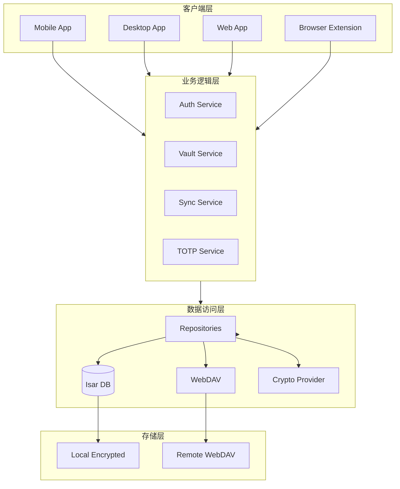
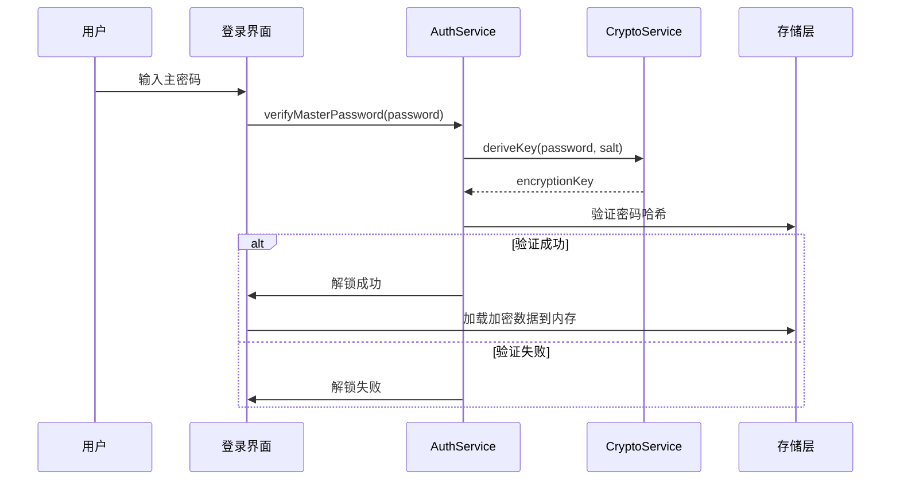
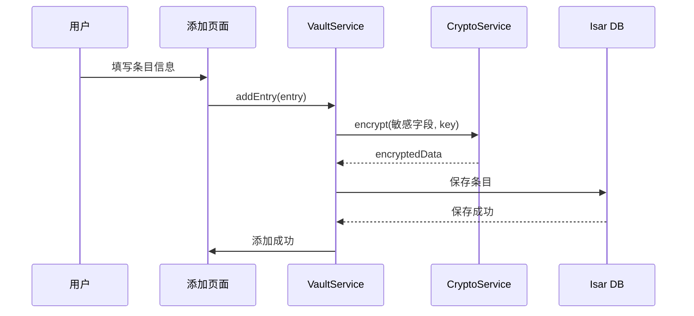
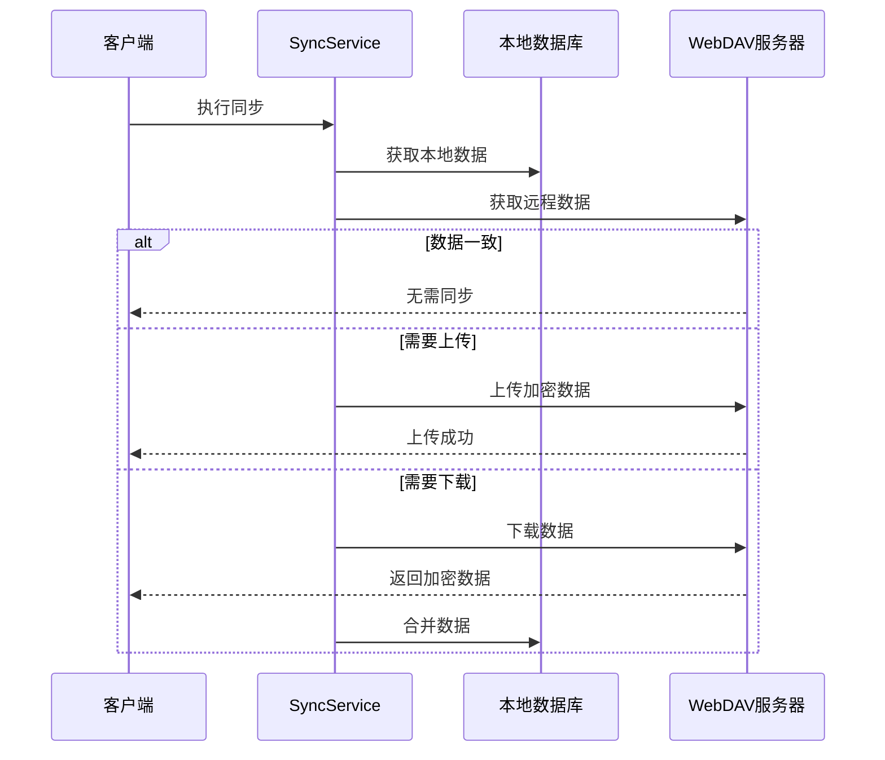
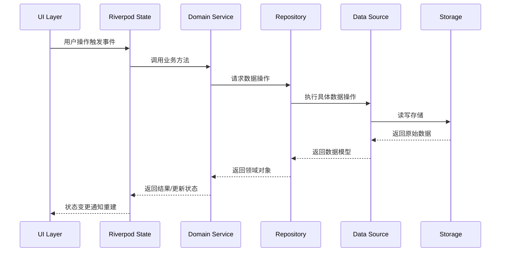
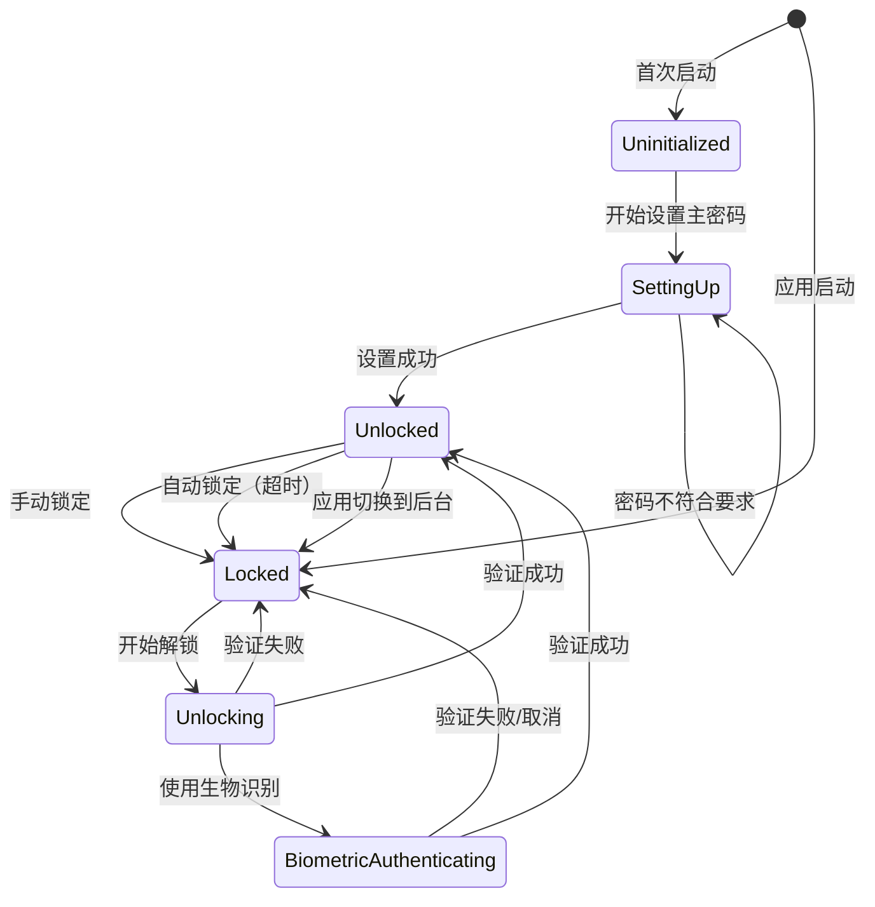

# 整体架构

> **版本**: v1.1.0  
> **更新日期**: 2026-02-20  
> **作者**: Vaultly Team  
> **文档体系**: 渐进式文档（project-wiki）

---

## 版本历史

| 版本 | 日期 | 修改内容 | 作者 |
|------|------|----------|------|
| v1.0.0 | 2026-02-15 | 初始版本 | Vaultly Team |
| v1.1.0 | 2026-02-20 | 补充数据流动原则、状态管理设计、代码实现映射 | Vaultly Team |

---

## 一、架构概览

### 1.1 系统分层



### 1.2 核心架构图

```
┌─────────────────────────────────────────────────────────────────────────────┐
│                              客户端层 (Flutter)                              │
├─────────────────────────────────────────────────────────────────────────────┤
│  ┌─────────────┐  ┌─────────────┐  ┌─────────────┐  ┌─────────────────┐   │
│  │   Mobile    │  │   Desktop   │  │     Web     │  │  Browser Ext   │   │
│  │ (iOS/Android│  │ (Win/Mac/Lin│  │ (Flutter Web│  │      (WXT)     │   │
│  └──────┬──────┘  └──────┬──────┘  └──────┬──────┘  └────────┬────────┘   │
└─────────┼────────────────┼────────────────┼──────────────────┼─────────────┘
          │                │                │                  │
          ▼                ▼                ▼                  ▼
┌─────────────────────────────────────────────────────────────────────────────┐
│                          核心业务逻辑层 (Domain)                              │
├─────────────────────────────────────────────────────────────────────────────┤
│  ┌─────────────┐  ┌─────────────┐  ┌─────────────┐  ┌─────────────────┐   │
│  │   Auth      │  │   Vault    │  │  Sync       │  │  TOTP           │   │
│  │   Service   │  │   Service  │  │  Service    │  │  Service        │   │
│  └─────────────┘  └─────────────┘  └─────────────┘  └─────────────────┘   │
└─────────────────────────────────────────────────────────────────────────────┘
          │
          ▼
┌─────────────────────────────────────────────────────────────────────────────┐
│                           数据访问层 (Data)                                  │
├─────────────────────────────────────────────────────────────────────────────┤
│  ┌─────────────┐  ┌─────────────┐  ┌─────────────┐  ┌─────────────────┐   │
│  │   Local DB  │  │  WebDAV     │  │  Crypto     │  │  Biometric     │  │
│  │   (Isar)    │  │  Client     │  │  Provider   │  │  Provider       │  │
│  └─────────────┘  └─────────────┘  └─────────────┘  └─────────────────┘   │
└─────────────────────────────────────────────────────────────────────────────┘
          │
          ▼
┌─────────────────────────────────────────────────────────────────────────────┐
│                           存储层 (Storage)                                  │
├─────────────────────────────────────────────────────────────────────────────┤
│  ┌─────────────────────────┐    ┌─────────────────────────────────────┐   │
│  │   Local Encrypted DB     │    │   Remote WebDAV Server             │   │
│  │   (Isar + AES-256)      │◄──►│   (Nextcloud/Synology/NAS)         │   │
│  └─────────────────────────┘    └─────────────────────────────────────┘   │
└─────────────────────────────────────────────────────────────────────────────┘
```

---

## 二、模块架构

### 2.1 Flutter 应用架构

```
┌─────────────────────────────────────────────────────────────────────────────┐
│                              Flutter App                                    │
├─────────────────────────────────────────────────────────────────────────────┤
│                                                                             │
│  ┌─────────────────────────────────────────────────────────────────────┐   │
│  │                      Presentation Layer                            │   │
│  │  ┌──────────┐ ┌──────────┐ ┌──────────┐ ┌──────────┐ ┌────────┐  │   │
│  │  │  Login   │ │  Vault   │ │  Add/Edit │ │ Settings │ │  Sync  │  │   │
│  │  │   Page   │ │   Page   │ │   Entry   │ │   Page   │ │  Page  │  │   │
│  │  └──────────┘ └──────────┘ └──────────┘ └──────────┘ └────────┘  │   │
│  └─────────────────────────────────────────────────────────────────────┘   │
│                                    │                                        │
│                                    ▼                                        │
│  ┌─────────────────────────────────────────────────────────────────────┐   │
│  │                    State Management (Riverpod)                    │   │
│  │  ┌──────────┐ ┌──────────┐ ┌──────────┐ ┌──────────┐ ┌────────┐  │   │
│  │  │  Auth    │ │  Vault   │ │  TOTP    │ │  Sync    │ │ Settings│ │   │
│  │  │ Notifier │ │ Notifier │ │ Notifier │ │ Notifier │ │Notifier│ │   │
│  │  └──────────┘ └──────────┘ └──────────┘ └──────────┘ └────────┘  │   │
│  └─────────────────────────────────────────────────────────────────────┘   │
│                                    │                                        │
│                                    ▼                                        │
│  ┌─────────────────────────────────────────────────────────────────────┐   │
│  │                        Service Layer                               │   │
│  │  ┌──────────────┐ ┌──────────────┐ ┌──────────────┐              │   │
│  │  │ CryptoService │ │ VaultService │ │ SyncService  │              │   │
│  │  │ AuthService   │ │ TOTPService  │ │ BiometricSvc │              │   │
│  │  └──────────────┘ └──────────────┘ └──────────────┘              │   │
│  └─────────────────────────────────────────────────────────────────────┘   │
│                                    │                                        │
│                                    ▼                                        │
│  ┌─────────────────────────────────────────────────────────────────────┐   │
│  │                      Data Repository Layer                         │   │
│  │  ┌──────────────┐  ┌──────────────┐  ┌──────────────┐            │   │
│  │  │ IsarRepo     │  │ WebDAVRepo   │  │ PrefsRepo    │            │   │
│  │  └──────────────┘  └──────────────┘  └──────────────┘            │   │
│  └─────────────────────────────────────────────────────────────────────┘   │
│                                    │                                        │
│                                    ▼                                        │
│  ┌─────────────────────────────────────────────────────────────────────┐   │
│  │                      Platform Integration                          │   │
│  │  ┌──────────────┐  ┌──────────────┐  ┌──────────────┐            │   │
│  │  │ local_auth    │  │ flutter_secure│  │ webdav_client│            │   │
│  │  │ (Biometric)  │  │ (Keychain)    │  │              │            │   │
│  │  └──────────────┘  └──────────────┘  └──────────────┘            │   │
│  └─────────────────────────────────────────────────────────────────────┘   │
│                                                                             │
└─────────────────────────────────────────────────────────────────────────────┘
```

---

## 三、关键数据流

### 3.1 登录流程



### 3.2 添加条目流程



### 3.3 同步流程



---

## 四、技术组件

### 4.1 核心服务

| 服务 | 职责 | 关键方法 |
|------|------|---------|
| **CryptoService** | 加密/解密、密钥派生 | encrypt(), decrypt(), deriveKey() |
| **AuthService** | 主密码验证、会话管理 | verifyPassword(), lock(), unlock() |
| **VaultService** | 条目 CRUD、搜索 | addEntry(), updateEntry(), deleteEntry(), search() |
| **SyncService** | WebDAV 同步管理 | sync(), resolveConflict() |
| **TOTPService** | TOTP 生成/验证 | generateTOTP(), parseOTPAuth() |
| **BiometricService** | 生物识别认证 | authenticate(), isAvailable() |

### 4.2 数据仓储

| 仓储 | 职责 |
|------|------|
| **VaultRepository** | 条目数据持久化 |
| **WebDAVRepository** | 远程同步数据操作 |
| **PreferencesRepository** | 应用设置存储 |

---

## 五、扩展性设计

### 5.1 模块化架构

```
vaultly/
├── packages/
│   ├── core/                  # 核心加密、通用工具
│   │   ├── crypto/
│   │   ├── models/
│   │   └── utils/
│   ├── data/                  # 数据层
│   │   ├── repositories/
│   │   ├── datasources/
│   │   └── providers/
│   ├── domain/                # 业务逻辑
│   │   ├── services/
│   │   └── entities/
│   ├── features/              # 功能模块
│   │   ├── auth/
│   │   ├── vault/
│   │   ├── sync/
│   │   └── totp/
│   └── app/                   # 主应用入口
└── extensions/
    └── browser/               # 浏览器插件
```

### 5.2 插件化扩展

未来可扩展功能：
- 密码健康检查
- 数据导入/导出（1Password、Bitwarden）
- 安全分享

---

## 六、数据流动设计

### 6.1 数据流动原则

根据 project-wiki 数据流动设计规范，Vaultly 遵循以下原则：

| 原则 | 说明 | 实现方式 |
|------|------|----------|
| **单向流动** | 数据单向流动，避免循环依赖 | UI → State → Service → Repository → DataSource |
| **明确源头** | 每个数据变更都有明确源头 | Riverpod StateNotifier 管理状态变更 |
| **可追踪性** | 数据流动路径清晰可追踪 | 日志记录关键数据流转节点 |
| **幂等性** | 相同操作产生相同结果 | 加密操作使用确定性算法 |
| **一致性** | 数据在流动过程中保持一致 | 事务包装数据库操作 |

### 6.2 数据流模式



### 6.3 缓存策略

| 数据类型 | 缓存位置 | 策略 | 说明 |
|----------|----------|------|------|
| Vault 密钥 | 内存 | 应用锁定后清除 | 敏感数据，不持久化 |
| 保险库条目 | Isar + 内存 | 启动加载，变更更新 | 本地优先 |
| 认证状态 | Riverpod State | 实时同步 | 驱动UI状态 |
| 同步元数据 | Isar | 持久化存储 | 同步状态跟踪 |

---

## 七、状态管理设计

### 7.1 状态管理架构



### 7.2 状态管理实现

使用 Riverpod 进行状态管理，核心设计：

```dart
// 不可变状态类
@immutable
class AuthState {
  final bool isUnlocked;
  final bool isPasswordSet;
  final bool isLoading;
  final String? error;

  const AuthState({
    this.isUnlocked = false,
    this.isPasswordSet = false,
    this.isLoading = false,
    this.error,
  });

  // 不可变更新
  AuthState copyWith({...}) => AuthState(...);
}

// StateNotifier 管理状态变更
class AuthNotifier extends StateNotifier<AuthState> {
  final AuthService _authService;
  
  Future<void> unlock(String password) async {
    state = state.copyWith(isLoading: true, error: null);
    
    final result = await _authService.unlock(password);
    
    result.fold(
      (error) => state = state.copyWith(isLoading: false, error: error),
      (_) => state = state.copyWith(isLoading: false, isUnlocked: true),
    );
  }
}
```

### 7.3 状态持久化

| 状态 | 持久化方式 | 说明 |
|------|------------|------|
| 认证状态 | 内存 | 应用重启后需要重新认证 |
| 自动锁定时间 | SharedPreferences | 用户设置持久化 |
| 生物识别启用状态 | Isar | 元数据的一部分 |
| 最后解锁时间 | Isar | 用于自动锁定判断 |

---

## 八、代码实现映射

### 8.1 架构层与代码对应

| 架构层 | 代码目录 | 关键文件 |
|--------|----------|----------|
| **Presentation** | `lib/ui/` | `pages/`, `widgets/`, `theme/` |
| **State Management** | `lib/core/providers/` | `auth_provider.dart`, `vault_service_provider.dart` |
| **Domain Service** | `lib/core/services/` | `auth_service.dart`, `vault_service.dart` |
| **Repository** | `lib/core/repositories/` | `vault_repository.dart`, `local_storage_repository.dart` |
| **Data Source** | `lib/core/crypto/`, `lib/core/models/` | `crypto_service.dart`, `vault_entry.dart` |

### 8.2 关键实现文件

| 功能 | 实现文件 | 说明 |
|------|----------|------|
| 路由守卫 | `lib/core/routes/app_router.dart` | 基于认证状态的重定向逻辑 |
| 加密服务 | `lib/core/crypto/services/crypto_service.dart` | AES-256-GCM + Argon2id |
| 认证服务 | `lib/core/crypto/services/auth_service.dart` | 主密码验证、生物识别 |
| 保险库服务 | `lib/core/services/vault_service.dart` | 条目 CRUD、字段级加密 |
| 状态管理 | `lib/core/providers/auth_provider.dart` | Riverpod StateNotifier |

---

## 九、相关文档

### 9.1 架构文档
- [安全架构](./安全架构.md) - 加密与安全设计
- [同步架构](./同步架构.md) - WebDAV 同步设计
- [插件架构](./插件架构.md) - WXT 浏览器插件

### 9.2 模块设计
- [认证模块](../03-模块设计/认证模块.md) - 详细模块设计
- [保险库模块](../03-模块设计/保险库模块.md) - 条目管理设计
- [同步模块](../03-模块设计/同步模块.md) - WebDAV 同步设计
- [TOTP模块](../03-模块设计/TOTP模块.md) - 双因素认证设计

### 9.3 渐进式文档
- [用户认证功能](../功能文档/用户认证功能.md) - 功能需求
- [用户认证需求](../需求文档/用户认证需求.md) - 数据模型与数据流
- [用户认证架构](../架构文档/用户认证架构.md) - 多角色视图
- [用户登录数据流](../数据流动/用户登录数据流.md) - 数据流转时序
- [认证状态机](../状态机/认证状态机.md) - 状态转换设计
