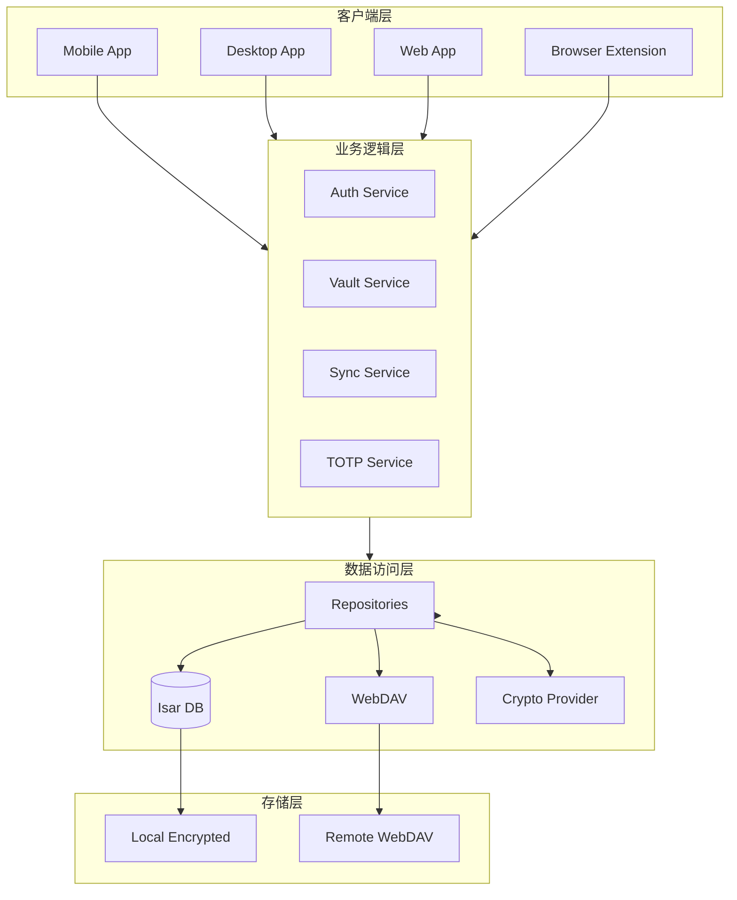
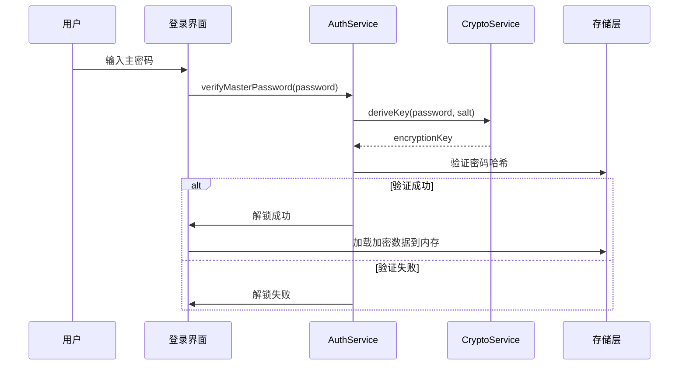
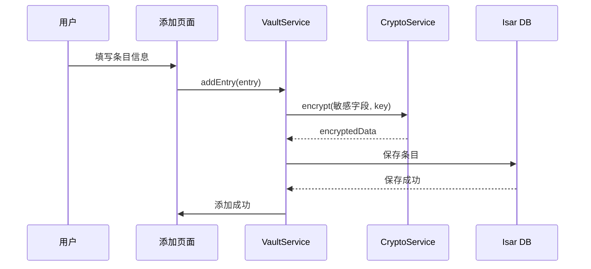
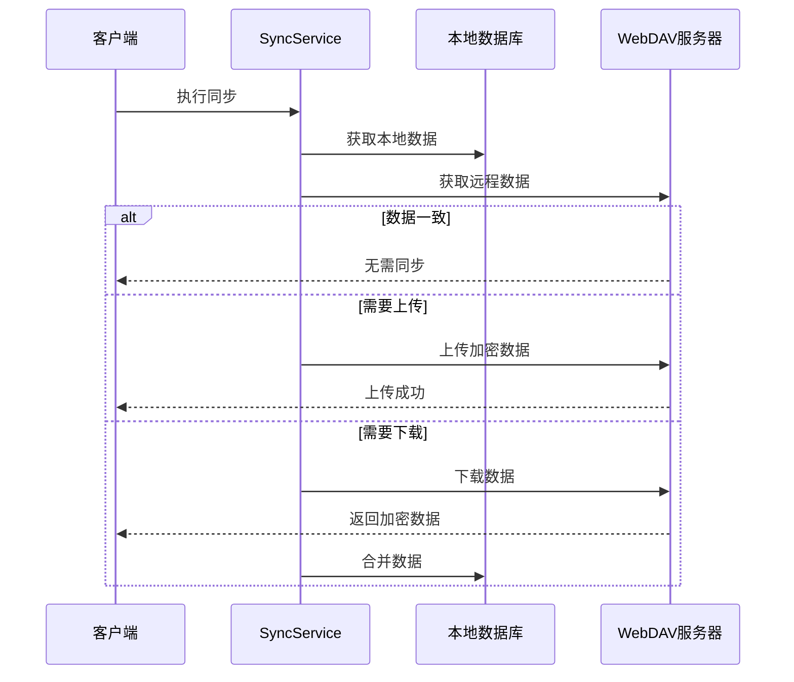

# 整体架构

## 一、架构概览

### 1.1 系统分层



### 1.2 核心架构图

```
┌─────────────────────────────────────────────────────────────────────────────┐
│                              客户端层 (Flutter)                              │
├─────────────────────────────────────────────────────────────────────────────┤
│  ┌─────────────┐  ┌─────────────┐  ┌─────────────┐  ┌─────────────────┐   │
│  │   Mobile    │  │   Desktop   │  │     Web     │  │  Browser Ext   │   │
│  │ (iOS/Android│  │ (Win/Mac/Lin│  │ (Flutter Web│  │      (WXT)     │   │
│  └──────┬──────┘  └──────┬──────┘  └──────┬──────┘  └────────┬────────┘   │
└─────────┼────────────────┼────────────────┼──────────────────┼─────────────┘
          │                │                │                  │
          ▼                ▼                ▼                  ▼
┌─────────────────────────────────────────────────────────────────────────────┐
│                          核心业务逻辑层 (Domain)                              │
├─────────────────────────────────────────────────────────────────────────────┤
│  ┌─────────────┐  ┌─────────────┐  ┌─────────────┐  ┌─────────────────┐   │
│  │   Auth      │  │   Vault    │  │  Sync       │  │  TOTP           │   │
│  │   Service   │  │   Service  │  │  Service    │  │  Service        │   │
│  └─────────────┘  └─────────────┘  └─────────────┘  └─────────────────┘   │
└─────────────────────────────────────────────────────────────────────────────┘
          │
          ▼
┌─────────────────────────────────────────────────────────────────────────────┐
│                           数据访问层 (Data)                                  │
├─────────────────────────────────────────────────────────────────────────────┤
│  ┌─────────────┐  ┌─────────────┐  ┌─────────────┐  ┌─────────────────┐   │
│  │   Local DB  │  │  WebDAV     │  │  Crypto     │  │  Biometric     │  │
│  │   (Isar)    │  │  Client     │  │  Provider   │  │  Provider       │  │
│  └─────────────┘  └─────────────┘  └─────────────┘  └─────────────────┘   │
└─────────────────────────────────────────────────────────────────────────────┘
          │
          ▼
┌─────────────────────────────────────────────────────────────────────────────┐
│                           存储层 (Storage)                                  │
├─────────────────────────────────────────────────────────────────────────────┤
│  ┌─────────────────────────┐    ┌─────────────────────────────────────┐   │
│  │   Local Encrypted DB     │    │   Remote WebDAV Server             │   │
│  │   (Isar + AES-256)      │◄──►│   (Nextcloud/Synology/NAS)         │   │
│  └─────────────────────────┘    └─────────────────────────────────────┘   │
└─────────────────────────────────────────────────────────────────────────────┘
```

---

## 二、模块架构

### 2.1 Flutter 应用架构

```
┌─────────────────────────────────────────────────────────────────────────────┐
│                              Flutter App                                    │
├─────────────────────────────────────────────────────────────────────────────┤
│                                                                             │
│  ┌─────────────────────────────────────────────────────────────────────┐   │
│  │                      Presentation Layer                            │   │
│  │  ┌──────────┐ ┌──────────┐ ┌──────────┐ ┌──────────┐ ┌────────┐  │   │
│  │  │  Login   │ │  Vault   │ │  Add/Edit │ │ Settings │ │  Sync  │  │   │
│  │  │   Page   │ │   Page   │ │   Entry   │ │   Page   │ │  Page  │  │   │
│  │  └──────────┘ └──────────┘ └──────────┘ └──────────┘ └────────┘  │   │
│  └─────────────────────────────────────────────────────────────────────┘   │
│                                    │                                        │
│                                    ▼                                        │
│  ┌─────────────────────────────────────────────────────────────────────┐   │
│  │                    State Management (Riverpod)                    │   │
│  │  ┌──────────┐ ┌──────────┐ ┌──────────┐ ┌──────────┐ ┌────────┐  │   │
│  │  │  Auth    │ │  Vault   │ │  TOTP    │ │  Sync    │ │ Settings│ │   │
│  │  │ Notifier │ │ Notifier │ │ Notifier │ │ Notifier │ │Notifier│ │   │
│  │  └──────────┘ └──────────┘ └──────────┘ └──────────┘ └────────┘  │   │
│  └─────────────────────────────────────────────────────────────────────┘   │
│                                    │                                        │
│                                    ▼                                        │
│  ┌─────────────────────────────────────────────────────────────────────┐   │
│  │                        Service Layer                               │   │
│  │  ┌──────────────┐ ┌──────────────┐ ┌──────────────┐              │   │
│  │  │ CryptoService │ │ VaultService │ │ SyncService  │              │   │
│  │  │ AuthService   │ │ TOTPService  │ │ BiometricSvc │              │   │
│  │  └──────────────┘ └──────────────┘ └──────────────┘              │   │
│  └─────────────────────────────────────────────────────────────────────┘   │
│                                    │                                        │
│                                    ▼                                        │
│  ┌─────────────────────────────────────────────────────────────────────┐   │
│  │                      Data Repository Layer                         │   │
│  │  ┌──────────────┐  ┌──────────────┐  ┌──────────────┐            │   │
│  │  │ IsarRepo     │  │ WebDAVRepo   │  │ PrefsRepo    │            │   │
│  │  └──────────────┘  └──────────────┘  └──────────────┘            │   │
│  └─────────────────────────────────────────────────────────────────────┘   │
│                                    │                                        │
│                                    ▼                                        │
│  ┌─────────────────────────────────────────────────────────────────────┐   │
│  │                      Platform Integration                          │   │
│  │  ┌──────────────┐  ┌──────────────┐  ┌──────────────┐            │   │
│  │  │ local_auth    │  │ flutter_secure│  │ webdav_client│            │   │
│  │  │ (Biometric)  │  │ (Keychain)    │  │              │            │   │
│  │  └──────────────┘  └──────────────┘  └──────────────┘            │   │
│  └─────────────────────────────────────────────────────────────────────┘   │
│                                                                             │
└─────────────────────────────────────────────────────────────────────────────┘
```

---

## 三、关键数据流

### 3.1 登录流程



### 3.2 添加条目流程



### 3.3 同步流程



---

## 四、技术组件

### 4.1 核心服务

| 服务 | 职责 | 关键方法 |
|------|------|---------|
| **CryptoService** | 加密/解密、密钥派生 | encrypt(), decrypt(), deriveKey() |
| **AuthService** | 主密码验证、会话管理 | verifyPassword(), lock(), unlock() |
| **VaultService** | 条目 CRUD、搜索 | addEntry(), updateEntry(), deleteEntry(), search() |
| **SyncService** | WebDAV 同步管理 | sync(), resolveConflict() |
| **TOTPService** | TOTP 生成/验证 | generateTOTP(), parseOTPAuth() |
| **BiometricService** | 生物识别认证 | authenticate(), isAvailable() |

### 4.2 数据仓储

| 仓储 | 职责 |
|------|------|
| **VaultRepository** | 条目数据持久化 |
| **WebDAVRepository** | 远程同步数据操作 |
| **PreferencesRepository** | 应用设置存储 |

---

## 五、扩展性设计

### 5.1 模块化架构

```
vaultly/
├── packages/
│   ├── core/                  # 核心加密、通用工具
│   │   ├── crypto/
│   │   ├── models/
│   │   └── utils/
│   ├── data/                  # 数据层
│   │   ├── repositories/
│   │   ├── datasources/
│   │   └── providers/
│   ├── domain/                # 业务逻辑
│   │   ├── services/
│   │   └── entities/
│   ├── features/              # 功能模块
│   │   ├── auth/
│   │   ├── vault/
│   │   ├── sync/
│   │   └── totp/
│   └── app/                   # 主应用入口
└── extensions/
    └── browser/               # 浏览器插件
```

### 5.2 插件化扩展

未来可扩展功能：
- 密码健康检查
- 数据导入/导出（1Password、Bitwarden）

- 安全分享

---

## 六、相关文档

- [安全架构](./安全- 紧急访问架构.md) - 加密与安全设计
- [同步架构](./同步架构.md) - WebDAV 同步设计
- [插件架构](./插件架构.md) - WXT 浏览器插件
- [模块设计](../03-模块设计/认证模块.md) - 详细模块设计
- [数据字典](../04-数据模型/数据字典.md) - 数据结构
