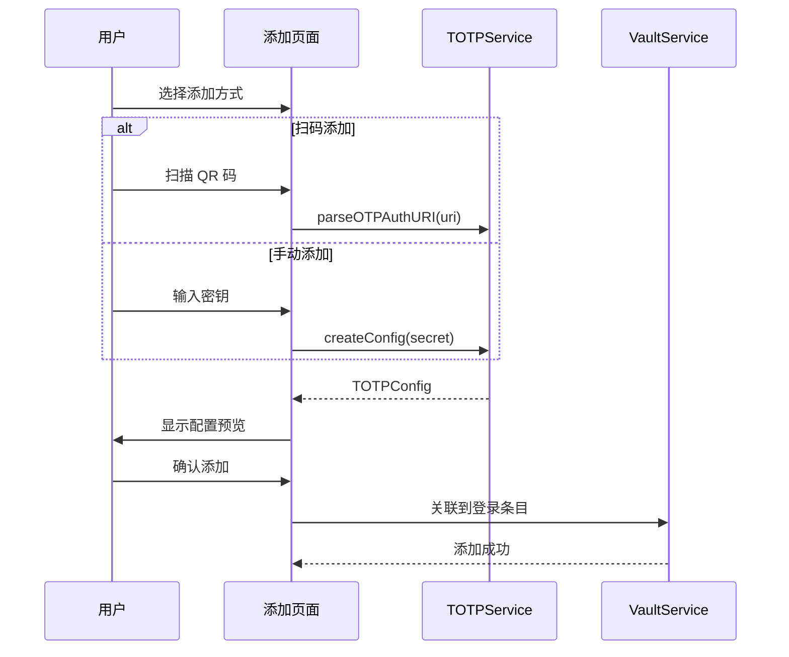
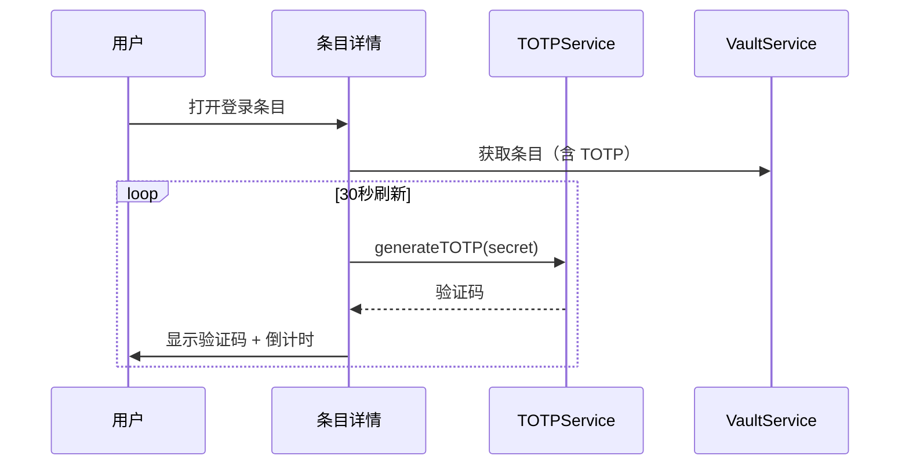

# TOTP 模块

> **版本**: v1.0.0  
> **更新日期**: 2026-02-20  
> **作者**: Vaultly Team  
> **文档类型**: 模块文档

---

## 版本历史

| 版本 | 日期 | 修改内容 | 作者 |
|------|------|----------|------|
| v1.0.0 | 2026-02-20 | 初始版本 | Vaultly Team |

---

## 一、模块概述

### 1.1 模块职责

TOTP 模块负责生成和管理基于时间的一次性密码（TOTP），实现双因素认证功能。

### 1.2 核心功能

| 功能 | 描述 |
|------|------|
| TOTP 生成 | 基于 RFC 6238 生成验证码 |
| 扫码添加 | 扫描 QR 码添加 TOTP |
| 手动添加 | 输入密钥添加 TOTP |
| 时间同步 | 自动校准时间偏差 |
| 与条目关联 | TOTP 关联登录凭证 |

---

## 二、技术原理

### 2.1 TOTP 算法

TOTP（Time-based One-Time Password）基于 HMAC-SHA1 算法：

```
TOTP = HOTP(K, T)
T = floor((Current Unix Time) / Time Step)
K = Secret Key
Time Step = 30 秒
```

### 2.2 参数配置

| 参数 | 值 | 说明 |
|------|-----|------|
| 算法 | HMAC-SHA1 | RFC 2104 |
| 时间步长 | 30 秒 | 默认值 |
| 初始时间 | Unix Epoch | 1970-01-01 |
| 长度 | 6/8 位 | 可配置 |
| 时间窗口 | ±1 | 容错范围 |

---

## 三、核心服务

### 3.1 TOTPService

```dart
class TOTPService {
  // 生成 TOTP 验证码
  String generateTOTP(String secret, {int digits = 6, int period = 30});
  
  // 验证 TOTP 验证码
  bool validateTOTP(String code, String secret, {int window = 1});
  
  // 解析 otpauth:// URI
  TOTPConfig? parseOTPAuthURI(String uri);
  
  // 生成 otpauth:// URI
  String generateOTPAuthURI(TOTPConfig config);
  
  // 获取剩余秒数
  int getRemainingSeconds({int period = 30});
}
```

### 3.2 TOTP 配置

```dart
class TOTPConfig {
  String secret;
  String issuer;        // 如 "Google"
  String accountName;   // 如 "user@example.com"
  int digits;          // 6 或 8
  int period;          // 时间步长
  Algorithm algorithm; // SHA1, SHA256, SHA512
}
```

---

## 四、使用流程

### 4.1 添加 TOTP 流程



### 4.2 显示 TOTP 流程



---

## 五、时间同步

### 5.1 时间偏差处理

```dart
class TimeSyncService {
  // 检查时间偏差
  Future<int> checkTimeOffset() async {
    final localTime = DateTime.now().millisecondsSinceEpoch ~/ 1000;
    final serverTime = await getServerTime(); // 通过 NTP 获取
    return serverTime - localTime;
  }
  
  // 使用时间偏移生成 TOTP
  String generateTOTPWithOffset(String secret, int offset) {
    final adjustedTime = DateTime.now().millisecondsSinceEpoch ~/ 1000 + offset;
    return _generateTOTP(secret, adjustedTime);
  }
}
```

### 5.2 同步策略

| 场景 | 策略 |
|------|------|
| 首次使用 | 自动检查 NTP 时间 |
| TOTP 验证失败 | 提示检查时间设置 |
| 手动校准 | 提供时间校准选项 |

---

## 六、相关文档

- [整体架构](../02-架构设计/整体架构.md) - 系统架构
- [安全架构](../02-架构设计/安全架构.md) - 安全设计
- [保险库模块](./保险库模块.md) - 与登录条目关联
