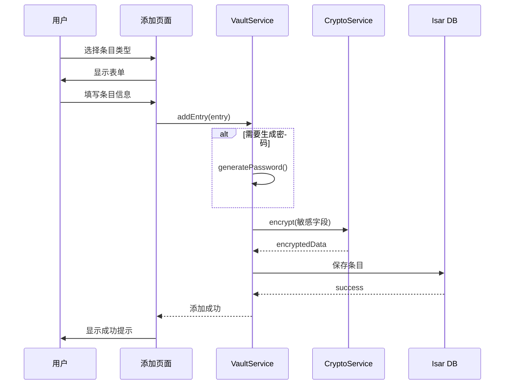

# 保险库模块

> **版本**: v1.1.0  
> **更新日期**: 2026-02-20  
> **作者**: Vaultly Team  
> **文档体系**: 渐进式文档（project-wiki）

---

## 版本历史

| 版本 | 日期 | 修改内容 | 作者 |
|------|------|----------|------|
| v1.0.0 | 2026-02-20 | 初始版本 | Vaultly Team |
| v1.1.0 | 2026-02-20 | 补充代码实现映射、完善数据流设计 | Vaultly Team |

---

## 一、模块概述

### 1.1 模块职责

保险库模块负责管理用户的各类敏感数据，包括登录凭证、银行卡、安全笔记、身份信息等。

### 1.2 核心功能

| 功能 | 描述 |
|------|------|
| 条目管理 | 添加、编辑、删除条目 |
| 条目搜索 | 全文搜索、按类型筛选 |
| 密码生成 | 强密码生成器 |
| 条目分类 | 标签、收藏、文件夹 |
| 数据导出 | 加密导出 |

---

## 二、条目类型

### 2.1 条目类型定义

| 类型 | 描述 | 关键字段 |
|------|------|----------|
| **Login** | 登录凭证 | username, password, url, totpSecret |
| **BankCard** | 银行卡 | cardNumber, cardHolder, expiry, cvv |
| **SecureNote** | 安全笔记 | content (Markdown) |
| **Identity** | 身份信息 | firstName, lastName, idNumber |
| **Custom** | 自定义条目 | 自定义字段 |

### 2.2 条目结构

```dart
// 基础条目
abstract class VaultEntry {
  String id;
  String title;
  DateTime createdAt;
  DateTime updatedAt;
  EntryType type;
  List<CustomField> customFields;
  List<String> tags;
  bool isFavorite;
  String? folderId;
}

// 登录凭证
class LoginEntry extends VaultEntry {
  String? username;
  String? email;
  String password;        // 加密存储
  String? url;
  String? totpSecret;    // 加密存储
  String? notes;
  List<String> favIcons;
}

// 银行卡
class BankCardEntry extends VaultEntry {
  String cardNumber;     // 加密存储
  String cardHolderName;
  int expiryMonth;
  int expiryYear;
  String? cvv;           // 加密存储
  String? bankName;
  CardType cardType;
}

// 安全笔记
class SecureNoteEntry extends VaultEntry {
  String content;        // 加密存储
  bool isMarkdown;
}

// 身份信息
class IdentityEntry extends VaultEntry {
  String? firstName;
  String? lastName;
  String? middleName;
  DateTime? birthDate;
  String? idNumber;      // 加密存储
  String? address;
  String? phone;
  String? email;
}

// 自定义字段
class CustomField {
  String name;
  String value;          // 加密存储
  FieldType type;        // text, hidden, date, url
  bool isSecret;
}
```

---

## 三、核心服务

### 3.1 VaultService

```dart
class VaultService {
  // 条目 CRUD
  Future<String> addEntry(VaultEntry entry);
  Future<void> updateEntry(VaultEntry entry);
  Future<void> deleteEntry(String id);
  Future<VaultEntry?> getEntry(String id);
  
  // 查询
  Future<List<VaultEntry>> getAllEntries();
  Future<List<VaultEntry>> searchEntries(String query);
  Future<List<VaultEntry>> getEntriesByType(EntryType type);
  Future<List<VaultEntry>> getFavorites();
  Future<List<VaultEntry>> getByTag(String tag);
  
  // 标签管理
  Future<void> addTag(String entryId, String tag);
  Future<void> removeTag(String entryId, String tag);
  Future<List<String>> getAllTags();
  
  // 收藏
  Future<void> toggleFavorite(String entryId);
}
```

### 3.2 PasswordGenerator

```dart
class PasswordGenerator {
  String generate({
    int length = 16,
    bool includeUppercase = true,
    bool includeLowercase = true,
    bool includeNumbers = true,
    bool includeSymbols = true,
    String? excludeChars,
  });
  
  int calculateStrength(String password);
}
```

---

## 四、数据流

### 4.1 添加条目流程



---

## 五、搜索功能

### 5.1 搜索实现

```dart
class SearchService {
  Future<List<VaultEntry>> search(String query) async {
    // 1. 搜索标题
    final titleResults = await _db.entries
        .filter()
        .titleContains(query, caseSensitive: false)
        .findAll();
    
    // 2. 搜索用户名
    final usernameResults = await _db.entries
        .filter()
        .anyOf([
          (q) => q.usernameContains(query),
          (q) => q.emailContains(query),
          (q) => q.urlContains(query),
        ])
        .findAll();
    
    // 3. 搜索标签
    final tagResults = await _db.entries
        .filter()
        .tagsElementContains(query)
        .findAll();
    
    // 合并结果
    return _mergeResults([titleResults, usernameResults, tagResults]);
  }
}
```

---

## 六、密码强度检测

### 6.1 强度等级

| 等级 | 分数 | 描述 |
|------|------|------|
| 非常弱 | 0-20 | 易被破解 |
| 弱 | 20-40 | 不推荐 |
| 中等 | 40-60 | 勉强可用 |
| 强 | 60-80 | 推荐 |
| 非常强 | 80-100 | 最佳 |

### 6.2 检测规则

| 检查项 | 加分/扣分 |
|--------|----------|
| 长度 > 8 | +10 |
| 长度 > 12 | +15 |
| 长度 > 16 | +20 |
| 包含大写字母 | +10 |
| 包含小写字母 | +10 |
| 包含数字 | +10 |
| 包含特殊字符 | +15 |
| 常见密码 | -30 |

---

## 七、代码实现映射

### 7.1 核心实现文件

| 服务/组件 | 实现文件 | 关键类/方法 |
|-----------|----------|-------------|
| **保险库服务** | `lib/core/services/vault_service.dart` | `VaultService` |
| **密码生成器** | `lib/core/utils/password_generator.dart` | `PasswordGenerator` |
| **密码策略** | `lib/core/utils/password_policy.dart` | `PasswordPolicy` |
| **条目模型** | `lib/core/models/vault_entry.dart` | `VaultEntry` 及子类 |
| **保险库仓库** | `lib/core/repositories/vault_repository.dart` | `VaultRepository` |
| **保险库状态** | `lib/core/providers/vault_service_provider.dart` | `VaultServiceNotifier` |
| **保险库页面** | `lib/ui/pages/vault_page.dart` | `VaultPage` |
| **添加条目页** | `lib/ui/pages/add_entry_page.dart` | `AddEntryPage` |
| **条目详情页** | `lib/ui/pages/entry_detail_page.dart` | `EntryDetailPage` |

### 7.2 保险库服务实现

```dart
// lib/core/services/vault_service.dart
class VaultService {
  final VaultRepository _repository;
  final CryptoService _cryptoService;
  final PasswordGenerator _passwordGenerator;
  
  // 添加条目
  Future<VaultEntry> addEntry(VaultEntry entry) async {
    // 1. 分离敏感字段和非敏感字段
    final sensitiveData = _extractSensitiveFields(entry);
    final nonSensitiveData = _extractNonSensitiveFields(entry);
    
    // 2. 加密敏感字段
    final encryptedData = await _cryptoService.encrypt(
      jsonEncode(sensitiveData),
      await _getVaultKey(),
    );
    
    // 3. 创建新条目
    final newEntry = entry.copyWith(
      id: const Uuid().v4(),
      createdAt: DateTime.now(),
      updatedAt: DateTime.now(),
      encryptedData: encryptedData,
    );
    
    // 4. 保存到仓库
    return await _repository.saveEntry(newEntry);
  }
  
  // 获取条目（含解密）
  Future<VaultEntry?> getEntry(String id) async {
    final entry = await _repository.getEntry(id);
    if (entry == null) return null;
    
    // 解密敏感字段
    if (entry.encryptedData != null) {
      final decryptedJson = await _cryptoService.decrypt(
        entry.encryptedData!,
        await _getVaultKey(),
      );
      final sensitiveData = jsonDecode(decryptedJson);
      return _mergeEntryData(entry, sensitiveData);
    }
    
    return entry;
  }
  
  // 搜索条目
  Future<List<VaultEntry>> searchEntries(String query) async {
    // 1. 搜索非加密字段
    final results = await _repository.searchByTitle(query);
    
    // 2. 加载并解密匹配的结果
    final decryptedResults = <VaultEntry>[];
    for (final entry in results) {
      final decrypted = await getEntry(entry.id);
      if (decrypted != null) {
        decryptedResults.add(decrypted);
      }
    }
    
    return decryptedResults;
  }
  
  // 生成强密码
  String generatePassword({
    int length = 16,
    bool includeUppercase = true,
    bool includeLowercase = true,
    bool includeNumbers = true,
    bool includeSymbols = true,
  }) {
    return _passwordGenerator.generate(
      length: length,
      includeUppercase: includeUppercase,
      includeLowercase: includeLowercase,
      includeNumbers: includeNumbers,
      includeSymbols: includeSymbols,
    );
  }
  
  // 计算密码强度
  int calculatePasswordStrength(String password) {
    return PasswordPolicy.calculateStrength(password);
  }
}
```

### 7.3 密码生成器实现

```dart
// lib/core/utils/password_generator.dart
class PasswordGenerator {
  static const String _uppercase = 'ABCDEFGHIJKLMNOPQRSTUVWXYZ';
  static const String _lowercase = 'abcdefghijklmnopqrstuvwxyz';
  static const String _numbers = '0123456789';
  static const String _symbols = '!@#\$%^&*()_+-=[]{}|;:,.<>?';
  
  String generate({
    int length = 16,
    bool includeUppercase = true,
    bool includeLowercase = true,
    bool includeNumbers = true,
    bool includeSymbols = true,
    String? excludeChars,
  }) {
    // 1. 构建字符集
    var charset = '';
    if (includeUppercase) charset += _uppercase;
    if (includeLowercase) charset += _lowercase;
    if (includeNumbers) charset += _numbers;
    if (includeSymbols) charset += _symbols;
    
    // 2. 排除指定字符
    if (excludeChars != null) {
      for (final char in excludeChars.split('')) {
        charset = charset.replaceAll(char, '');
      }
    }
    
    // 3. 确保至少包含每种类型的字符
    final password = <String>[];
    final random = Random.secure();
    
    if (includeUppercase) {
      password.add(_uppercase[random.nextInt(_uppercase.length)]);
    }
    if (includeLowercase) {
      password.add(_lowercase[random.nextInt(_lowercase.length)]);
    }
    if (includeNumbers) {
      password.add(_numbers[random.nextInt(_numbers.length)]);
    }
    if (includeSymbols) {
      password.add(_symbols[random.nextInt(_symbols.length)]);
    }
    
    // 4. 填充剩余长度
    while (password.length < length) {
      password.add(charset[random.nextInt(charset.length)]);
    }
    
    // 5. 打乱顺序
    password.shuffle(random);
    
    return password.join();
  }
}
```

### 7.4 状态管理实现

```dart
// lib/core/providers/vault_service_provider.dart
final vaultServiceProvider = Provider<VaultService>((ref) {
  return VaultService(
    repository: ref.watch(vaultRepositoryProvider),
    cryptoService: ref.watch(cryptoServiceProvider),
    passwordGenerator: PasswordGenerator(),
  );
});

final vaultEntriesProvider = StreamProvider<List<VaultEntry>>((ref) {
  final vaultService = ref.watch(vaultServiceProvider);
  return vaultService.watchAllEntries();
});

final searchEntriesProvider = FutureProvider.family<List<VaultEntry>, String>(
  (ref, query) async {
    final vaultService = ref.watch(vaultServiceProvider);
    return await vaultService.searchEntries(query);
  },
);

final passwordStrengthProvider = Provider.family<int, String>(
  (ref, password) {
    return PasswordPolicy.calculateStrength(password);
  },
);
```

---

## 八、相关文档

### 8.1 架构设计
- [整体架构](../02-架构设计/整体架构.md) - 系统架构
- [安全架构](../02-架构设计/安全架构.md) - 安全设计

### 8.2 数据模型
- [数据字典](../04-数据模型/数据字典.md) - 数据结构
- [加密结构](../04-数据模型/加密结构.md) - 加密数据格式

### 8.3 渐进式文档链
- [保险库管理功能](../功能文档/保险库管理功能.md) - 功能需求
- [保险库管理需求](../需求文档/保险库管理需求.md) - 数据模型与数据流
- [保险库管理架构](../架构文档/保险库管理架构.md) - 技术选型与实现
