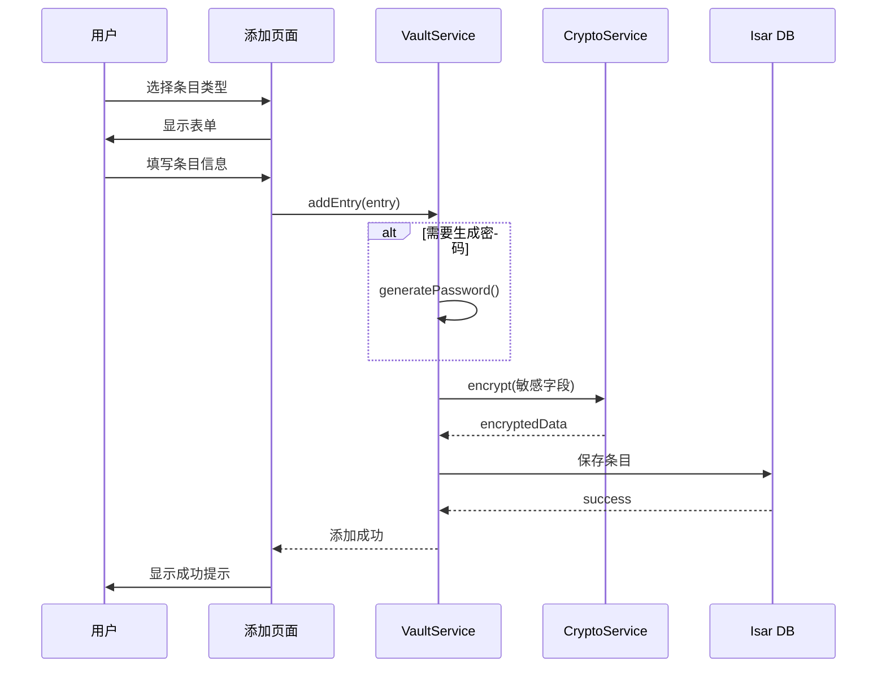

# 保险库模块

## 一、模块概述

### 1.1 模块职责

保险库模块负责管理用户的各类敏感数据，包括登录凭证、银行卡、安全笔记、身份信息等。

### 1.2 核心功能

| 功能 | 描述 |
|------|------|
| 条目管理 | 添加、编辑、删除条目 |
| 条目搜索 | 全文搜索、按类型筛选 |
| 密码生成 | 强密码生成器 |
| 条目分类 | 标签、收藏、文件夹 |
| 数据导出 | 加密导出 |

---

## 二、条目类型

### 2.1 条目类型定义

| 类型 | 描述 | 关键字段 |
|------|------|----------|
| **Login** | 登录凭证 | username, password, url, totpSecret |
| **BankCard** | 银行卡 | cardNumber, cardHolder, expiry, cvv |
| **SecureNote** | 安全笔记 | content (Markdown) |
| **Identity** | 身份信息 | firstName, lastName, idNumber |
| **Custom** | 自定义条目 | 自定义字段 |

### 2.2 条目结构

```dart
// 基础条目
abstract class VaultEntry {
  String id;
  String title;
  DateTime createdAt;
  DateTime updatedAt;
  EntryType type;
  List<CustomField> customFields;
  List<String> tags;
  bool isFavorite;
  String? folderId;
}

// 登录凭证
class LoginEntry extends VaultEntry {
  String? username;
  String? email;
  String password;        // 加密存储
  String? url;
  String? totpSecret;    // 加密存储
  String? notes;
  List<String> favIcons;
}

// 银行卡
class BankCardEntry extends VaultEntry {
  String cardNumber;     // 加密存储
  String cardHolderName;
  int expiryMonth;
  int expiryYear;
  String? cvv;           // 加密存储
  String? bankName;
  CardType cardType;
}

// 安全笔记
class SecureNoteEntry extends VaultEntry {
  String content;        // 加密存储
  bool isMarkdown;
}

// 身份信息
class IdentityEntry extends VaultEntry {
  String? firstName;
  String? lastName;
  String? middleName;
  DateTime? birthDate;
  String? idNumber;      // 加密存储
  String? address;
  String? phone;
  String? email;
}

// 自定义字段
class CustomField {
  String name;
  String value;          // 加密存储
  FieldType type;        // text, hidden, date, url
  bool isSecret;
}
```

---

## 三、核心服务

### 3.1 VaultService

```dart
class VaultService {
  // 条目 CRUD
  Future<String> addEntry(VaultEntry entry);
  Future<void> updateEntry(VaultEntry entry);
  Future<void> deleteEntry(String id);
  Future<VaultEntry?> getEntry(String id);
  
  // 查询
  Future<List<VaultEntry>> getAllEntries();
  Future<List<VaultEntry>> searchEntries(String query);
  Future<List<VaultEntry>> getEntriesByType(EntryType type);
  Future<List<VaultEntry>> getFavorites();
  Future<List<VaultEntry>> getByTag(String tag);
  
  // 标签管理
  Future<void> addTag(String entryId, String tag);
  Future<void> removeTag(String entryId, String tag);
  Future<List<String>> getAllTags();
  
  // 收藏
  Future<void> toggleFavorite(String entryId);
}
```

### 3.2 PasswordGenerator

```dart
class PasswordGenerator {
  String generate({
    int length = 16,
    bool includeUppercase = true,
    bool includeLowercase = true,
    bool includeNumbers = true,
    bool includeSymbols = true,
    String? excludeChars,
  });
  
  int calculateStrength(String password);
}
```

---

## 四、数据流

### 4.1 添加条目流程



---

## 五、搜索功能

### 5.1 搜索实现

```dart
class SearchService {
  Future<List<VaultEntry>> search(String query) async {
    // 1. 搜索标题
    final titleResults = await _db.entries
        .filter()
        .titleContains(query, caseSensitive: false)
        .findAll();
    
    // 2. 搜索用户名
    final usernameResults = await _db.entries
        .filter()
        .anyOf([
          (q) => q.usernameContains(query),
          (q) => q.emailContains(query),
          (q) => q.urlContains(query),
        ])
        .findAll();
    
    // 3. 搜索标签
    final tagResults = await _db.entries
        .filter()
        .tagsElementContains(query)
        .findAll();
    
    // 合并结果
    return _mergeResults([titleResults, usernameResults, tagResults]);
  }
}
```

---

## 六、密码强度检测

### 6.1 强度等级

| 等级 | 分数 | 描述 |
|------|------|------|
| 非常弱 | 0-20 | 易被破解 |
| 弱 | 20-40 | 不推荐 |
| 中等 | 40-60 | 勉强可用 |
| 强 | 60-80 | 推荐 |
| 非常强 | 80-100 | 最佳 |

### 6.2 检测规则

| 检查项 | 加分/扣分 |
|--------|----------|
| 长度 > 8 | +10 |
| 长度 > 12 | +15 |
| 长度 > 16 | +20 |
| 包含大写字母 | +10 |
| 包含小写字母 | +10 |
| 包含数字 | +10 |
| 包含特殊字符 | +15 |
| 常见密码 | -30 |

---

## 七、相关文档

- [整体架构](../02-架构设计/整体架构.md) - 系统架构
- [数据模型](../04-数据模型/数据字典.md) - 数据结构
- [保险库接口](../05-API接口/保险库接口.md) - API 接口
