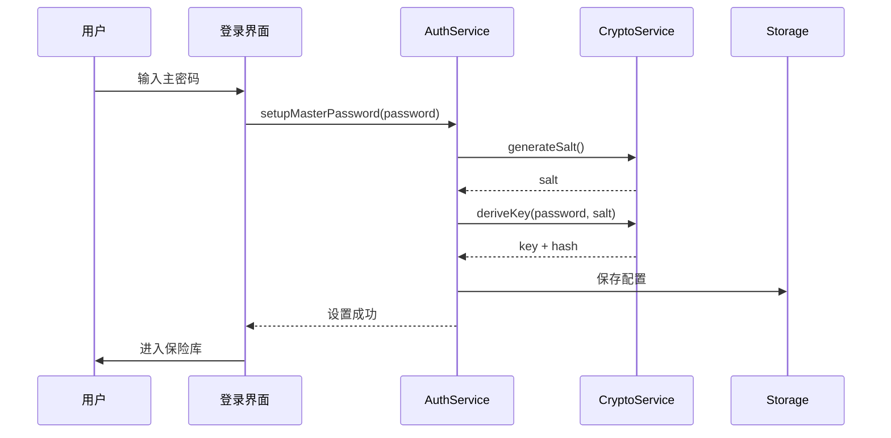
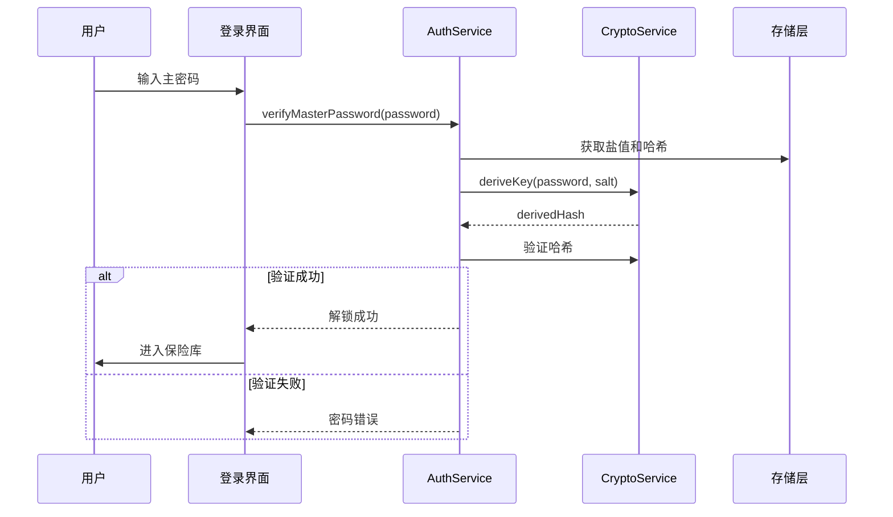
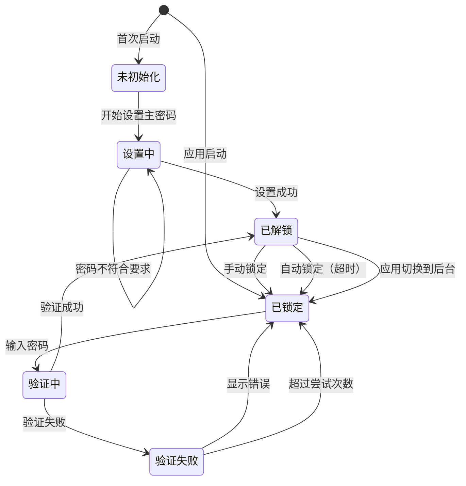

# 认证模块

> **版本**: v1.2.0  
> **更新日期**: 2026-02-21  
> **作者**: Vaultly Team  
> **文档体系**: 渐进式文档（project-wiki）

---

## 版本历史

| 版本 | 日期 | 修改内容 | 作者 |
|------|------|----------|------|
| v1.0.0 | 2026-02-20 | 初始版本 | Vaultly Team |
| v1.1.0 | 2026-02-20 | 补充代码实现映射、完善状态机设计 | Vaultly Team |
| v1.2.0 | 2026-02-21 | 移除生物识别相关内容 | Vaultly Team |

---

## 一、模块概述

### 1.1 模块职责

认证模块负责用户身份验证、会话管理和安全解锁，是整个应用的安全入口。

### 1.2 核心功能

| 功能 | 描述 |
|------|------|
| 主密码设置 | 首次使用时设置主密码 |
| 主密码验证 | 解锁时验证主密码 |
| 会话管理 | 自动锁定、超时锁定 |
| 密码重置 | 通过安全问题重置 |

---

## 二、数据结构

### 2.1 认证数据

```dart
class AuthConfig {
  String vaultId;           // 保险库 ID
  String passwordHash;     // Argon2id 哈希
  String salt;             // 密码盐值
  int lockTimeout;         // 锁定超时时间（分钟）
  int failedAttempts;     // 失败尝试次数
  DateTime? lockedUntil;  // 锁定截止时间
}

class Session {
  String sessionId;
  DateTime createdAt;
  DateTime lastActiveAt;
  bool isLocked;
}
```

---

## 三、核心服务

### 3.1 AuthService

```dart
class AuthService {
  // 设置主密码
  Future<void> setupMasterPassword(String password);
  
  // 验证主密码
  Future<bool> verifyMasterPassword(String password);
  
  // 解锁会话
  Future<bool> unlock(String password);
  
  // 锁定会话
  void lock();
  
  // 检查是否已设置密码
  Future<bool> isPasswordSet();
}
```

---

## 四、登录流程

### 4.1 首次设置流程



### 4.2 解锁流程



---

## 五、安全特性

### 5.1 密码策略

#### 5.1.1 基本要求

| 规则 | 要求 |
|------|------|
| 最小长度 | 8 字符 |
| 最大长度 | 128 字符 |
| 大小写 | 至少包含 |
| 数字 | 至少包含 |
| 特殊字符 | 建议包含 |

#### 5.1.2 密码强度计算

密码强度采用评分制（0-100分），根据以下规则计算：

**长度加分：**
| 密码长度 | 得分 |
|----------|------|
| ≥ 8 字符 | +10 |
| ≥ 12 字符 | +15 |
| ≥ 16 字符 | +20 |
| ≥ 20 字符 | +10 |

**字符类型加分：**
| 字符类型 | 得分 |
|----------|------|
| 大写字母 (A-Z) | +10 |
| 小写字母 (a-z) | +10 |
| 数字 (0-9) | +10 |
| 特殊字符 | +15 |

**组合奖励：**
- 长度 ≥ 12 且包含全部四种字符类型：+10

**扣分项：**
| 问题 | 扣分 |
|------|------|
| 常见密码 | -30 |
| 过多重复字符 | -10 |
| 连续字符序列 (123, abc) | -10 |

**强度等级：**
| 分数范围 | 等级 | 颜色 |
|----------|------|------|
| 0-19 | 非常弱 | 红色 |
| 20-39 | 弱 | 橙色 |
| 40-59 | 中等 | 黄色 |
| 60-79 | 强 | 浅绿 |
| 80-100 | 非常强 | 绿色 |

> **注意：** 密码强度达到 80 分即为"非常强"，不需要进度条完全填满（100分）。这是正常设计，因为 80 分以上的密码已具备足够的安全性。

### 5.2 锁定策略

| 条件 | 动作 |
|------|------|
| 连续 5 次失败 | 锁定 5 分钟 |
| 连续 10 次失败 | 锁定 30 分钟 |
| 30 分钟无操作 | 自动锁定 |
| 应用进入后台 | 可选立即锁定 |

---

## 六、状态机设计

### 6.1 认证状态机



### 6.2 状态定义

| 状态 | 说明 | 允许操作 |
|------|------|---------|
| 未初始化 | 首次使用，未设置主密码 | 设置主密码 |
| 设置中 | 正在设置主密码 | 确认设置、取消 |
| 已锁定 | 需要验证才能访问 | 输入密码 |
| 验证中 | 正在验证密码 | - |
| 验证失败 | 密码验证失败 | 重试、显示错误 |
| 已解锁 | 已验证，可访问保险库 | 访问数据、锁定 |

---

## 七、代码实现映射

### 7.1 核心实现文件

| 服务 | 实现文件 | 关键类/方法 |
|------|----------|-------------|
| **认证服务** | `lib/core/crypto/services/auth_service.dart` | `AuthService` |
| **加密服务** | `lib/core/crypto/services/crypto_service.dart` | `CryptoService` |
| **自动锁定服务** | `lib/core/services/auto_lock_service.dart` | `AutoLockService` |
| **认证状态管理** | `lib/core/providers/auth_provider.dart` | `AuthNotifier` |
| **登录页面** | `lib/ui/pages/login_page.dart` | `LoginPage` |
| **解锁页面** | `lib/ui/pages/unlock_page.dart` | `UnlockPage` |

### 7.2 认证服务实现

```dart
// lib/core/crypto/services/auth_service.dart
class AuthService {
  final LocalStorageRepository _storage;
  final CryptoService _cryptoService;
  
  // 设置主密码
  Future<void> setupMasterPassword(String password) async {
    // 1. 生成随机盐值
    final salt = _cryptoService.generateSalt();
    
    // 2. 使用 Argon2id 派生密钥
    final keyMaterial = await _cryptoService.deriveKeyWithArgon2id(
      password: password,
      salt: salt,
    );
    
    // 3. 保存配置
    await _storage.saveAuthConfig(AuthConfig(
      salt: base64Encode(salt),
      passwordHash: keyMaterial.hash,
      lockTimeout: 30,
    ));
  }
  
  // 验证主密码
  Future<bool> verifyMasterPassword(String password) async {
    final config = await _storage.getAuthConfig();
    if (config == null) return false;
    
    final salt = base64Decode(config.salt);
    
    // 派生密钥并验证
    final keyMaterial = await _cryptoService.deriveKeyWithArgon2id(
      password: password,
      salt: salt,
    );
    
    return keyMaterial.hash == config.passwordHash;
  }
  
  // 解锁保险库
  Future<bool> unlock(String password) async {
    final isValid = await verifyMasterPassword(password);
    if (isValid) {
      // 派生 Vault 密钥并缓存到内存
      final vaultKey = await _deriveVaultKey(password);
      await _storage.setVaultKey(vaultKey);
      return true;
    }
    return false;
  }
}
```

### 7.3 状态管理实现

```dart
// lib/core/providers/auth_provider.dart
class AuthNotifier extends StateNotifier<AuthState> {
  final AuthService _authService;
  
  AuthNotifier(this._authService) 
      : super(AuthState.initial());
  
  Future<void> checkAuthStatus() async {
    final isPasswordSet = await _authService.isPasswordSet();
    if (!isPasswordSet) {
      state = state.copyWith(status: AuthStatus.uninitialized);
    } else {
      state = state.copyWith(status: AuthStatus.locked);
    }
  }
  
  Future<void> unlock(String password) async {
    state = state.copyWith(isLoading: true, error: null);
    
    final success = await _authService.unlock(password);
    
    if (success) {
      state = state.copyWith(
        status: AuthStatus.unlocked,
        isLoading: false,
      );
    } else {
      state = state.copyWith(
        isLoading: false,
        error: '密码错误',
      );
    }
  }
  
  void lock() {
    _authService.lock();
    state = state.copyWith(status: AuthStatus.locked);
  }
}
```

---

## 八、相关文档

### 8.1 架构设计
- [整体架构](../02-架构设计/整体架构.md) - 系统架构
- [安全架构](../02-架构设计/安全架构.md) - 安全设计

### 8.2 渐进式文档链
- [用户认证功能](../功能文档/用户认证功能.md) - 功能需求
- [用户认证需求](../需求文档/用户认证需求.md) - 数据模型与数据流
- [用户认证架构](../架构文档/用户认证架构.md) - 技术选型与实现

### 8.3 状态机
- [认证状态机](../状态机/认证状态机.md) - 状态转换设计
