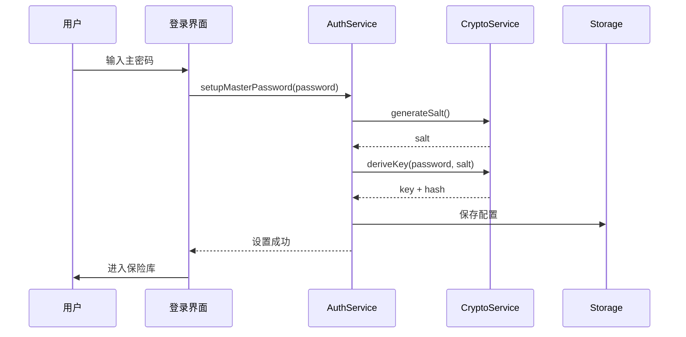
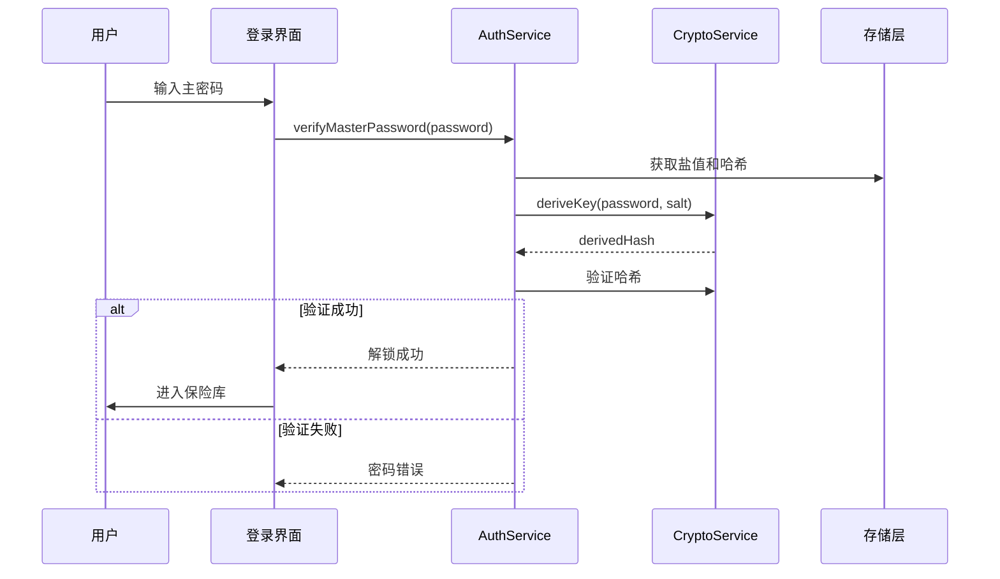

# 认证模块

## 一、模块概述

### 1.1 模块职责

认证模块负责用户身份验证、会话管理和安全解锁，是整个应用的安全入口。

### 1.2 核心功能

| 功能 | 描述 |
|------|------|
| 主密码设置 | 首次使用时设置主密码 |
| 主密码验证 | 解锁时验证主密码 |
| 生物识别 | 指纹/Face ID 快速解锁 |
| 会话管理 | 自动锁定、超时锁定 |
| 密码重置 | 通过安全问题重置 |

---

## 二、数据结构

### 2.1 认证数据

```dart
class AuthConfig {
  String vaultId;           // 保险库 ID
  String passwordHash;     // Argon2id 哈希
  String salt;             // 密码盐值
  bool biometricEnabled;   // 生物识别是否启用
  int lockTimeout;         // 锁定超时时间（分钟）
  int failedAttempts;     // 失败尝试次数
  DateTime? lockedUntil;  // 锁定截止时间
}

class Session {
  String sessionId;
  DateTime createdAt;
  DateTime lastActiveAt;
  bool isLocked;
}
```

---

## 三、核心服务

### 3.1 AuthService

```dart
class AuthService {
  // 设置主密码
  Future<void> setupMasterPassword(String password);
  
  // 验证主密码
  Future<bool> verifyMasterPassword(String password);
  
  // 解锁会话
  Future<bool> unlock(String password);
  
  // 锁定会话
  void lock();
  
  // 检查是否已设置密码
  Future<bool> isPasswordSet();
  
  // 启用生物识别
  Future<void> enableBiometric();
  
  // 禁用生物识别
  Future<void> disableBiometric();
  
  // 生物识别解锁
  Future<bool> unlockWithBiometric();
}
```

### 3.2 BiometricService

```dart
class BiometricService {
  // 检查生物识别是否可用
  Future<bool> isAvailable();
  
  // 获取可用的生物识别类型
  Future<List<BiometricType>> getAvailableTypes();
  
  // 执行生物识别认证
  Future<bool> authenticate({String reason});
}
```

---

## 四、登录流程

### 4.1 首次设置流程



### 4.2 解锁流程



---

## 五、安全特性

### 5.1 密码策略

| 规则 | 要求 |
|------|------|
| 最小长度 | 8 字符 |
| 最大长度 | 128 字符 |
| 大小写 | 至少包含 |
| 数字 | 至少包含 |
| 特殊字符 | 建议包含 |

### 5.2 锁定策略

| 条件 | 动作 |
|------|------|
| 连续 5 次失败 | 锁定 5 分钟 |
| 连续 10 次失败 | 锁定 30 分钟 |
| 30 分钟无操作 | 自动锁定 |
| 应用进入后台 | 可选立即锁定 |

---

## 六、相关文档

- [整体架构](../02-架构设计/整体架构.md) - 系统架构
- [安全架构](../02-架构设计/安全架构.md) - 安全设计
- [认证接口](../05-API接口/认证接口.md) - API 接口
