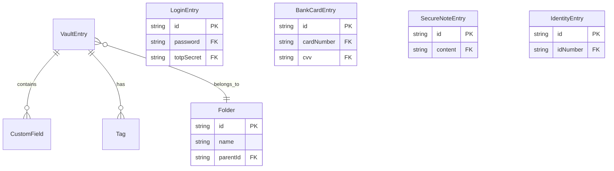

# 数据字典

## 一、核心数据模型

### 1.1 条目类型枚举

```dart
enum EntryType {
  login,       // 登录凭证
  bankCard,    // 银行卡
  secureNote,  // 安全笔记
  identity,    // 身份信息
  custom,      // 自定义
}

enum CardType {
  visa,
  mastercard,
  amex,
  discover,
  jcb,
  unionPay,
  other,
}

enum FieldType {
  text,
  hidden,
  date,
  url,
  email,
  phone,
  number,
}
```

### 1.2 VaultEntry - 基础条目

| 字段名 | 类型 | 必填 | 默认值 | 说明 |
|--------|------|------|--------|------|
| id | string (UUID) | 是 | 自动生成 | 唯一标识 |
| title | string | 是 | - | 条目标题 |
| type | EntryType | 是 | - | 条目类型 |
| createdAt | datetime | 是 | 创建时间 | 创建时间 |
| updatedAt | datetime | 是 | 更新时间 | 更新时间 |
| customFields | List\<CustomField\> | 否 | \[\] | 自定义字段 |
| tags | List\<string\> | 否 | \[\] | 标签 |
| isFavorite | bool | 否 | false | 是否收藏 |
| folderId | string? | 否 | null | 文件夹 ID |

### 1.3 LoginEntry - 登录凭证

| 字段名 | 类型 | 必填 | 加密 | 说明 |
|--------|------|------|------|------|
| username | string? | 否 | 否 | 用户名 |
| email | string? | 否 | 否 | 邮箱 |
| password | string | 是 | ✅ | 密码 |
| url | string? | 否 | 否 | 网站 URL |
| totpSecret | string? | 否 | ✅ | TOTP 密钥 |
| notes | string? | 否 | ✅ | 备注 |
| favIcons | List\<string\> | 否 | 否 | 网站图标 |

### 1.4 BankCardEntry - 银行卡

| 字段名 | 类型 | 必填 | 加密 | 说明 |
|--------|------|------|------|------|
| cardNumber | string | 是 | ✅ | 卡号 |
| cardHolderName | string | 是 | 否 | 持卡人姓名 |
| expiryMonth | int | 是 | 否 | 有效期月 |
| expiryYear | int | 是 | 否 | 有效期年 |
| cvv | string? | 否 | ✅ | CVV 码 |
| bankName | string? | 否 | 否 | 银行名称 |
| cardType | CardType | 否 | 否 | 卡类型 |

### 1.5 SecureNoteEntry - 安全笔记

| 字段名 | 类型 | 必填 | 加密 | 说明 |
|--------|------|------|------|------|
| content | string | 是 | ✅ | 笔记内容 |
| isMarkdown | bool | 否 | 否 | 是否支持 Markdown |

### 1.6 IdentityEntry - 身份信息

| 字段名 | 类型 | 必填 | 加密 | 说明 |
|--------|------|------|------|------|
| firstName | string? | 否 | 否 | 名 |
| lastName | string? | 否 | 否 | 姓 |
| middleName | string? | 否 | 否 | 中间名 |
| birthDate | date? | 否 | 否 | 出生日期 |
| idNumber | string? | 否 | ✅ | 证件号码 |
| address | string? | 否 | 否 | 地址 |
| phone | string? | 否 | 否 | 电话 |
| email | string? | 否 | 否 | 邮箱 |

### 1.7 CustomField - 自定义字段

| 字段名 | 类型 | 必填 | 加密 | 说明 |
|--------|------|------|------|------|
| name | string | 是 | 否 | 字段名称 |
| value | string | 是 | ✅ | 字段值 |
| type | FieldType | 否 | 否 | 字段类型 |
| isSecret | bool | 否 | false | 是否敏感 |

---

## 二、认证数据

### 2.1 AuthConfig - 认证配置

| 字段名 | 类型 | 必填 | 说明 |
|--------|------|------|------|
| vaultId | string | 是 | 保险库 ID |
| passwordHash | string | 是 | 密码哈希 |
| salt | string | 是 | 盐值 |
| biometricEnabled | bool | 否 | 生物识别启用 |
| lockTimeout | int | 否 | 锁定超时(分钟) |
| failedAttempts | int | 否 | 失败次数 |
| lockedUntil | datetime? | 否 | 锁定截止时间 |

### 2.2 Session - 会话

| 字段名 | 类型 | 必填 | 说明 |
|--------|------|------|------|
| sessionId | string | 是 | 会话 ID |
| createdAt | datetime | 是 | 创建时间 |
| lastActiveAt | datetime | 是 | 最后活跃时间 |
| isLocked | bool | 是 | 是否锁定 |

---

## 三、同步数据

### 3.1 VaultMetadata - 保险库元数据

| 字段名 | 类型 | 必填 | 说明 |
|--------|------|------|------|
| id | string | 是 | 保险库 ID |
| version | int | 是 | 数据版本 |
| salt | string | 是 | 盐值 |
| argon2Hash | string | 是 | Argon2 哈希 |
| lastSyncedAt | datetime | 否 | 最后同步时间 |
| entryCount | int | 否 | 条目数量 |
| checksum | string | 否 | 数据校验和 |

### 3.2 WebDAVConfig - WebDAV 配置

| 字段名 | 类型 | 必填 | 说明 |
|--------|------|------|------|
| serverUrl | string | 是 | 服务器 URL |
| username | string | 是 | 用户名 |
| password | string | 是 | 密码(加密) |
| remotePath | string | 是 | 远程路径 |
| enableSync | bool | 否 | 启用同步 |
| syncInterval | int | 否 | 同步间隔 |

### 3.3 SyncState - 同步状态

| 字段名 | 类型 | 必填 | 说明 |
|--------|------|------|------|
| status | SyncStatus | 是 | 同步状态 |
| lastSyncTime | datetime? | 否 | 最后同步时间 |
| localHash | string? | 否 | 本地哈希 |
| remoteHash | string? | 否 | 远程哈希 |
| conflicts | List\<Conflict\> | 否 | 冲突列表 |
| errorMessage | string? | 否 | 错误信息 |

---

## 四、ER 图

### 4.1 实体关系图



---

## 五、数据流

### 5.1 数据加密流

```
明文数据 (PlainText)
       │
       ▼
┌──────────────────┐
│  AES-256-GCM    │  ◄── 加密密钥 (来自 Argon2id)
│    加密          │
└────────┬─────────┘
         │
         ▼
┌──────────────────┐
│  密文 + IV + Tag │
└────────┬─────────┘
         │
         ▼
┌──────────────────┐
│    Isar DB      │
└──────────────────┘
```

---

## 六、相关文档

- [加密结构](./加密结构.md) - 加密数据格式
- [架构设计](../02-架构设计/整体架构.md) - 系统架构
- [模块设计](../03-模块设计/保险库模块.md) - 模块设计
