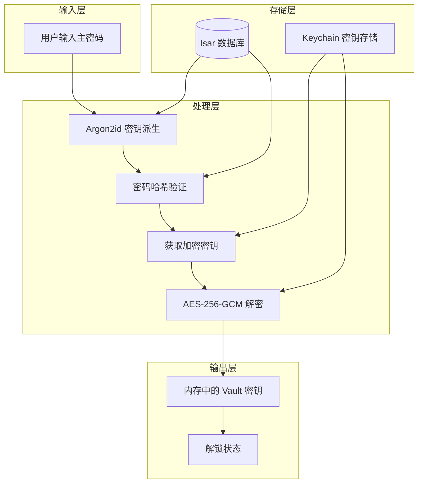
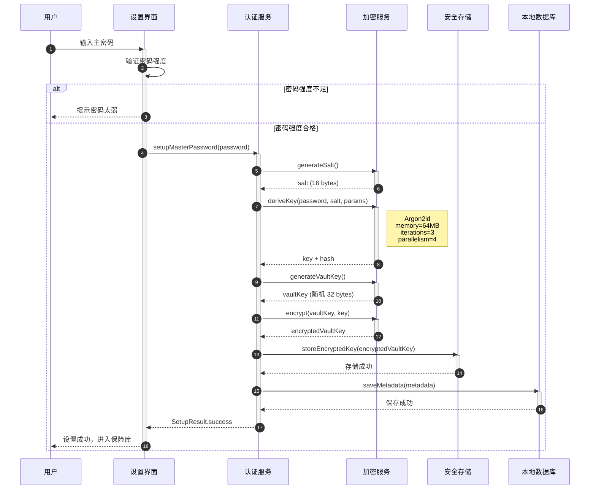
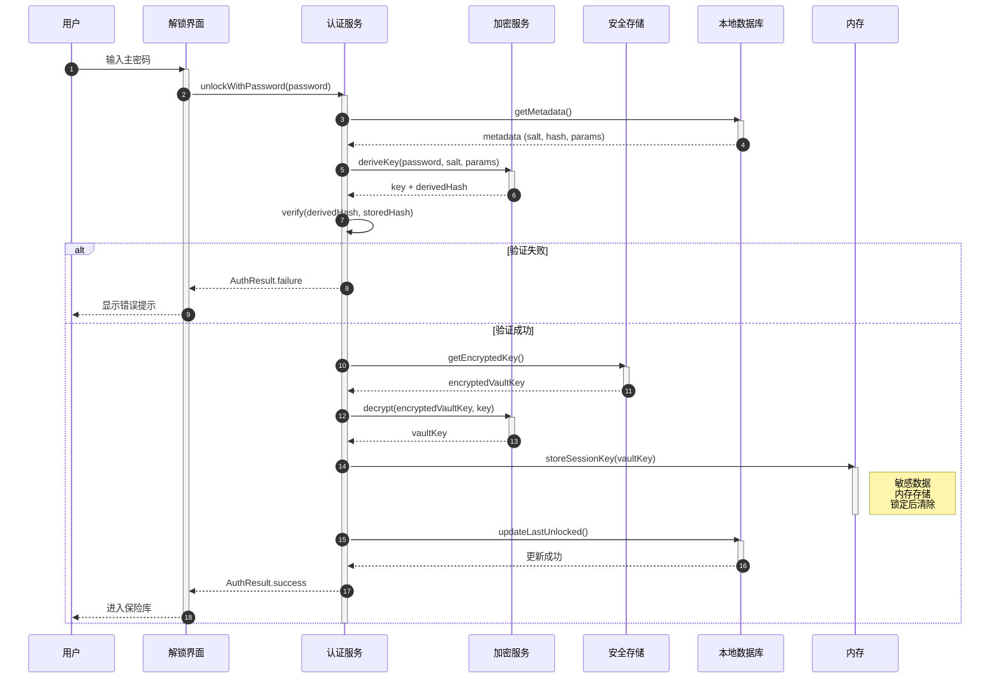
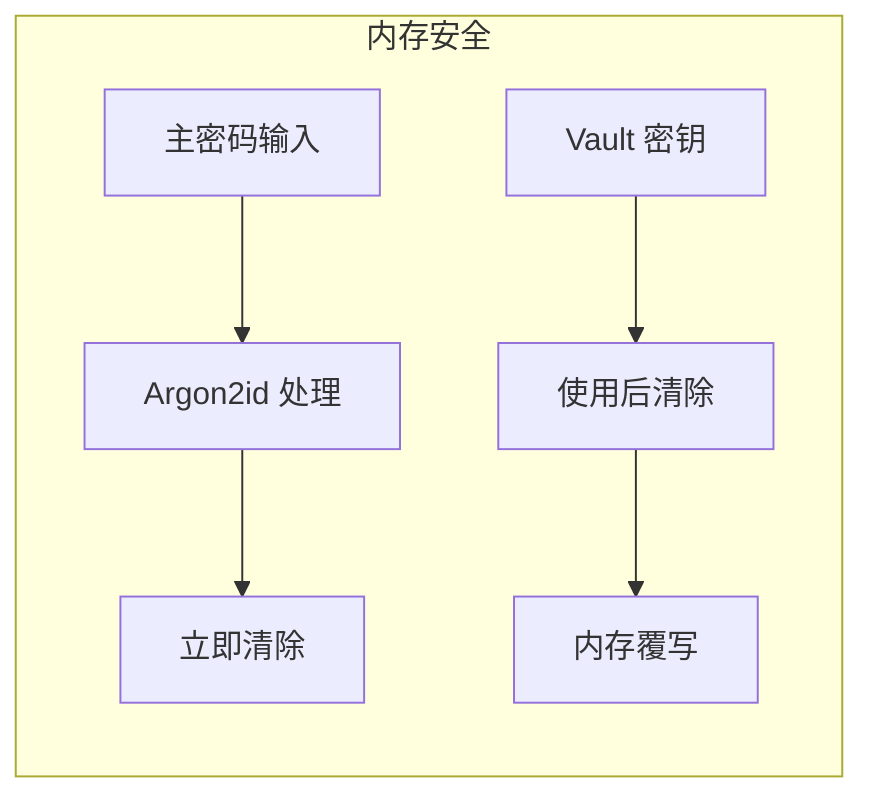

# 用户登录数据流

> 数据流动文档 - 描述用户登录流程中的数据流转路径

---

## 一、数据流概述

### 1.1 流程说明

用户登录数据流描述了从用户输入主密码到成功解锁保险库的完整数据流转过程。包含密钥派生、密码验证、数据解密等关键步骤。

### 1.2 数据流图



---

## 二、详细数据流

### 2.1 首次设置主密码数据流



#### 数据流转说明

| 步骤 | 数据源 | 数据目标 | 数据内容 | 处理方式 |
|------|--------|---------|---------|---------|
| 1 | 用户输入 | UI | 主密码（明文） | 输入验证 |
| 2 | CryptoService | AuthService | 随机盐值 (16 bytes) | 安全随机生成 |
| 3 | 密码+盐值 | CryptoService | 派生密钥 | Argon2id 慢哈希 |
| 4 | CryptoService | AuthService | 加密密钥 + 验证哈希 | 密钥分割 |
| 5 | CryptoService | AuthService | Vault 密钥 (32 bytes) | 安全随机生成 |
| 6 | Vault 密钥 | CryptoService | 加密后的 Vault 密钥 | AES-256-GCM |
| 7 | AuthService | Keychain | encryptedVaultKey | 安全存储 |
| 8 | AuthService | Isar | 元数据（含密码哈希）| 持久化存储 |

### 2.2 主密码解锁数据流



#### 数据流转说明

| 步骤 | 数据源 | 数据目标 | 数据内容 | 处理方式 |
|------|--------|---------|---------|---------|
| 1 | 用户输入 | UI | 主密码（明文） | 输入接收 |
| 2 | Isar | AuthService | 盐值、哈希、参数 | 元数据查询 |
| 3 | 密码+盐值 | CryptoService | 派生密钥 | Argon2id 哈希 |
| 4 | AuthService | 内部验证 | 哈希比对 | 安全比较 |
| 5 | Keychain | AuthService | 加密的 Vault 密钥 | 安全读取 |
| 6 | 加密密钥 | CryptoService | Vault 密钥（明文）| AES-256-GCM 解密 |
| 7 | AuthService | 内存 | Vault 密钥 | 会话存储 |
| 8 | AuthService | Isar | 最后解锁时间 | 状态更新 |

### 2.3 生物识别解锁数据流

```mermaid
sequenceDiagram
    autonumber
    participant User as 用户
    participant UI as 解锁界面
    participant AuthService as 认证服务
    participant Biometric as 生物识别服务
    participant Keychain as 安全存储
    participant Isar as 本地数据库
    participant Memory as 内存

    User->>UI: 点击生物识别按钮
    activate UI
    UI->>AuthService: unlockWithBiometric()
    activate AuthService
    
    AuthService->>Isar: getMetadata()
    activate Isar
    Isar-->>AuthService: metadata
    deactivate Isar
    
    alt 生物识别未启用
        AuthService-->>UI: BiometricResult.notEnabled
        UI-->>User: 提示先启用生物识别
    else 生物识别已启用
        AuthService->>Biometric: authenticate()
        activate Biometric
        
        alt 生物识别失败
            Biometric-->>AuthService: failure
            deactivate Biometric
            AuthService-->>UI: BiometricResult.failure
            UI-->>User: 提示使用主密码
        else 生物识别成功
            Biometric-->>AuthService: success
            deactivate Biometric
            
            AuthService->>Keychain: getBiometricProtectedKey()
            activate Keychain
            Keychain-->>AuthService: encryptedVaultKey
            deactivate Keychain
            
            AuthService->>Keychain: decryptWithBiometric(encryptedVaultKey)
            activate Keychain
            Keychain-->>AuthService: vaultKey
            deactivate Keychain
            
            AuthService->>Memory: storeSessionKey(vaultKey)
            activate Memory
            Note right of Memory: 生物识别保护<br/>硬件安全模块
            deactivate Memory
            
            AuthService->>Isar: updateLastUnlocked()
            activate Isar
            Isar-->>AuthService: 更新成功
            deactivate Isar
            
            AuthService-->>UI: AuthResult.success
            UI-->>User: 进入保险库
        end
    end
    deactivate AuthService
    deactivate UI
```

---

## 三、数据安全要点

### 3.1 敏感数据处理

| 数据类型 | 存储位置 | 加密方式 | 生命周期 |
|---------|---------|---------|---------|
| 主密码 | 不存储 | - | 输入后立即处理 |
| 密码哈希 | Isar | Argon2id | 永久存储 |
| Vault 密钥 | Keychain | 硬件加密 | 永久存储（加密状态）|
| 会话密钥 | 内存 | - | 解锁期间，锁定后清除 |
| 盐值 | Isar | 明文 | 永久存储 |

### 3.2 安全传输



### 3.3 数据一致性

| 检查点 | 机制 | 说明 |
|--------|------|------|
| 密码验证 | Argon2id 哈希比对 | 防止暴力破解 |
| 密钥完整性 | AES-GCM 认证标签 | 检测篡改 |
| 会话有效性 | 超时机制 | 自动锁定保护 |

---

## 四、性能指标

| 操作 | 目标耗时 | 瓶颈分析 |
|------|---------|---------|
| 密钥派生 | 500-1000ms | Argon2id 内存困难计算 |
| 密码验证 | < 100ms | 哈希比对 |
| 密钥解密 | < 50ms | AES-256-GCM |
| 总解锁时间 | < 2s | 用户体验可接受 |

---

## 五、错误处理

| 错误类型 | 处理策略 | 用户提示 |
|---------|---------|---------|
| 密码错误 | 失败计数 + 延迟 | "密码错误，请重试" |
| 生物识别失败 | 回退到密码 | "请使用主密码解锁" |
| 密钥损坏 | 数据恢复流程 | "数据损坏，请联系支持" |
| 内存不足 | 优雅降级 | "系统资源不足" |

---

## 六、相关文档

- [用户认证功能文档](../功能文档/用户认证功能.md)
- [用户认证需求文档](../需求文档/用户认证需求.md)
- [认证状态机](../状态机/认证状态机.md)

---

## 七、变更记录

| 版本 | 日期 | 变更内容 | 作者 |
|------|------|---------|------|
| v1.0 | 2026-02-20 | 初始版本 | Vaultly Team |
