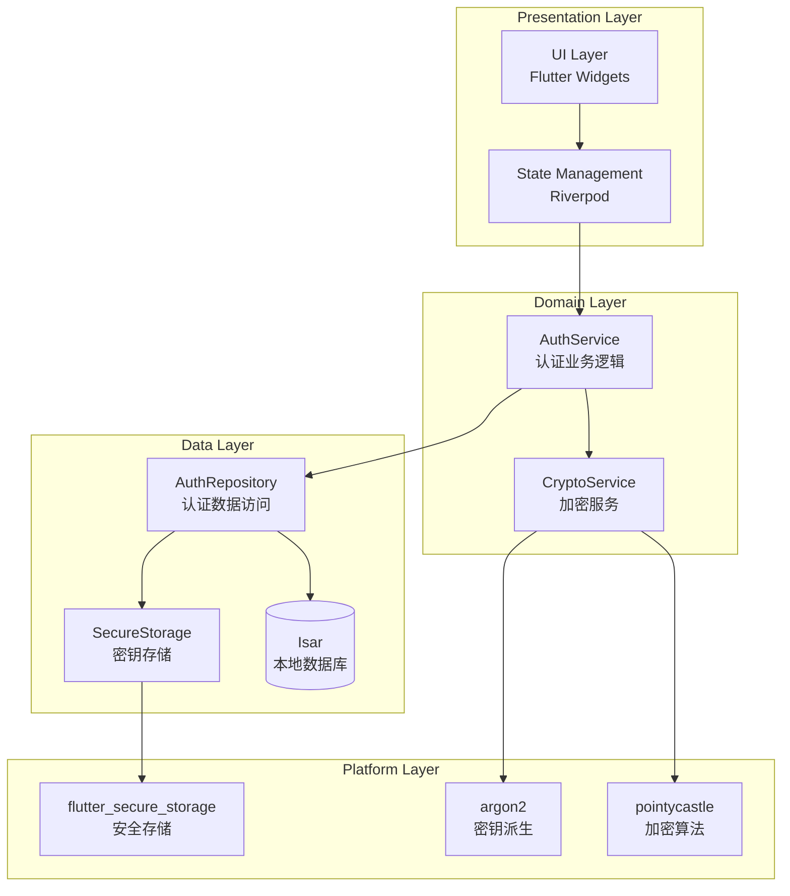
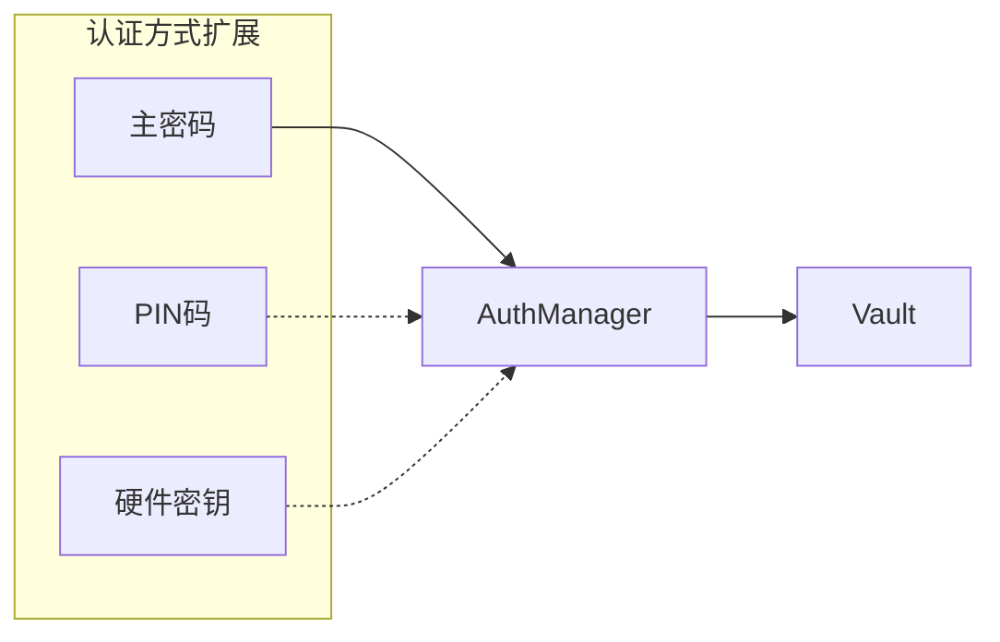
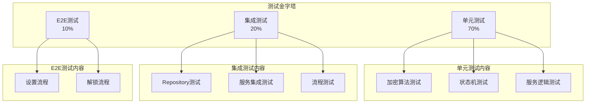
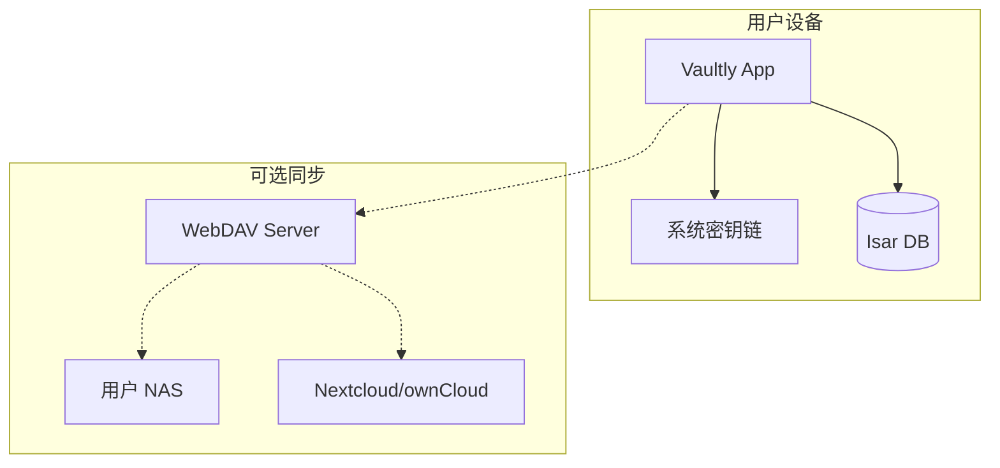
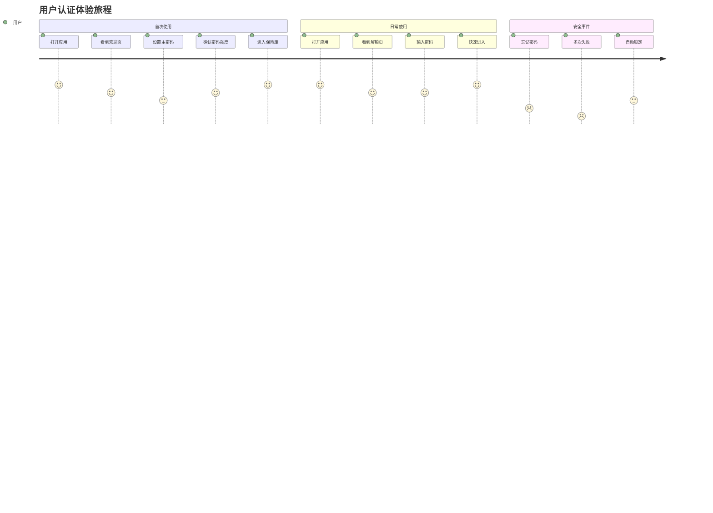

# 用户认证架构文档

> 架构文档 - 多角色视图、多维度设计、技术选型

---

## 一、架构师视图

### 1.1 整体架构



### 1.2 技术选型决策

#### 1.2.1 密钥派生算法

| 方案 | 优点 | 缺点 | 决策 |
|------|------|------|------|
| **Argon2id** | 抵抗 GPU/ASIC 攻击、内存困难 | 计算较慢 | ✅ 采用 |
| PBKDF2 | 标准、广泛支持 | 易被 GPU 加速 | ❌ 备选 |
| scrypt | 内存困难 | 参数调优复杂 | ❌ 备选 |
| bcrypt | 抵抗 GPU | 内存效率低 | ❌ 备选 |

**决策理由**：Argon2id 是密码哈希竞赛 winner，提供最佳安全性。

#### 1.2.2 对称加密算法

| 方案 | 优点 | 缺点 | 决策 |
|------|------|------|------|
| **AES-256-GCM** | 认证加密、性能优秀 | 需要 IV 管理 | ✅ 采用 |
| AES-256-CBC + HMAC | 广泛支持 | 需要额外认证 | ❌ 备选 |
| ChaCha20-Poly1305 | 流加密、移动端友好 | 较少硬件加速 | ❌ 备选 |

**决策理由**：AES-256-GCM 是业界标准，硬件加速支持好。

### 1.3 可扩展性设计



**扩展点**：
- 新增认证方式只需实现 `AuthProvider` 接口
- 支持多因素认证组合
- 未来可集成硬件安全密钥（YubiKey）

---

## 二、开发工程师视图

### 2.1 模块结构

```
lib/
├── features/
│   └── auth/
│       ├── data/
│       │   ├── repositories/
│       │   │   └── auth_repository.dart
│       │   ├── datasources/
│       │   │   └── secure_storage_datasource.dart
│       │   └── models/
│       │       └── vault_metadata_model.dart
│       ├── domain/
│       │   ├── entities/
│       │   │   ├── vault_metadata.dart
│       │   │   └── auth_session.dart
│       │   ├── repositories/
│       │   │   └── auth_repository_interface.dart
│       │   └── services/
        │   │       ├── auth_service.dart
        │   │       └── crypto_service.dart
│       └── presentation/
│           ├── providers/
│           │   └── auth_provider.dart
│           ├── screens/
│           │   ├── setup_screen.dart
│           │   ├── unlock_screen.dart
│           │   └── security_settings_screen.dart
│           └── widgets/
│               └── password_strength_indicator.dart
```

### 2.2 核心类设计

#### AuthService 实现

```dart
class AuthServiceImpl implements AuthService {
  final AuthRepository _repository;
  final CryptoService _crypto;
  
  // 内存中的会话密钥（敏感）
  Uint8List? _sessionKey;
  
  // 状态管理
  final _authStateController = StreamController<AuthState>.broadcast();
  
  @override
  Future<AuthResult> unlockWithPassword(String password) async {
    try {
      // 1. 获取元数据
      final metadata = await _repository.getMetadata();
      
      // 2. 派生密钥
      final result = await _crypto.deriveKey(
        password: password,
        salt: base64Decode(metadata.salt),
        params: Argon2Parameters.fromJson(metadata.argon2Params),
      );
      
      // 3. 验证哈希
      if (!await _crypto.verifyHash(result.hash, metadata.passwordHash)) {
        return AuthResult.failure;
      }
      
      // 4. 获取并解密 Vault 密钥
      final encryptedKey = await _repository.getEncryptedVaultKey();
      _sessionKey = await _crypto.decrypt(encryptedKey, result.key);
      
      // 5. 更新状态
      _authStateController.add(AuthState.unlocked);
      await _repository.updateLastUnlocked();
      
      return AuthResult.success;
    } catch (e) {
      return AuthResult.error;
    }
  }
  
  @override
  Future<void> lock() async {
    // 安全清除内存密钥
    _sessionKey?.fillRange(0, _sessionKey!.length, 0);
    _sessionKey = null;
    _authStateController.add(AuthState.locked);
  }
}
```

#### CryptoService 实现

```dart
class CryptoServiceImpl implements CryptoService {
  static const _keyLength = 32;  // AES-256
  static const _ivLength = 12;   // GCM recommended
  static const _saltLength = 16;
  
  @override
  Future<DerivedKeyResult> deriveKey({
    required String password,
    required Uint8List salt,
    required Argon2Parameters params,
  }) async {
    // 使用 Argon2id 派生密钥
    final argon2 = Argon2BytesGenerator();
    argon2.init(params.toParams());
    
    final passwordBytes = utf8.encode(password);
    final result = Uint8List(params.hashLength);
    
    argon2.generateBytes(passwordBytes, result);
    
    // 分割密钥和哈希
    final key = result.sublist(0, _keyLength);
    final hash = base64Encode(result);
    
    return DerivedKeyResult(key: key, hash: hash);
  }
  
  @override
  Future<EncryptedData> encrypt(Uint8List data, Uint8List key) async {
    // 生成随机 IV
    final iv = _secureRandom(_ivLength);
    
    // AES-256-GCM 加密
    final cipher = GCMBlockCipher(AESEngine())
      ..init(true, AEADParameters(KeyParameter(key), 128, iv));
    
    final encrypted = cipher.process(data);
    
    return EncryptedData(
      cipherText: base64Encode(encrypted),
      iv: base64Encode(iv),
      authTag: base64Encode(cipher.mac),
    );
  }
  
  Uint8List _secureRandom(int length) {
    final random = SecureRandom('Fortuna')
      ..seed(KeyParameter(Platform.instance.platformEntropy()));
    return random.nextBytes(length);
  }
}
```

### 2.3 数据访问层

#### AuthRepository

```dart
class AuthRepositoryImpl implements AuthRepository {
  final Isar _isar;
  final FlutterSecureStorage _secureStorage;
  
  @override
  Future<VaultMetadata> getMetadata() async {
    return await _isar.vaultMetadata.where().findFirst()
      ?? throw StateError('Vault not initialized');
  }
  
  @override
  Future<void> saveMetadata(VaultMetadata metadata) async {
    await _isar.writeTxn(() async {
      await _isar.vaultMetadata.put(metadata);
    });
  }
  
  @override
  Future<Uint8List> getEncryptedVaultKey() async {
    final base64Key = await _secureStorage.read(key: 'vault_key');
    if (base64Key == null) throw StateError('Vault key not found');
    return base64Decode(base64Key);
  }
  
  @override
  Future<void> saveEncryptedVaultKey(Uint8List key) async {
    await _secureStorage.write(
      key: 'vault_key',
      value: base64Encode(key),
    );
  }
}
```

---

## 三、测试工程师视图

### 3.1 测试策略



### 3.2 关键测试用例

#### 3.2.1 加密正确性测试

```dart
group('CryptoService', () {
  test('deriveKey should produce consistent results', () async {
    final password = 'test_password';
    final salt = Uint8List.fromList(List.generate(16, (i) => i));
    final params = Argon2Parameters.standard();
    
    final result1 = await cryptoService.deriveKey(
      password: password,
      salt: salt,
      params: params,
    );
    
    final result2 = await cryptoService.deriveKey(
      password: password,
      salt: salt,
      params: params,
    );
    
    expect(result1.hash, equals(result2.hash));
  });
  
  test('encrypt/decrypt roundtrip should work', () async {
    final data = utf8.encode('sensitive data');
    final key = Uint8List.fromList(List.generate(32, (i) => i));
    
    final encrypted = await cryptoService.encrypt(data, key);
    final decrypted = await cryptoService.decrypt(encrypted, key);
    
    expect(decrypted, equals(data));
  });
  
  test('decrypt with wrong key should fail', () async {
    final data = utf8.encode('sensitive data');
    final key = Uint8List.fromList(List.generate(32, (i) => i));
    final wrongKey = Uint8List.fromList(List.generate(32, (i) => i + 1));
    
    final encrypted = await cryptoService.encrypt(data, key);
    
    expect(
      () => cryptoService.decrypt(encrypted, wrongKey),
      throwsException,
    );
  });
});
```

#### 3.2.2 状态机测试

```dart
group('AuthStateMachine', () {
  test('should transition from locked to unlocked on success', () {
    final machine = AuthStateMachine();
    
    expect(machine.state, equals(AuthState.locked));
    
    machine.transition(AuthEvent.unlockWithPassword);
    expect(machine.state, equals(AuthState.unlocking));
    
    machine.transition(AuthEvent.verifySuccess);
    expect(machine.state, equals(AuthState.unlocked));
  });
  
  test('should transition back to locked on lock event', () {
    final machine = AuthStateMachine(initialState: AuthState.unlocked);
    
    machine.transition(AuthEvent.lock);
    expect(machine.state, equals(AuthState.locked));
  });
  
  test('should handle auto-lock timeout', () async {
    final machine = AuthStateMachine(
      initialState: AuthState.unlocked,
      autoLockDuration: Duration(milliseconds: 100),
    );
    
    await Future.delayed(Duration(milliseconds: 150));
    expect(machine.state, equals(AuthState.locked));
  });
});
```

#### 3.2.3 边界条件测试

| 测试场景 | 输入 | 预期结果 |
|---------|------|---------|
| 空密码 | "" | 拒绝，提示密码不能为空 |
| 短密码 | "123" | 拒绝，提示密码太短 |
| 弱密码 | "password" | 拒绝，提示密码太弱 |
| 超长密码 | 129 个字符 | 拒绝，提示密码太长 |
| 特殊字符 | "p@ssw0rd!" | 接受，强度评估 |
| Unicode 密码 | "密码123" | 接受，正确处理 |
| 连续失败 | 错误密码 x5 | 临时锁定，延迟重试 |

---

## 四、运维/SRE 视图

### 4.1 部署架构



**特点**：
- 纯客户端应用，无需后端服务器
- 用户数据完全由用户控制
- 可选 WebDAV 同步，数据端到端加密

### 4.2 监控指标

| 指标 | 类型 | 说明 |
|------|------|------|
| auth_success_rate | 成功率 | 认证成功比例 |
| auth_duration | 延迟 | 认证耗时（P50/P95/P99） |
| auto_lock_count | 计数 | 自动锁定次数 |
| session_duration | 分布 | 会话持续时长 |

### 4.3 故障排查

| 故障现象 | 可能原因 | 排查步骤 |
|---------|---------|---------|
| 无法解锁 | 密码错误 | 检查密码哈希、Argon2 参数 |
| 数据损坏 | 存储问题 | 校验数据完整性哈希 |
| 性能下降 | 密钥派生慢 | 检查 Argon2 参数配置 |

---

## 五、产品经理视图

### 5.1 用户旅程地图



### 5.2 功能覆盖矩阵

| 功能 | MVP | v0.2 | v1.0 |
|------|-----|------|------|
| 主密码设置 | ✅ | ✅ | ✅ |
| 主密码解锁 | ✅ | ✅ | ✅ |
| 自动锁定 | ⚠️ | ✅ | ✅ |
| 修改密码 | ⚠️ | ✅ | ✅ |
| PIN 码 | ❌ | ❌ | ⚠️ |
| 硬件密钥 | ❌ | ❌ | ❌ |

### 5.3 体验风险

| 风险 | 影响 | 缓解措施 |
|------|------|---------|
| 忘记主密码 | 高 | 明确告知无法恢复、建议导出备份 |
| 自动锁定太频繁 | 中 | 可配置时间、智能检测使用 |
| 首次设置复杂 | 低 | 密码强度实时反馈、提供建议 |

---

## 六、相关文档

- [用户认证功能文档](../功能文档/用户认证功能.md) - 功能需求、用户场景
- [用户认证需求文档](../需求文档/用户认证需求.md) - 数据模型、数据流动、状态管理
- [认证状态机](../状态机/认证状态机.md) - 状态转换设计
- [认证数据流](../数据流动/用户登录数据流.md) - 数据流动设计

---

## 七、变更记录

| 版本 | 日期 | 变更内容 | 作者 |
|------|------|---------|------|
| v1.1.0 | 2026-02-21 | 移除生物识别相关内容 | Vaultly Team |
| v1.0.0 | 2026-02-20 | 初始版本 | Vaultly Team |
