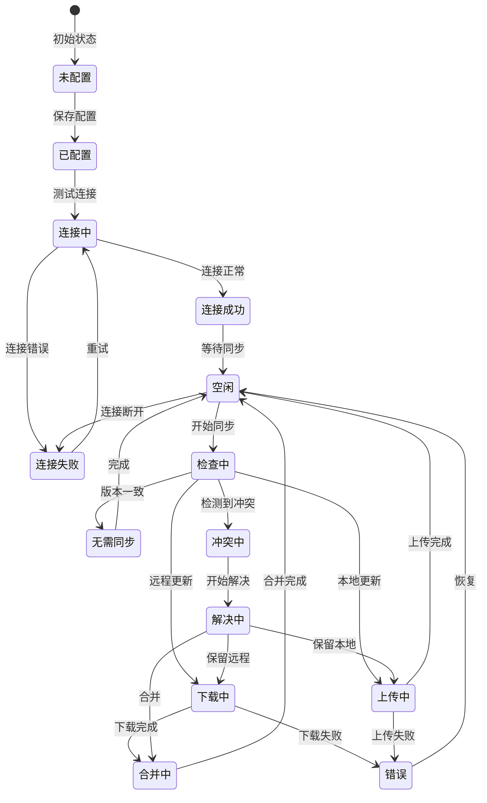

# 同步状态机

> 状态机文档 - 描述 WebDAV 同步模块的状态转换设计

---

## 一、状态机概述

### 1.1 设计目标

同步状态机用于管理 WebDAV 同步的完整生命周期，包括连接配置、版本检查、数据上传/下载、冲突处理等流程。

### 1.2 状态机图



---

## 二、状态定义

### 2.1 状态列表

| 状态 ID | 状态名称 | 说明 | 允许的事件 |
|---------|---------|------|-----------|
| SYNC-01 | 未配置 | 未设置 WebDAV 连接 | CONFIGURE |
| SYNC-02 | 已配置 | 已配置但未测试 | TEST_CONNECTION |
| SYNC-03 | 连接中 | 正在测试连接 | CONNECTION_SUCCESS, CONNECTION_FAILURE |
| SYNC-04 | 连接成功 | 连接正常 | START_SYNC |
| SYNC-05 | 连接失败 | 连接错误 | RETRY, UPDATE_CONFIG |
| SYNC-06 | 空闲 | 等待同步 | START_SYNC, DISCONNECT |
| SYNC-07 | 检查中 | 检查版本差异 | NO_CHANGES, NEED_DOWNLOAD, NEED_UPLOAD, CONFLICT_DETECTED |
| SYNC-08 | 无需同步 | 版本一致 | COMPLETE |
| SYNC-09 | 下载中 | 正在下载 | DOWNLOAD_COMPLETE, DOWNLOAD_ERROR |
| SYNC-10 | 上传中 | 正在上传 | UPLOAD_COMPLETE, UPLOAD_ERROR |
| SYNC-11 | 合并中 | 合并数据 | MERGE_COMPLETE |
| SYNC-12 | 冲突中 | 检测到冲突 | START_RESOLVE |
| SYNC-13 | 解决中 | 正在解决冲突 | RESOLUTION_COMPLETE |
| SYNC-14 | 错误 | 同步错误 | RETRY, RESET |

### 2.2 状态属性

```dart
class SyncState {
  final SyncStateType type;
  final DateTime enteredAt;
  final double progress;              // 进度 0-100
  final String? currentOperation;     // 当前操作描述
  final SyncError? error;             // 错误信息
  final List<Conflict>? conflicts;    // 冲突列表
  
  // 状态特定属性
  final int? retryCount;              // 重试次数（错误状态）
  final DateTime? retryAfter;         // 下次重试时间
}

enum SyncStateType {
  unconfigured,
  configured,
  connecting,
  connected,
  connectionFailed,
  idle,
  checking,
  noChanges,
  downloading,
  uploading,
  merging,
  conflicted,
  resolving,
  error,
}
```

---

## 三、事件定义

### 3.1 事件列表

| 事件 ID | 事件名称 | 触发条件 | 携带数据 |
|---------|---------|---------|---------|
| EVT-01 | CONFIGURE | 用户配置同步 | config: SyncConfig |
| EVT-02 | TEST_CONNECTION | 测试连接 | - |
| EVT-03 | CONNECTION_SUCCESS | 连接成功 | serverInfo: ServerInfo |
| EVT-04 | CONNECTION_FAILURE | 连接失败 | error: Error |
| EVT-05 | RETRY | 重试连接/同步 | - |
| EVT-06 | UPDATE_CONFIG | 更新配置 | config: SyncConfig |
| EVT-07 | START_SYNC | 开始同步 | - |
| EVT-08 | NO_CHANGES | 无需同步 | - |
| EVT-09 | NEED_DOWNLOAD | 需要下载 | remoteVersion: Version |
| EVT-10 | NEED_UPLOAD | 需要上传 | localVersion: Version |
| EVT-11 | CONFLICT_DETECTED | 检测到冲突 | conflicts: List<Conflict> |
| EVT-12 | DOWNLOAD_COMPLETE | 下载完成 | data: EncryptedData |
| EVT-13 | DOWNLOAD_ERROR | 下载失败 | error: Error |
| EVT-14 | UPLOAD_COMPLETE | 上传完成 | - |
| EVT-15 | UPLOAD_ERROR | 上传失败 | error: Error |
| EVT-16 | MERGE_COMPLETE | 合并完成 | - |
| EVT-17 | START_RESOLVE | 开始解决冲突 | - |
| EVT-18 | RESOLUTION_COMPLETE | 冲突解决完成 | resolution: Resolution |
| EVT-19 | COMPLETE | 同步完成 | result: SyncResult |
| EVT-20 | DISCONNECT | 断开连接 | - |
| EVT-21 | RESET | 重置状态 | - |

---

## 四、状态转换表

### 4.1 完整转换表

| 当前状态 | 事件 | 目标状态 | 动作 | 条件 |
|---------|------|---------|------|------|
| 未配置 | CONFIGURE | 已配置 | 保存配置 | - |
| 已配置 | TEST_CONNECTION | 连接中 | 发送测试请求 | - |
| 连接中 | CONNECTION_SUCCESS | 连接成功 | 更新状态 | HTTP 200 |
| 连接中 | CONNECTION_FAILURE | 连接失败 | 记录错误 | HTTP != 200 |
| 连接失败 | RETRY | 连接中 | 重试连接 | retryCount < 3 |
| 连接失败 | UPDATE_CONFIG | 已配置 | 更新配置 | - |
| 连接成功 | START_SYNC | 检查中 | 检查版本 | - |
| 空闲 | START_SYNC | 检查中 | 检查版本 | - |
| 空闲 | DISCONNECT | 已配置 | 断开连接 | - |
| 检查中 | NO_CHANGES | 无需同步 | - | 版本一致 |
| 检查中 | NEED_DOWNLOAD | 下载中 | 开始下载 | 远程更新 |
| 检查中 | NEED_UPLOAD | 上传中 | 开始上传 | 本地更新 |
| 检查中 | CONFLICT_DETECTED | 冲突中 | 记录冲突 | 双方更新 |
| 无需同步 | COMPLETE | 空闲 | 更新状态 | - |
| 下载中 | DOWNLOAD_COMPLETE | 合并中 | 开始合并 | - |
| 下载中 | DOWNLOAD_ERROR | 错误 | 记录错误 | - |
| 上传中 | UPLOAD_COMPLETE | 空闲 | 更新状态 | - |
| 上传中 | UPLOAD_ERROR | 错误 | 记录错误 | - |
| 合并中 | MERGE_COMPLETE | 空闲 | 更新本地 | - |
| 冲突中 | START_RESOLVE | 解决中 | 显示冲突 | - |
| 解决中 | RESOLUTION_COMPLETE | 上传中/下载中 | 应用解决 | 根据选择 |
| 错误 | RETRY | 空闲 | 重置错误 | - |
| 错误 | RESET | 已配置 | 重置状态 | - |

### 4.2 转换条件实现

```dart
class SyncStateMachine {
  // 版本检查转换条件
  bool _shouldDownload(LocalVersion local, RemoteVersion remote) {
    return remote.modifiedAt > local.modifiedAt &&
           remote.checksum != local.checksum;
  }
  
  bool _shouldUpload(LocalVersion local, RemoteVersion remote) {
    return local.modifiedAt > remote.modifiedAt &&
           local.checksum != remote.checksum;
  }
  
  bool _hasConflict(LocalVersion local, RemoteVersion remote) {
    return local.modifiedAt > remote.lastSyncAt &&
           remote.modifiedAt > local.lastSyncAt;
  }
  
  // 执行状态转换
  Future<void> transition(SyncEvent event) async {
    final current = _currentState.type;
    
    switch (current) {
      case SyncStateType.checking:
        await _handleCheckingTransition(event);
        break;
      case SyncStateType.resolving:
        await _handleResolvingTransition(event);
        break;
      // ... 其他状态
    }
  }
  
  Future<void> _handleCheckingTransition(SyncEvent event) async {
    final local = await _getLocalVersion();
    final remote = await _getRemoteVersion();
    
    if (_hasConflict(local, remote)) {
      final conflicts = await _detectConflicts();
      await _transitionTo(SyncStateType.conflicted, conflicts: conflicts);
    } else if (_shouldDownload(local, remote)) {
      await _transitionTo(SyncStateType.downloading);
      await _startDownload();
    } else if (_shouldUpload(local, remote)) {
      await _transitionTo(SyncStateType.uploading);
      await _startUpload();
    } else {
      await _transitionTo(SyncStateType.noChanges);
    }
  }
}
```

---

## 五、状态动作

### 5.1 进入动作

| 状态 | 动作 | 说明 |
|------|------|------|
| 连接中 | 显示连接指示器 | 提示正在连接 |
| 检查中 | 查询版本信息 | 获取本地和远程版本 |
| 下载中 | 显示下载进度 | 实时更新进度条 |
| 上传中 | 显示上传进度 | 实时更新进度条 |
| 合并中 | 执行数据合并 | 合并本地和远程数据 |
| 冲突中 | 显示冲突列表 | 展示所有冲突条目 |
| 错误 | 显示错误信息 | 提供重试选项 |

### 5.2 退出动作

| 状态 | 动作 | 说明 |
|------|------|------|
| 下载中 | 验证下载数据 | 检查完整性 |
| 上传中 | 更新本地状态 | 标记同步完成 |
| 合并中 | 保存合并结果 | 持久化数据 |
| 冲突中 | 清理冲突数据 | 释放内存 |

### 5.3 动作实现

```dart
class SyncStateMachine {
  // 进入动作
  Future<void> _onEnterState(SyncStateType state) async {
    switch (state) {
      case SyncStateType.connecting:
        await _notifyUI(SyncUIState.connecting);
        break;
        
      case SyncStateType.checking:
        await _notifyUI(SyncUIState.checking);
        _currentOperation = '检查版本...';
        break;
        
      case SyncStateType.downloading:
        await _notifyUI(SyncUIState.downloading);
        _currentOperation = '下载数据...';
        break;
        
      case SyncStateType.uploading:
        await _notifyUI(SyncUIState.uploading);
        _currentOperation = '上传数据...';
        break;
        
      case SyncStateType.conflicted:
        await _notifyUI(SyncUIState.conflicted);
        await _showConflictResolution();
        break;
        
      case SyncStateType.error:
        await _notifyUI(SyncUIState.error);
        await _logError();
        break;
        
      default:
        break;
    }
  }
  
  // 退出动作
  Future<void> _onExitState(SyncStateType state) async {
    switch (state) {
      case SyncStateType.downloading:
        await _verifyDownloadedData();
        break;
        
      case SyncStateType.uploading:
        await _updateLocalSyncState();
        break;
        
      case SyncStateType.merging:
        await _saveMergedData();
        break;
        
      default:
        break;
    }
  }
}
```

---

## 六、并发与异常处理

### 6.1 并发控制

```dart
class SyncStateMachine {
  bool _isProcessing = false;
  final List<SyncEvent> _eventQueue = [];
  
  Future<void> transition(SyncEvent event) async {
    // 防止并发转换
    if (_isProcessing) {
      // 某些事件可以插队（如取消）
      if (event.priority == EventPriority.high) {
        _eventQueue.insert(0, event);
      } else {
        _eventQueue.add(event);
      }
      return;
    }
    
    _isProcessing = true;
    try {
      await _processTransition(event);
    } catch (e) {
      await _handleTransitionError(e);
    } finally {
      _isProcessing = false;
      
      // 处理队列
      if (_eventQueue.isNotEmpty) {
        final next = _eventQueue.removeAt(0);
        await transition(next);
      }
    }
  }
}
```

### 6.2 异常处理

| 异常类型 | 处理策略 | 目标状态 |
|---------|---------|---------|
| 网络异常 | 重试3次后报错 | 错误 |
| 认证异常 | 提示重新配置 | 连接失败 |
| 数据损坏 | 提示恢复备份 | 错误 |
| 冲突异常 | 进入冲突解决 | 冲突中 |
| 存储空间不足 | 提示清理空间 | 错误 |

---

## 七、测试场景

### 7.1 正常流程测试

| 场景 | 步骤 | 预期状态序列 |
|------|------|-------------|
| 首次配置 | 输入配置 → 测试 → 启用 | 未配置 → 已配置 → 连接中 → 连接成功 |
| 正常同步 | 本地变更 → 自动同步 | 空闲 → 检查中 → 上传中 → 空闲 |
| 接收更新 | 远程变更 → 检测 → 下载 | 空闲 → 检查中 → 下载中 → 合并中 → 空闲 |
| 无需同步 | 检查 → 一致 | 空闲 → 检查中 → 无需同步 → 空闲 |

### 7.2 异常流程测试

| 场景 | 步骤 | 预期状态序列 |
|------|------|-------------|
| 连接失败 | 配置错误 → 测试 | 已配置 → 连接中 → 连接失败 |
| 下载失败 | 网络中断 | 下载中 → 错误 → 空闲（重试）|
| 冲突处理 | 双方修改 → 解决 | 检查中 → 冲突中 → 解决中 → 上传中 → 空闲 |
| 自动恢复 | 错误 → 重试成功 | 错误 → 空闲 → 检查中 → ... |

---

## 八、相关文档

- [WebDAV 同步功能文档](../功能文档/WebDAV同步功能.md)
- [WebDAV 同步需求文档](../需求文档/WebDAV同步需求.md)
- [WebDAV 同步数据流](../数据流动/WebDAV同步数据流.md)

---

## 九、变更记录

| 版本 | 日期 | 变更内容 | 作者 |
|------|------|---------|------|
| v1.0 | 2026-02-20 | 初始版本 | Vaultly Team |
