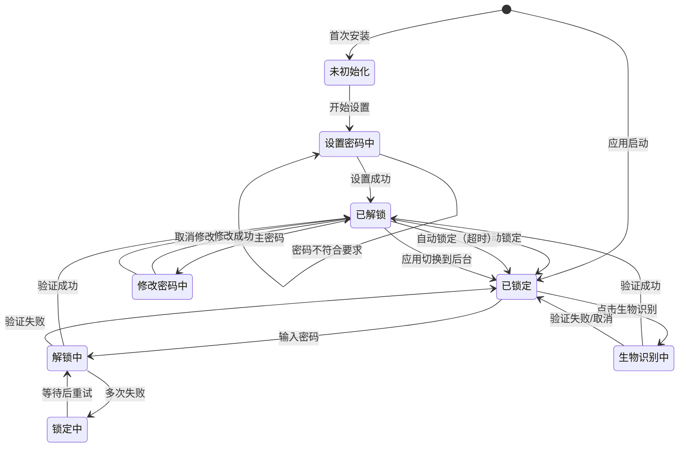

# 认证状态机

> 状态机文档 - 描述用户认证模块的状态转换设计

---

## 一、状态机概述

### 1.1 设计目标

认证状态机用于管理用户从应用启动到解锁保险库的完整认证流程，包括首次设置、日常解锁、自动锁定等场景。

### 1.2 状态机图



---

## 二、状态定义

### 2.1 状态列表

| 状态 ID | 状态名称 | 说明 | 允许的事件 |
|---------|---------|------|-----------|
| AUTH-01 | 未初始化 | 首次使用，未设置主密码 | SETUP_PASSWORD |
| AUTH-02 | 设置密码中 | 正在设置主密码 | PASSWORD_SET, PASSWORD_INVALID |
| AUTH-03 | 已锁定 | 保险库已加密，需要解锁 | UNLOCK_PASSWORD, UNLOCK_BIOMETRIC |
| AUTH-04 | 解锁中 | 正在验证主密码 | VERIFY_SUCCESS, VERIFY_FAILURE, LOCKOUT |
| AUTH-05 | 生物识别中 | 正在进行生物识别验证 | BIOMETRIC_SUCCESS, BIOMETRIC_FAILURE |
| AUTH-06 | 锁定中 | 多次失败，暂时锁定 | UNLOCK_TIMEOUT |
| AUTH-07 | 已解锁 | 保险库已解密，可访问 | LOCK, CHANGE_PASSWORD, AUTO_LOCK |
| AUTH-08 | 修改密码中 | 正在修改主密码 | PASSWORD_CHANGED, CANCEL_CHANGE |

### 2.2 状态属性

```dart
class AuthState {
  final AuthStateType type;
  final DateTime enteredAt;
  final Map<String, dynamic> context;
  
  // 状态特定属性
  final int? failedAttempts;          // 失败次数（解锁中）
  final DateTime? lockoutEndTime;     // 锁定结束时间（锁定中）
  final String? errorMessage;         // 错误信息
}

enum AuthStateType {
  uninitialized,
  settingPassword,
  locked,
  unlocking,
  biometricAuth,
  lockedOut,
  unlocked,
  changingPassword,
}
```

---

## 三、事件定义

### 3.1 事件列表

| 事件 ID | 事件名称 | 触发条件 | 携带数据 |
|---------|---------|---------|---------|
| EVT-01 | SETUP_PASSWORD | 用户首次设置密码 | password: String |
| EVT-02 | PASSWORD_SET | 密码设置成功 | - |
| EVT-03 | PASSWORD_INVALID | 密码不符合要求 | reason: String |
| EVT-04 | UNLOCK_PASSWORD | 用户输入密码解锁 | password: String |
| EVT-05 | UNLOCK_BIOMETRIC | 用户使用生物识别 | - |
| EVT-06 | VERIFY_SUCCESS | 验证成功 | - |
| EVT-07 | VERIFY_FAILURE | 验证失败 | reason: String |
| EVT-08 | LOCKOUT | 失败次数超限 | duration: Duration |
| EVT-09 | UNLOCK_TIMEOUT | 锁定时间结束 | - |
| EVT-10 | BIOMETRIC_SUCCESS | 生物识别成功 | - |
| EVT-11 | BIOMETRIC_FAILURE | 生物识别失败 | reason: String |
| EVT-12 | LOCK | 用户手动锁定 | - |
| EVT-13 | AUTO_LOCK | 自动锁定触发 | reason: String |
| EVT-14 | CHANGE_PASSWORD | 用户修改密码 | oldPassword, newPassword |
| EVT-15 | PASSWORD_CHANGED | 密码修改成功 | - |
| EVT-16 | CANCEL_CHANGE | 取消修改密码 | - |

### 3.2 事件结构

```dart
abstract class AuthEvent {
  final String id;
  final DateTime timestamp;
  final Map<String, dynamic> payload;
}

class UnlockWithPasswordEvent extends AuthEvent {
  final String password;
}

class VerifySuccessEvent extends AuthEvent {
  final AuthMethod method;
}

class VerifyFailureEvent extends AuthEvent {
  final String reason;
  final int remainingAttempts;
}
```

---

## 四、状态转换表

### 4.1 完整转换表

| 当前状态 | 事件 | 目标状态 | 动作 | 条件 |
|---------|------|---------|------|------|
| 未初始化 | SETUP_PASSWORD | 设置密码中 | 开始设置流程 | - |
| 设置密码中 | PASSWORD_SET | 已解锁 | 创建元数据、加密存储 | 密码强度合格 |
| 设置密码中 | PASSWORD_INVALID | 设置密码中 | 显示错误提示 | 密码强度不足 |
| 已锁定 | UNLOCK_PASSWORD | 解锁中 | 开始验证 | - |
| 已锁定 | UNLOCK_BIOMETRIC | 生物识别中 | 调用生物识别 | 生物识别已启用 |
| 解锁中 | VERIFY_SUCCESS | 已解锁 | 加载保险库 | 验证通过 |
| 解锁中 | VERIFY_FAILURE | 已锁定 | 增加失败计数 | 验证失败 |
| 解锁中 | LOCKOUT | 锁定中 | 启动锁定计时 | 失败次数 >= 5 |
| 生物识别中 | BIOMETRIC_SUCCESS | 已解锁 | 加载保险库 | 验证通过 |
| 生物识别中 | BIOMETRIC_FAILURE | 已锁定 | 显示错误 | 验证失败 |
| 锁定中 | UNLOCK_TIMEOUT | 已锁定 | 允许重试 | 锁定时间结束 |
| 已解锁 | LOCK | 已锁定 | 清除内存密钥 | - |
| 已解锁 | AUTO_LOCK | 已锁定 | 清除内存密钥 | 超时/后台切换 |
| 已解锁 | CHANGE_PASSWORD | 修改密码中 | 开始修改流程 | - |
| 修改密码中 | PASSWORD_CHANGED | 已解锁 | 重新加密数据 | 修改成功 |
| 修改密码中 | CANCEL_CHANGE | 已解锁 | 取消操作 | - |

### 4.2 转换条件

```dart
class StateTransition {
  final AuthStateType from;
  final AuthEventType event;
  final AuthStateType to;
  final TransitionCondition? condition;
  final TransitionAction action;
}

typedef TransitionCondition = bool Function(AuthState current, AuthEvent event);
typedef TransitionAction = Future<void> Function(AuthState current, AuthEvent event);

// 示例：解锁失败转换
final unlockFailureTransition = StateTransition(
  from: AuthStateType.unlocking,
  event: AuthEventType.verifyFailure,
  to: AuthStateType.locked,
  condition: (state, event) {
    final attempts = (state.failedAttempts ?? 0) + 1;
    return attempts < 5; // 未达到锁定阈值
  },
  action: (state, event) async {
    // 增加失败计数
    // 记录日志
    // 显示错误提示
  },
);

// 示例：锁定转换
final lockoutTransition = StateTransition(
  from: AuthStateType.unlocking,
  event: AuthEventType.verifyFailure,
  to: AuthStateType.lockedOut,
  condition: (state, event) {
    final attempts = (state.failedAttempts ?? 0) + 1;
    return attempts >= 5; // 达到锁定阈值
  },
  action: (state, event) async {
    // 设置锁定时间（5分钟）
    // 显示锁定提示
    // 记录安全日志
  },
);
```

---

## 五、状态动作

### 5.1 进入动作 (Entry Actions)

| 状态 | 动作 | 说明 |
|------|------|------|
| 设置密码中 | 显示密码强度指示器 | 实时反馈密码强度 |
| 解锁中 | 显示加载指示器 | 提示用户正在验证 |
| 生物识别中 | 调用系统生物识别 | 触发指纹/Face ID |
| 锁定中 | 显示锁定倒计时 | 告知用户等待时间 |
| 已解锁 | 加载保险库数据 | 解密并加载条目 |
| 修改密码中 | 验证当前密码 | 确认用户身份 |

### 5.2 退出动作 (Exit Actions)

| 状态 | 动作 | 说明 |
|------|------|------|
| 解锁中 | 清除输入 | 清除密码输入框 |
| 生物识别中 | 取消生物识别 | 中断生物识别流程 |
| 已解锁 | 清除内存 | 清除解密密钥 |

### 5.3 动作实现

```dart
class AuthStateMachine {
  AuthState _currentState;
  
  // 状态进入动作
  Future<void> _onEnterState(AuthStateType state) async {
    switch (state) {
      case AuthStateType.unlocking:
        await _showLoadingIndicator();
        break;
      case AuthStateType.unlocked:
        await _loadVaultData();
        break;
      case AuthStateType.lockedOut:
        await _startLockoutTimer();
        break;
      default:
        break;
    }
  }
  
  // 状态退出动作
  Future<void> _onExitState(AuthStateType state) async {
    switch (state) {
      case AuthStateType.unlocking:
        await _clearPasswordInput();
        break;
      case AuthStateType.unlocked:
        await _clearSensitiveData();
        break;
      default:
        break;
    }
  }
  
  // 状态转换
  Future<void> transition(AuthEvent event) async {
    final transition = _findTransition(_currentState.type, event.type);
    if (transition == null) return;
    
    // 检查条件
    if (transition.condition != null && 
        !transition.condition!(_currentState, event)) {
      return;
    }
    
    // 执行退出动作
    await _onExitState(_currentState.type);
    
    // 执行转换动作
    await transition.action(_currentState, event);
    
    // 更新状态
    _currentState = AuthState(
      type: transition.to,
      enteredAt: DateTime.now(),
    );
    
    // 执行进入动作
    await _onEnterState(_currentState.type);
    
    // 通知监听者
    _notifyStateChange(_currentState);
  }
}
```

---

## 六、并发与异常处理

### 6.1 并发控制

```dart
class AuthStateMachine {
  bool _isProcessing = false;
  final List<AuthEvent> _eventQueue = [];
  
  Future<void> transition(AuthEvent event) async {
    if (_isProcessing) {
      _eventQueue.add(event);
      return;
    }
    
    _isProcessing = true;
    try {
      await _processTransition(event);
    } finally {
      _isProcessing = false;
      
      // 处理队列中的事件
      if (_eventQueue.isNotEmpty) {
        final nextEvent = _eventQueue.removeAt(0);
        await transition(nextEvent);
      }
    }
  }
}
```

### 6.2 异常处理

| 异常类型 | 处理策略 | 目标状态 |
|---------|---------|---------|
| 验证异常 | 记录日志，显示错误 | 已锁定 |
| 存储异常 | 记录日志，提示用户 | 保持当前 |
| 生物识别取消 | 静默处理 | 已锁定 |
| 超时异常 | 自动锁定 | 已锁定 |

---

## 七、测试场景

### 7.1 正常流程测试

| 场景 | 步骤 | 预期状态序列 |
|------|------|-------------|
| 首次设置 | 输入密码 → 确认 → 保存 | 未初始化 → 设置密码中 → 已解锁 |
| 正常解锁 | 输入正确密码 | 已锁定 → 解锁中 → 已解锁 |
| 生物识别解锁 | 点击生物识别 → 验证成功 | 已锁定 → 生物识别中 → 已解锁 |
| 手动锁定 | 点击锁定按钮 | 已解锁 → 已锁定 |

### 7.2 异常流程测试

| 场景 | 步骤 | 预期状态序列 |
|------|------|-------------|
| 密码错误 | 输入错误密码 x3 | 已锁定 → 解锁中 → 已锁定（失败计数=3）|
| 多次失败 | 输入错误密码 x5 | 已锁定 → 解锁中 → 锁定中 |
| 生物识别失败 | 点击生物识别 → 失败 | 已锁定 → 生物识别中 → 已锁定 |
| 自动锁定 | 解锁后闲置5分钟 | 已解锁 → 已锁定 |

---

## 八、相关文档

- [用户认证功能文档](../功能文档/用户认证功能.md)
- [用户认证需求文档](../需求文档/用户认证需求.md)
- [用户登录数据流](../数据流动/用户登录数据流.md)

---

## 九、变更记录

| 版本 | 日期 | 变更内容 | 作者 |
|------|------|---------|------|
| v1.0 | 2026-02-20 | 初始版本 | Vaultly Team |
