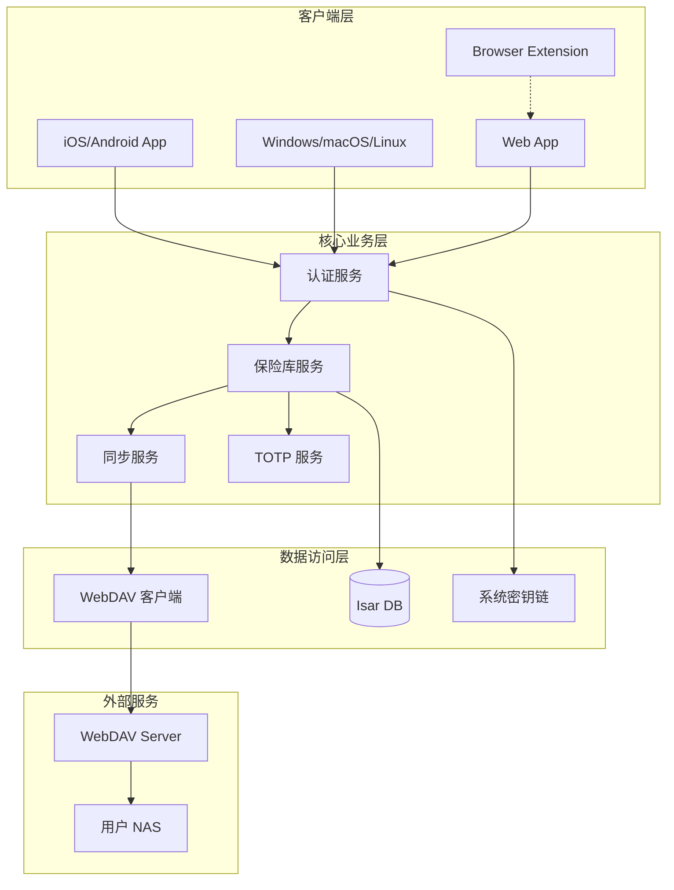
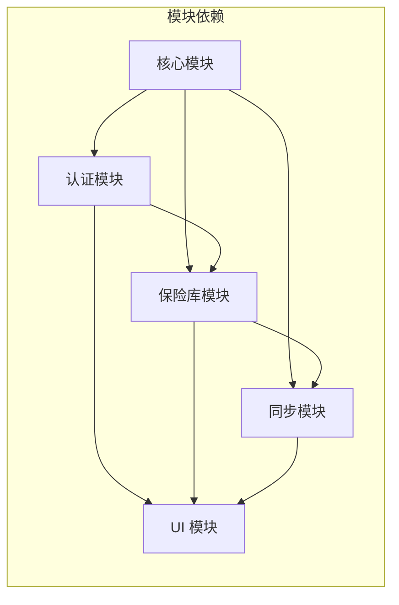
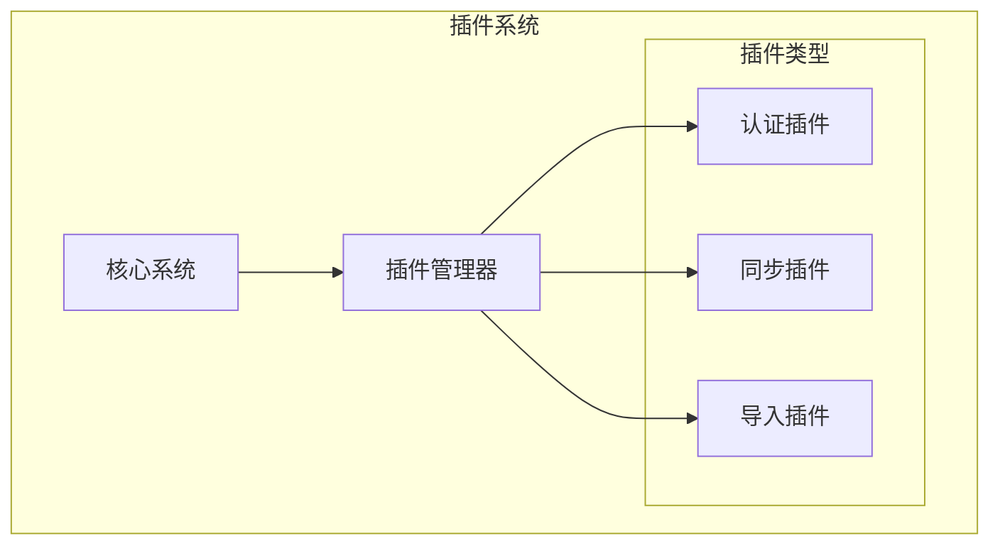
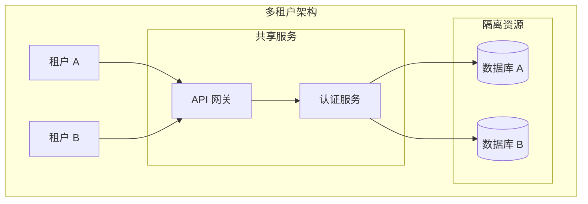
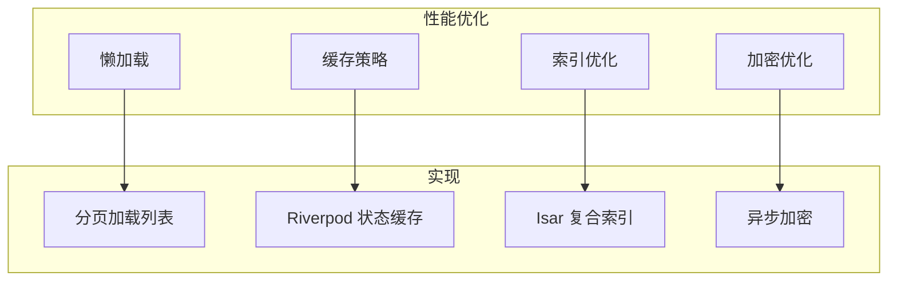
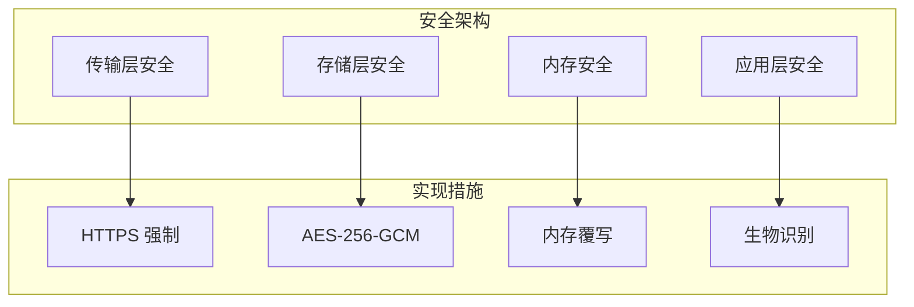
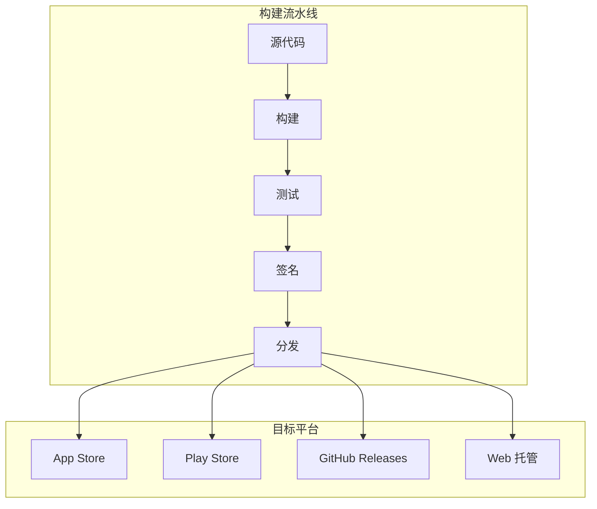

# 架构师视图

> 为架构师提供的技术选型、整体架构、可扩展性设计指南

---

## 一、技术选型总览

### 1.1 核心技术栈

| 层级 | 技术选型 | 备选方案 | 选择理由 |
|------|---------|---------|---------|
| **框架** | Flutter 3.27+ | React Native | 跨平台能力强，性能优秀，UI一致性 |
| **状态管理** | Riverpod | flutter_bloc | 轻量、类型安全、编译时安全 |
| **本地数据库** | Isar | Hive, SQLite | 高性能、支持复杂查询、原生加密支持 |
| **加密** | AES-256-GCM | ChaCha20-Poly1305 | 业界标准，硬件加速支持好 |
| **密钥派生** | Argon2id | PBKDF2, scrypt | 密码哈希竞赛 winner，抗 GPU/ASIC |
| **同步协议** | WebDAV | 自定义协议 | 兼容主流 NAS，用户可控 |
| **插件框架** | WXT | 原生 Manifest V3 | 现代化，开发体验好 |

### 1.2 架构决策记录 (ADR)

#### ADR-001: 选择 Flutter 作为跨平台框架

**状态**: 已接受

**背景**: 需要支持 iOS、Android、Desktop、Web 多平台

**决策**: 使用 Flutter 3.27+

**理由**:
- 单一代码库覆盖所有目标平台
- 接近原生的性能
- 丰富的生态系统和插件
- 优秀的开发体验（Hot Reload）

**后果**:
- 需要 Dart 技能栈
- Web 平台有 SEO 限制（可接受）

#### ADR-002: 选择端到端加密架构

**状态**: 已接受

**背景**: 密码管理器必须保证数据安全

**决策**: 采用零知识架构，端到端加密

**理由**:
- 服务器无法解密用户数据
- 即使服务器被攻破，数据仍然安全
- 符合隐私保护最佳实践

**后果**:
- 无法提供密码找回功能
- 需要用户自行备份主密码

---

## 二、整体架构

### 2.1 系统架构图

### 2.2 模块依赖关系

**依赖规则**:
- 核心模块（加密、工具）不依赖其他模块
- 认证模块是最底层业务模块
- UI 模块依赖所有业务模块
- 禁止循环依赖

---

## 三、可扩展性设计

### 3.1 水平扩展能力

| 扩展点 | 当前实现 | 未来扩展 |
|--------|---------|---------|
| 认证方式 | 主密码 + 生物识别 | + PIN 码、硬件密钥 |
| 同步协议 | WebDAV | + S3、Google Drive |
| 条目类型 | 4 种 | + 自定义类型 |
| 加密算法 | AES-256-GCM | + 算法可配置 |

### 3.2 插件化架构

### 3.3 多租户支持（未来）

---

## 四、性能设计

### 4.1 性能目标

| 指标 | 目标值 | 测量方法 |
|------|--------|---------|
| 应用启动 | < 2s | 冷启动时间 |
| 解锁响应 | < 500ms | 输入密码到进入主界面 |
| 列表加载 | < 100ms | 100 条记录 |
| 搜索响应 | < 200ms | 全文搜索 |
| 同步时间 | < 5s | 1MB 数据 |

### 4.2 性能优化策略

---

## 五、安全架构

### 5.1 安全层次

### 5.2 威胁建模

| 威胁 | 风险等级 | 缓解措施 |
|------|---------|---------|
| 暴力破解 | 高 | Argon2id 慢哈希 |
| 内存转储 | 中 | 敏感数据使用后清除 |
| 中间人攻击 | 中 | HTTPS + 证书固定 |
| 恶意插件 | 低 | CSP + 权限隔离 |

---

## 六、部署架构

### 6.1 客户端部署

### 6.2 版本策略

| 版本类型 | 格式 | 示例 | 说明 |
|---------|------|------|------|
| 主版本 | x.0.0 | 1.0.0 | 重大更新，可能不兼容 |
| 次版本 | x.y.0 | 1.1.0 | 新功能，向后兼容 |
| 修订版本 | x.y.z | 1.1.1 | Bug 修复 |

---

## 七、相关文档

- [整体架构](../02-架构设计/整体架构.md)
- [安全架构](../02-架构设计/安全架构.md)
- [技术栈](../01-项目概览/技术栈.md)

---

## 八、变更记录

| 版本 | 日期 | 变更内容 | 作者 |
|------|------|---------|------|
| v1.0 | 2026-02-20 | 初始版本 | Vaultly Team |
