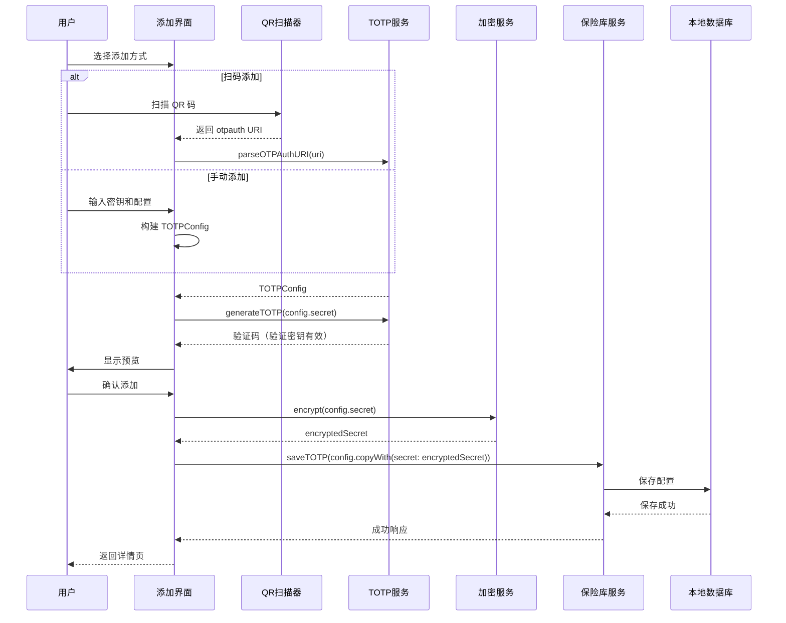
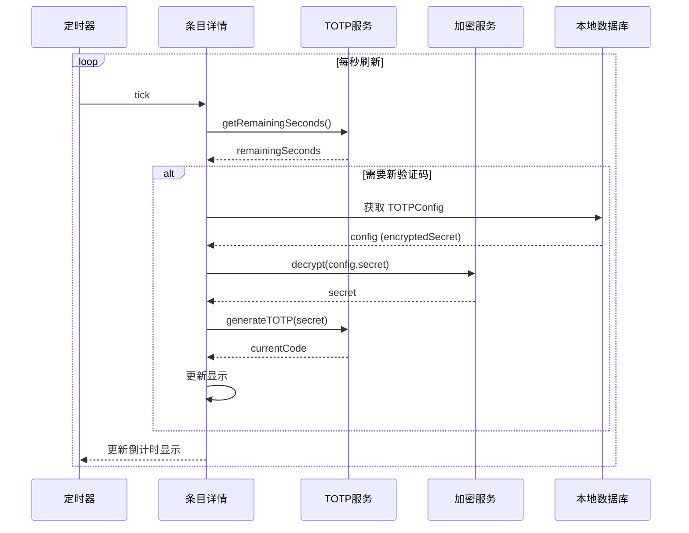
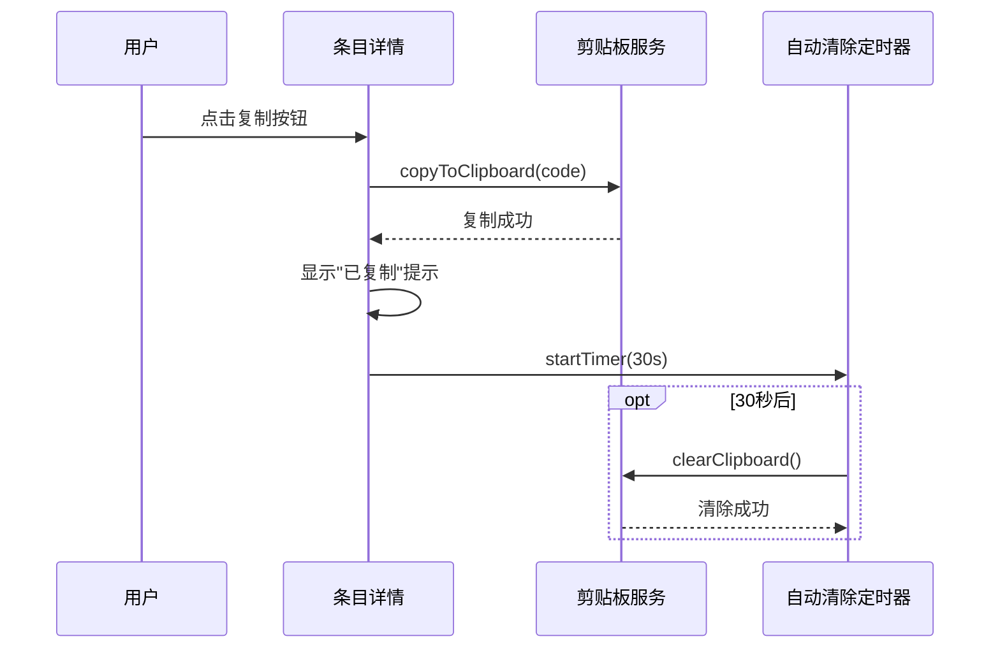
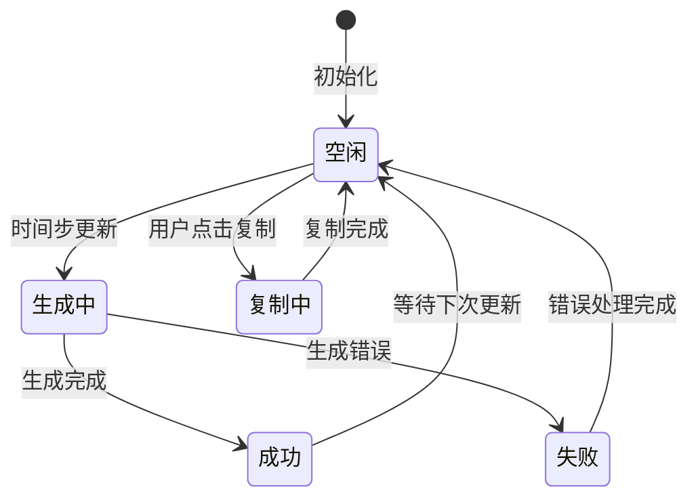
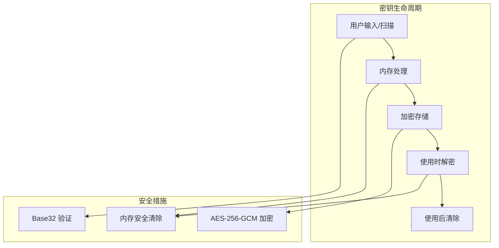

# TOTP 双因素认证需求文档

> **版本**: v1.0.0  
> **更新日期**: 2026-02-20  
> **作者**: Vaultly Team  
> **文档类型**: 需求文档

---

## 版本历史

| 版本 | 日期 | 修改内容 | 作者 |
|------|------|----------|------|
| v1.0.0 | 2026-02-20 | 初始版本 | Vaultly Team |

---

## 一、数据模型

### 1.1 核心实体

#### TOTPConfig（TOTP配置）

```dart
class TOTPConfig {
  final String id;                    // 唯一标识 (UUID)
  final String secret;                // Base32 编码的密钥（加密存储）
  final String issuer;                // 服务商名称（如 "Google"）
  final String accountName;           // 账号名称（如 "user@example.com"）
  final int digits;                   // 验证码位数（默认 6）
  final int period;                   // 时间步长（默认 30 秒）
  final Algorithm algorithm;          // 哈希算法（默认 SHA1）
  final DateTime createdAt;           // 创建时间
  final DateTime updatedAt;           // 更新时间
  final String? entryId;              // 关联的登录条目 ID
}

enum Algorithm {
  sha1,       // HMAC-SHA1（RFC 6238 标准）
  sha256,     // HMAC-SHA256
  sha512,     // HMAC-SHA512
}
```

#### TOTPState（TOTP状态）

```dart
class TOTPState {
  final String currentCode;           // 当前验证码
  final int remainingSeconds;         // 剩余有效秒数
  final bool isGenerating;            // 是否正在生成
  final TOTPError? error;             // 错误信息
  final DateTime lastUpdated;         // 最后更新时间
}

class TOTPError {
  final TOTPErrorType type;
  final String message;
}

enum TOTPErrorType {
  invalidSecret,      // 密钥无效
  generationFailed,   // 生成失败
  syncError,          // 时间同步错误
}
```

### 1.2 数据字典

| 字段名 | 类型 | 长度 | 必填 | 说明 |
|--------|------|------|------|------|
| id | String | 36 | ✅ | UUID v4 |
| secret | String | - | ✅ | Base32 编码密钥（加密存储）|
| issuer | String | 256 | ✅ | 服务商名称 |
| accountName | String | 256 | ✅ | 账号名称 |
| digits | int | - | ✅ | 默认 6，可选 8 |
| period | int | - | ✅ | 默认 30 秒 |
| algorithm | Enum | - | ✅ | 默认 sha1 |
| entryId | String | 36 | ❌ | 关联的登录条目 ID |

---

## 二、数据流动

### 2.1 添加 TOTP 数据流



### 2.2 生成验证码数据流



### 2.3 复制验证码数据流



---

## 三、状态管理

### 3.1 TOTP 生成状态机



### 3.2 状态定义

| 状态 | 说明 | 允许的操作 |
|------|------|-----------|
| 空闲 | 等待时间步更新 | 复制当前验证码 |
| 生成中 | 正在计算新验证码 | - |
| 成功 | 验证码生成成功 | 复制、显示倒计时 |
| 失败 | 生成过程出错 | 重试、显示错误 |
| 复制中 | 正在复制到剪贴板 | - |

### 3.3 状态转换表

| 当前状态 | 事件 | 目标状态 | 动作 |
|---------|------|---------|------|
| 空闲 | TIME_STEP_UPDATE | 生成中 | 开始生成新验证码 |
| 生成中 | GENERATION_SUCCESS | 成功 | 更新显示 |
| 生成中 | GENERATION_FAILURE | 失败 | 显示错误 |
| 成功 | COPY_REQUEST | 复制中 | 复制到剪贴板 |
| 复制中 | COPY_COMPLETE | 空闲 | 显示已复制提示 |
| 失败 | RETRY_REQUEST | 生成中 | 重新生成 |

---

## 四、接口设计

### 4.1 TOTPService 接口

```dart
abstract class TOTPService {
  // 生成 TOTP 验证码
  String generateTOTP(
    String secret, {
    int digits = 6,
    int period = 30,
    Algorithm algorithm = Algorithm.sha1,
  });
  
  // 验证 TOTP 验证码
  bool validateTOTP(
    String code,
    String secret, {
    int window = 1,
    int digits = 6,
    int period = 30,
  });
  
  // 解析 otpauth:// URI
  TOTPConfig? parseOTPAuthURI(String uri);
  
  // 生成 otpauth:// URI
  String generateOTPAuthURI(TOTPConfig config);
  
  // 获取剩余秒数
  int getRemainingSeconds({int period = 30});
  
  // 验证密钥有效性
  bool validateSecret(String secret);
}
```

### 4.2 TOTP 管理接口

```dart
abstract class TOTPManagementService {
  // CRUD 操作
  Future<TOTPConfig> addTOTP(TOTPConfig config);
  Future<TOTPConfig> updateTOTP(TOTPConfig config);
  Future<void> deleteTOTP(String id);
  Future<TOTPConfig?> getTOTP(String id);
  Future<TOTPConfig?> getTOTPByEntryId(String entryId);
  Future<List<TOTPConfig>> getAllTOTPs();
  
  // 关联操作
  Future<void> linkToEntry(String totpId, String entryId);
  Future<void> unlinkFromEntry(String totpId);
  
  // 批量操作
  Future<List<TOTPConfig>> getTOTPsByEntryIds(List<String> entryIds);
}
```

### 4.3 结果类型定义

```dart
enum TOTPResult {
  success,
  invalidSecret,      // 密钥无效
  invalidURI,         // URI 格式错误
  generationFailed,   // 生成失败
  entryNotFound,      // 关联条目不存在
  alreadyExists,      // TOTP 已存在
  error,              // 其他错误
}

class TOTPValidationResult {
  final bool isValid;
  final int? timeOffset;    // 检测到的时间偏移
  final String? errorMessage;
}
```

---

## 五、缓存策略

### 5.1 内存缓存

| 数据 | 缓存位置 | 策略 | 说明 |
|------|---------|------|------|
| 当前验证码 | UI State | 30秒有效 | 定时刷新 |
| 解密密钥 | 临时变量 | 使用后立即清除 | 安全考虑 |
| TOTP 配置 | Riverpod State | 应用生命周期 | 不频繁变更 |

### 5.2 存储策略

| 数据 | 存储位置 | 格式 |
|------|---------|------|
| TOTP 配置 | Isar | 密钥加密存储 |
| 生成历史 | 不存储 | - |
| 时间偏移 | SharedPreferences | 明文 |

---

## 六、安全考虑

### 6.1 密钥安全



### 6.2 安全措施

| 措施 | 实现 | 优先级 |
|------|------|--------|
| 密钥加密 | AES-256-GCM 加密存储 | P0 |
| 内存安全 | 密钥不长期驻留内存 | P0 |
| 剪贴板保护 | 30秒自动清除 | P0 |
| 密钥验证 | 添加前验证 Base32 格式 | P1 |
| 时间同步 | 支持 NTP 时间校准 | P2 |

---

## 七、代码实现映射

### 7.1 数据模型实现

```dart
// lib/core/services/totp_service.dart
class TOTPConfig {
  final String id;
  final String secret;        // 加密后的密钥
  final String issuer;
  final String accountName;
  final int digits;
  final int period;
  final Algorithm algorithm;
  final DateTime createdAt;
  final DateTime updatedAt;
  final String? entryId;

  TOTPConfig({
    required this.id,
    required this.secret,
    required this.issuer,
    required this.accountName,
    this.digits = 6,
    this.period = 30,
    this.algorithm = Algorithm.sha1,
    required this.createdAt,
    required this.updatedAt,
    this.entryId,
  });
  
  // 创建副本（用于更新）
  TOTPConfig copyWith({...}) => TOTPConfig(...);
}
```

### 7.2 服务层实现

```dart
// lib/core/services/totp_service.dart
class TOTPServiceImpl implements TOTPService {
  final CryptoService _cryptoService;
  
  @override
  String generateTOTP(
    String secret, {
    int digits = 6,
    int period = 30,
    Algorithm algorithm = Algorithm.sha1,
  }) {
    final counter = _getTimeCounter(period);
    return _generateHOTP(secret, counter, digits, algorithm);
  }
  
  @override
  bool validateTOTP(
    String code,
    String secret, {
    int window = 1,
    int digits = 6,
    int period = 30,
  }) {
    if (code.length != digits) return false;
    
    final counter = _getTimeCounter(period);
    
    // 检查时间窗口内的所有可能
    for (int i = -window; i <= window; i++) {
      final expectedCode = _generateHOTP(secret, counter + i, digits);
      if (expectedCode == code) {
        return true;
      }
    }
    
    return false;
  }
  
  @override
  TOTPConfig? parseOTPAuthURI(String uri) {
    try {
      if (!uri.startsWith('otpauth://totp/')) {
        return null;
      }

      final parsedUri = Uri.parse(uri);
      final path = parsedUri.path;
      final query = parsedUri.queryParameters;

      String? secret = query['secret'];
      if (secret == null || secret.isEmpty) return null;

      String issuer = query['issuer'] ?? '';
      String accountName = path.substring(1);

      if (issuer.isEmpty && accountName.contains(':')) {
        final parts = accountName.split(':');
        issuer = parts[0];
        accountName = parts[1];
      }

      final digits = int.tryParse(query['digits'] ?? '') ?? 6;
      final period = int.tryParse(query['period'] ?? '') ?? 30;
      final algorithm = _parseAlgorithm(query['algorithm']);

      return TOTPConfig(
        id: const Uuid().v4(),
        secret: secret.toUpperCase(),
        issuer: issuer,
        accountName: accountName,
        digits: digits,
        period: period,
        algorithm: algorithm,
        createdAt: DateTime.now(),
        updatedAt: DateTime.now(),
      );
    } catch (_) {
      return null;
    }
  }
}
```

### 7.3 状态管理实现

```dart
// lib/core/providers/totp_provider.dart
final totpServiceProvider = Provider<TOTPService>((ref) {
  return TOTPServiceImpl(
    cryptoService: ref.watch(cryptoServiceProvider),
  );
});

final totpCodeProvider = StreamProvider.family<TOTPState, String>(
  (ref, totpId) async* {
    final totpService = ref.watch(totpServiceProvider);
    final vaultService = ref.watch(vaultServiceProvider);
    
    final config = await vaultService.getTOTP(totpId);
    if (config == null) return;
    
    // 每秒更新
    await for (final _ in Stream.periodic(const Duration(seconds: 1))) {
      final remaining = totpService.getRemainingSeconds(period: config.period);
      
      // 时间步更新时生成新验证码
      if (remaining == config.period - 1 || remaining == 0) {
        final code = totpService.generateTOTP(config.secret);
        yield TOTPState(
          currentCode: code,
          remainingSeconds: remaining,
          lastUpdated: DateTime.now(),
        );
      } else {
        yield TOTPState(
          remainingSeconds: remaining,
          lastUpdated: DateTime.now(),
        );
      }
    }
  },
);
```

### 7.4 关键实现文件映射

| 文档概念 | 实现文件 | 说明 |
|----------|----------|------|
| **TOTPConfig** | `lib/core/services/totp_service.dart` | TOTP 配置模型 |
| **TOTPService** | `lib/core/services/totp_service.dart` | TOTP 业务逻辑 |
| **TOTP 状态** | `lib/core/providers/totp_provider.dart` | Riverpod 状态管理 |
| **加密存储** | `lib/core/services/vault_service.dart` | 密钥加密存储 |

---

## 八、相关文档

### 8.1 渐进式文档链
- [TOTP 双因素认证功能](../功能文档/TOTP双因素认证功能.md) - 功能需求、用户场景
- [TOTP 双因素认证架构](../架构文档/TOTP双因素认证架构.md) - 技术选型、实现方案

### 8.2 模块设计
- [TOTP 模块](../03-模块设计/TOTP模块.md) - 详细模块设计

### 8.3 数据模型
- [数据字典](../04-数据模型/数据字典.md) - 核心数据结构

---

## 九、变更记录

| 版本 | 日期 | 变更内容 | 作者 |
|------|------|----------|------|
| v1.0.0 | 2026-02-20 | 初始版本 | Vaultly Team |
