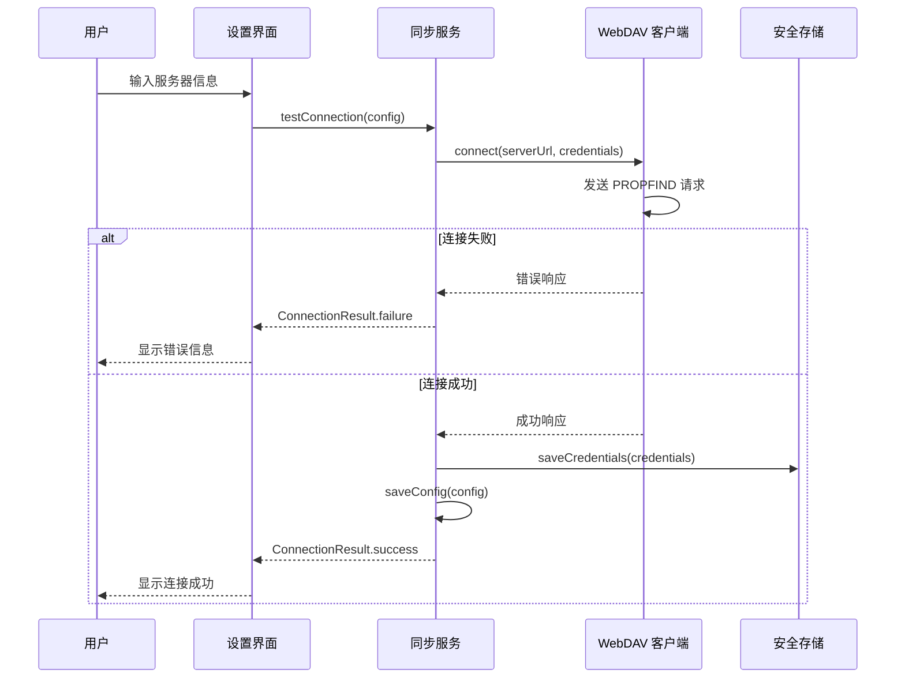
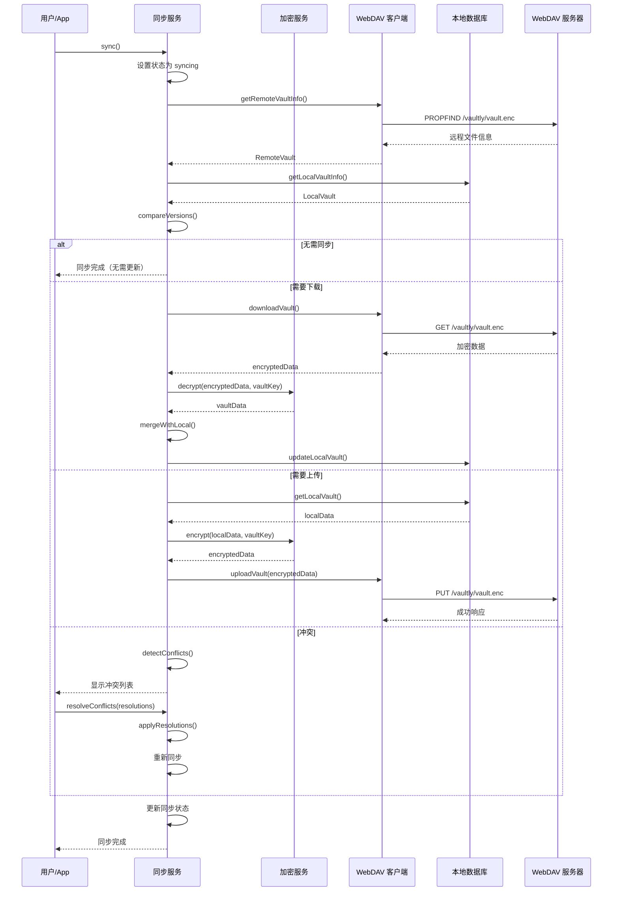
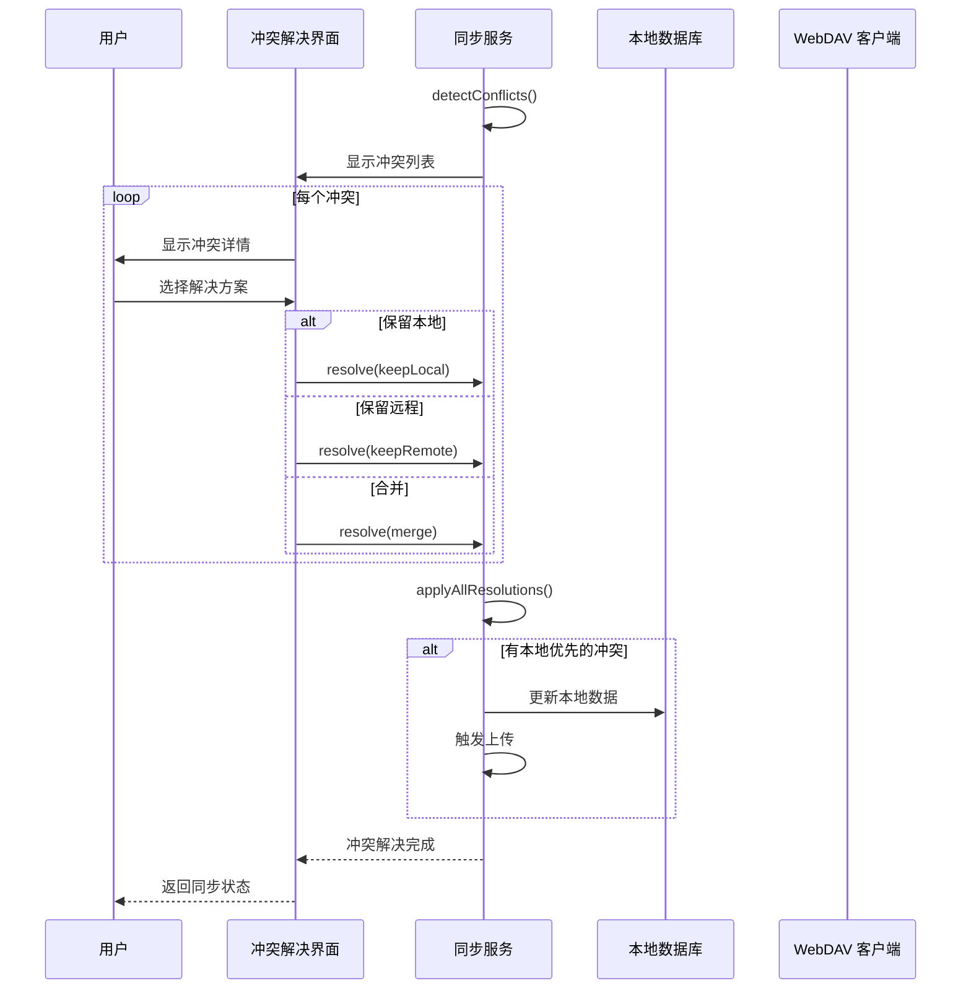
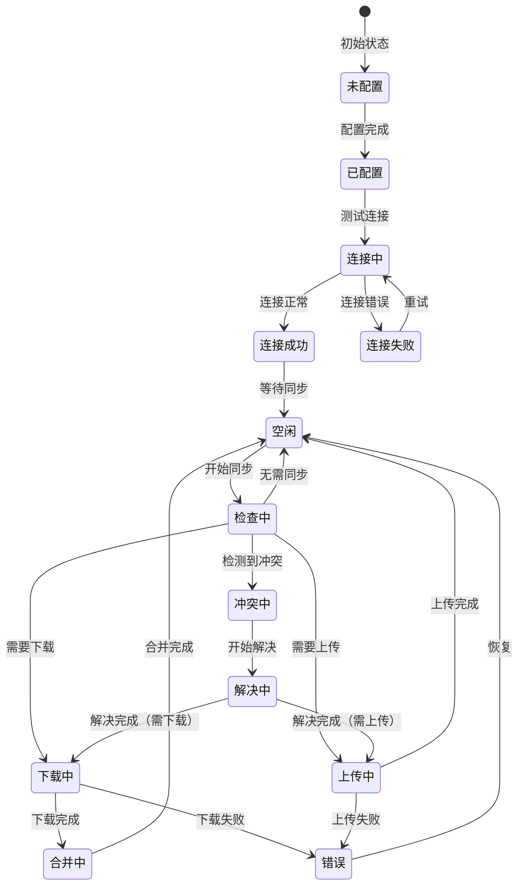

# WebDAV 同步需求文档

> 需求文档 - 定义 WebDAV 同步的数据模型、数据流动、状态管理、接口设计

---

## 一、数据模型

### 1.1 核心实体

#### SyncConfig（同步配置）

```dart
class SyncConfig {
  final String id;                    // 配置 ID
  final String serverUrl;             // WebDAV 服务器地址
  final String username;              // 用户名
  final String? password;             // 密码（存储在 Keychain）
  final String? appPassword;          // 应用专用密码
  final String remotePath;            // 远程路径（默认 /vaultly/）
  
  // 同步设置
  final SyncMode syncMode;            // 同步模式
  final Duration autoSyncInterval;    // 自动同步间隔
  final bool syncOnChange;            // 变更时同步
  final bool syncOnStartup;           // 启动时同步
  
  // 状态
  final bool isEnabled;               // 是否启用
  final DateTime? lastSyncAt;         // 最后同步时间
  final SyncStatus lastSyncStatus;    // 最后同步状态
}

enum SyncMode {
  auto,       // 自动双向同步
  manual,     // 仅手动同步
  uploadOnly, // 仅上传（备份模式）
  downloadOnly, // 仅下载（恢复模式）
}

enum SyncStatus {
  success,
  failure,
  conflict,
  inProgress,
  neverSynced,
}
```

#### SyncState（同步状态）

```dart
class SyncState {
  final SyncStatus status;            // 当前状态
  final double progress;              // 进度（0-100）
  final String? currentOperation;     // 当前操作描述
  final DateTime? startedAt;          // 开始时间
  final DateTime? completedAt;        // 完成时间
  final SyncError? error;             // 错误信息
  final List<Conflict>? conflicts;    // 冲突列表
}

class SyncError {
  final SyncErrorType type;
  final String message;
  final String? details;
}

enum SyncErrorType {
  networkError,       // 网络错误
  authenticationError, // 认证失败
  serverError,        // 服务器错误
  conflictError,      // 冲突错误
  quotaExceeded,      // 配额超限
  unknownError,       // 未知错误
}
```

#### Conflict（冲突）

```dart
class Conflict {
  final String entryId;               // 冲突条目 ID
  final ConflictType type;            // 冲突类型
  final DateTime localModifiedAt;     // 本地修改时间
  final DateTime remoteModifiedAt;    // 远程修改时间
  final VaultEntry? localEntry;       // 本地条目
  final VaultEntry? remoteEntry;      // 远程条目
}

enum ConflictType {
  localModified,      // 仅本地修改
  remoteModified,     // 仅远程修改
  bothModified,       // 双方都修改
  localDeleted,       // 本地删除
  remoteDeleted,      // 远程删除
}
```

#### RemoteVault（远程保险库）

```dart
class RemoteVault {
  final String version;               // 数据版本
  final DateTime modifiedAt;          // 修改时间
  final String checksum;              // 数据校验和
  final int entryCount;               // 条目数量
  final int size;                     // 文件大小（字节）
}
```

### 1.2 数据字典

| 字段名 | 类型 | 长度 | 必填 | 说明 |
|--------|------|------|------|------|
| serverUrl | String | 2048 | ✅ | WebDAV 服务器 URL |
| username | String | 256 | ✅ | 登录用户名 |
| remotePath | String | 512 | ✅ | 默认 /vaultly/ |
| syncMode | Enum | - | ✅ | 默认 auto |
| autoSyncInterval | Duration | - | ❌ | 自动同步间隔 |
| isEnabled | Bool | - | ✅ | 默认 false |

---

## 二、数据流动

### 2.1 配置 WebDAV 连接数据流



### 2.2 执行同步数据流



### 2.3 冲突解决数据流



---

## 三、状态管理

### 3.1 同步状态机



### 3.2 状态定义

| 状态 | 说明 | 允许的操作 |
|------|------|-----------|
| 未配置 | 未设置 WebDAV | 配置连接 |
| 已配置 | 已配置但未测试 | 测试连接 |
| 连接中 | 正在测试连接 | 取消 |
| 连接成功 | 连接正常 | 开始同步 |
| 连接失败 | 连接错误 | 重试、修改配置 |
| 空闲 | 等待同步 | 手动同步 |
| 检查中 | 检查版本差异 | - |
| 下载中 | 正在下载 | 取消 |
| 上传中 | 正在上传 | 取消 |
| 合并中 | 合并数据 | - |
| 冲突中 | 检测到冲突 | 解决冲突 |
| 解决中 | 正在解决冲突 | - |
| 错误 | 同步错误 | 重试、查看错误 |

### 3.3 状态转换表

| 当前状态 | 事件 | 目标状态 | 动作 |
|---------|------|---------|------|
| 未配置 | CONFIGURE | 已配置 | 保存配置 |
| 已配置 | TEST_CONNECTION | 连接中 | 测试连接 |
| 连接中 | CONNECTION_SUCCESS | 连接成功 | - |
| 连接中 | CONNECTION_FAILURE | 连接失败 | 记录错误 |
| 连接成功 | START_SYNC | 检查中 | 检查版本 |
| 检查中 | NEED_DOWNLOAD | 下载中 | 开始下载 |
| 检查中 | NEED_UPLOAD | 上传中 | 开始上传 |
| 检查中 | NO_CHANGES | 空闲 | - |
| 检查中 | CONFLICT_DETECTED | 冲突中 | 记录冲突 |
| 下载中 | DOWNLOAD_COMPLETE | 合并中 | 合并数据 |
| 合并中 | MERGE_COMPLETE | 空闲 | 更新本地 |
| 上传中 | UPLOAD_COMPLETE | 空闲 | 更新状态 |
| 冲突中 | START_RESOLVE | 解决中 | 显示冲突 |
| 解决中 | RESOLUTION_COMPLETE | 上传中/下载中 | 应用解决 |

---

## 四、接口设计

### 4.1 SyncService 接口

```dart
abstract class SyncService {
  // 配置管理
  Future<void> saveConfig(SyncConfig config);
  Future<SyncConfig?> getConfig();
  Future<void> deleteConfig();
  
  // 连接测试
  Future<ConnectionResult> testConnection(SyncConfig config);
  
  // 同步操作
  Future<SyncResult> sync();
  Future<SyncResult> syncUpload();
  Future<SyncResult> syncDownload();
  
  // 状态查询
  Stream<SyncState> get syncStateStream;
  SyncState get currentState;
  bool get isSyncing;
  
  // 冲突解决
  Future<void> resolveConflict(String entryId, ConflictResolution resolution);
  Future<void> resolveAllConflicts(Map<String, ConflictResolution> resolutions);
  
  // 历史记录
  Future<List<SyncHistory>> getSyncHistory({int limit = 50});
  Future<void> clearSyncHistory();
}

enum ConflictResolution {
  keepLocal,    // 保留本地
  keepRemote,   // 保留远程
  merge,        // 合并
  skip,         // 跳过
}
```

### 4.2 WebDAVClient 接口

```dart
abstract class WebDAVClient {
  // 连接
  Future<void> connect(String url, String username, String password);
  Future<void> disconnect();
  
  // 文件操作
  Future<bool> fileExists(String path);
  Future<RemoteFile> getFileInfo(String path);
  Future<Uint8List> downloadFile(String path);
  Future<void> uploadFile(String path, Uint8List data);
  Future<void> deleteFile(String path);
  
  // 目录操作
  Future<void> createDirectory(String path);
  Future<List<RemoteFile>> listDirectory(String path);
}

class RemoteFile {
  final String path;
  final String name;
  final int size;
  final DateTime modifiedAt;
  final bool isDirectory;
}
```

---

## 五、缓存策略

### 5.1 本地缓存

| 数据 | 缓存位置 | 策略 | 说明 |
|------|---------|------|------|
| 同步配置 | Isar + Keychain | 持久化 | 配置信息 |
| 最后同步状态 | Isar | 持久化 | 同步历史 |
| 远程文件信息 | 内存 | 同步时更新 | 临时缓存 |
| 冲突列表 | 内存 | 解决后清除 | 临时数据 |

### 5.2 同步策略

| 策略 | 触发条件 | 行为 |
|------|---------|------|
| 即时同步 | 条目变更后 | 延迟 5s 后同步 |
| 定时同步 | 每 N 分钟 | 检查并同步 |
| 启动同步 | 应用启动 | 检查远程变更 |
| 手动同步 | 用户触发 | 立即同步 |

---

## 六、安全考虑

### 6.1 传输安全

| 措施 | 实现 | 说明 |
|------|------|------|
| HTTPS 强制 | 仅允许 HTTPS URL | 防止中间人攻击 |
| 证书校验 | 验证服务器证书 | 防止伪造 |
| 凭证安全 | Keychain 存储 | 系统级保护 |

### 6.2 数据安全

| 措施 | 实现 | 说明 |
|------|------|------|
| 端到端加密 | 上传前加密 | 服务器无法解密 |
| 完整性校验 | SHA-256 校验和 | 检测数据损坏 |
| 版本控制 | 保留历史版本 | 防止数据丢失 |

---

## 七、相关文档

- [WebDAV 同步功能文档](../功能文档/WebDAV同步功能.md) - 功能需求、用户场景
- [WebDAV 同步架构文档](../架构文档/WebDAV同步架构.md) - 技术选型、实现方案
- [同步状态机](../状态机/同步状态机.md) - 状态转换设计
- [同步数据流](../数据流动/WebDAV同步数据流.md) - 数据流动设计

---

## 八、变更记录

| 版本 | 日期 | 变更内容 | 作者 |
|------|------|---------|------|
| v1.0 | 2026-02-20 | 初始版本 | Vaultly Team |
