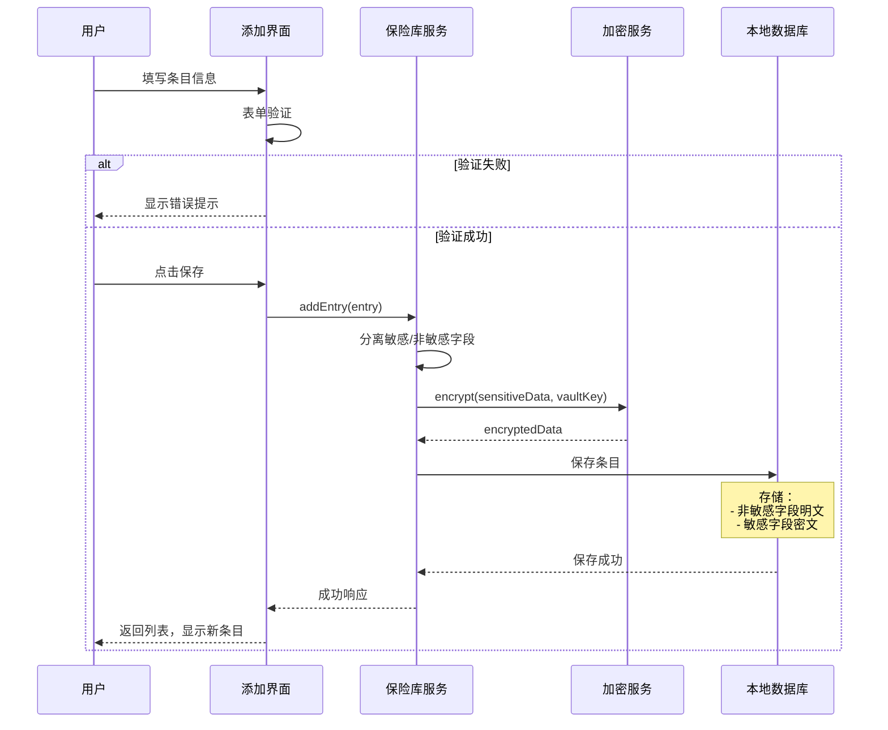
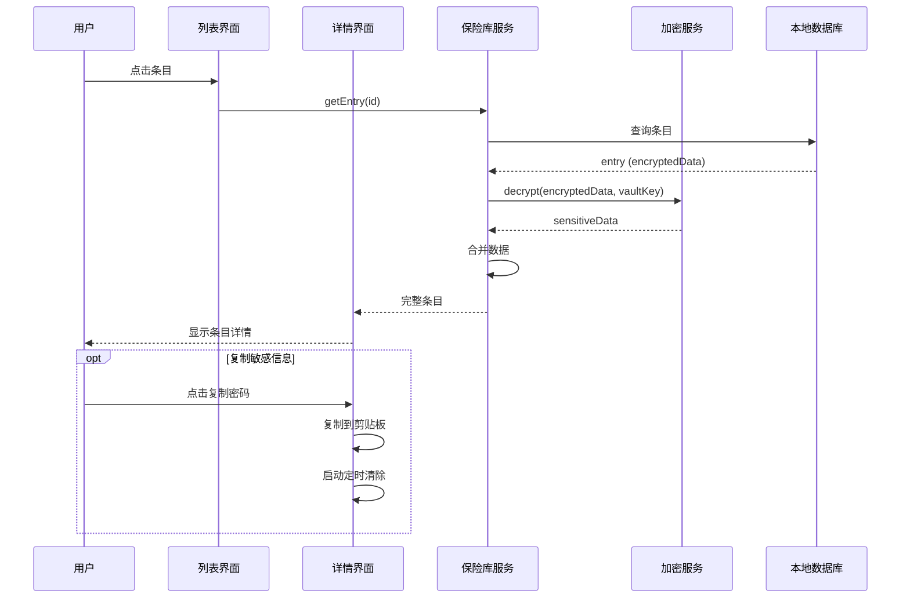
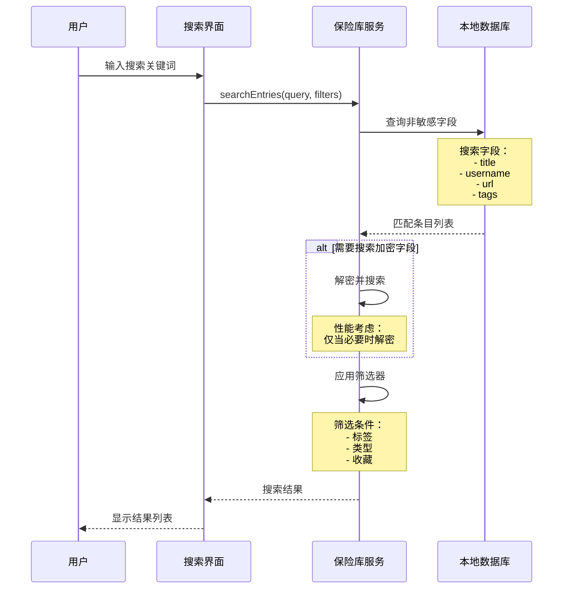
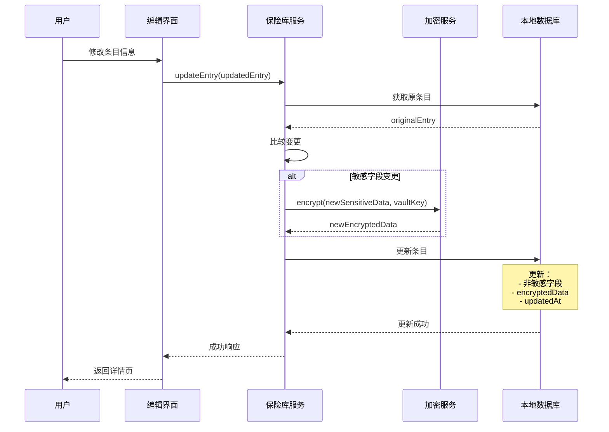
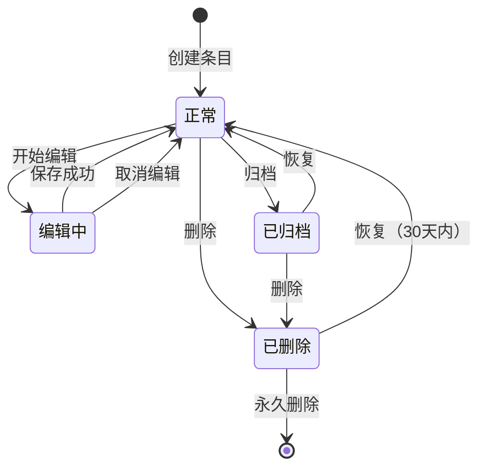
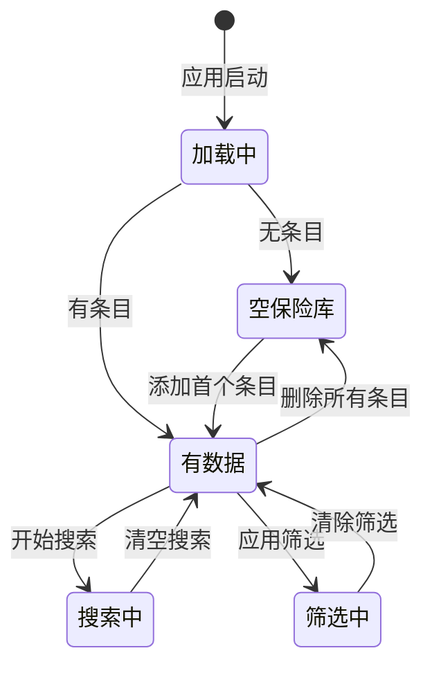
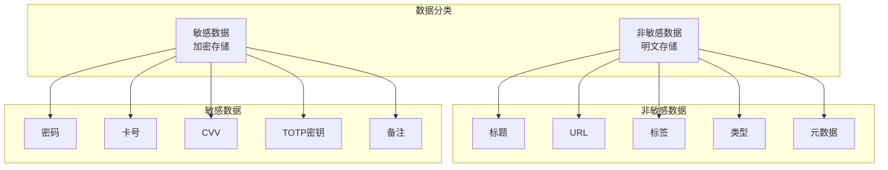

# 保险库管理需求文档

> 需求文档 - 定义保险库管理的数据模型、数据流动、状态管理、接口设计

---

## 一、数据模型

### 1.1 核心实体

#### VaultEntry（基础条目）

```dart
abstract class VaultEntry {
  // 基础信息
  final String id;                    // 唯一标识 (UUID)
  final String title;                 // 条目标题
  final EntryType type;               // 条目类型
  final DateTime createdAt;           // 创建时间
  final DateTime updatedAt;           // 最后更新时间
  final bool isArchived;              // 是否归档
  final bool isFavorite;              // 是否收藏
  
  // 分类信息
  final List<String> tags;            // 标签列表
  final String? folderId;             // 所属文件夹
  
  // 自定义字段
  final List<CustomField> customFields;
  
  // 加密数据（JSON 字符串，加密存储）
  final EncryptedData encryptedData;
}

enum EntryType {
  login,      // 登录凭证
  bankCard,   // 银行卡
  secureNote, // 安全笔记
  identity,   // 身份信息
}
```

#### LoginEntry（登录凭证）

```dart
class LoginEntry extends VaultEntry {
  // 非敏感信息（明文存储）
  final String? url;                  // 网站 URL
  final String? username;             // 用户名（可选明文）
  final String? email;                // 邮箱
  
  // 敏感信息（加密存储在 encryptedData）
  // - password: String
  // - totpSecret: String?
  // - notes: String?
  // - securityQuestions: List<Map>?
}
```

#### BankCardEntry（银行卡）

```dart
class BankCardEntry extends VaultEntry {
  // 非敏感信息
  final String cardHolderName;        // 持卡人
  final int expiryMonth;              // 有效期月
  final int expiryYear;               // 有效期年
  final CardType cardType;            // 卡类型
  final String? bankName;             // 银行名称
  
  // 敏感信息（加密存储）
  // - cardNumber: String
  // - cvv: String
}

enum CardType {
  visa,
  mastercard,
  amex,
  unionPay,
  other,
}
```

#### SecureNoteEntry（安全笔记）

```dart
class SecureNoteEntry extends VaultEntry {
  final bool isMarkdown;              // 是否 Markdown
  
  // 敏感信息（加密存储）
  // - content: String
}
```

#### IdentityEntry（身份信息）

```dart
class IdentityEntry extends VaultEntry {
  // 非敏感信息
  final String? firstName;
  final String? lastName;
  final String? middleName;
  final DateTime? birthDate;
  final String? phone;
  final String? email;
  final String? address;
  
  // 敏感信息（加密存储）
  // - idNumber: String (身份证号/护照号等)
  // - additionalInfo: Map
}
```

#### CustomField（自定义字段）

```dart
class CustomField {
  final String id;
  final String name;                  // 字段名称
  final FieldType type;               // 字段类型
  final String value;                 // 字段值（加密存储）
  final bool isSecret;                // 是否敏感
}

enum FieldType {
  text,       // 文本
  hidden,     // 隐藏（密码等）
  date,       // 日期
  url,        // URL
  email,      // 邮箱
  phone,      // 电话
}
```

### 1.2 数据字典

| 字段名 | 类型 | 长度 | 必填 | 说明 |
|--------|------|------|------|------|
| id | String | 36 | ✅ | UUID v4 |
| title | String | 256 | ✅ | 条目标题 |
| type | Enum | - | ✅ | 条目类型 |
| createdAt | DateTime | - | ✅ | 创建时间 |
| updatedAt | DateTime | - | ✅ | 更新时间 |
| isArchived | Bool | - | ✅ | 默认 false |
| isFavorite | Bool | - | ✅ | 默认 false |
| tags | List<String> | - | ❌ | 标签数组 |
| encryptedData | JSON | - | ✅ | 加密后的敏感数据 |

---

## 二、数据流动

### 2.1 添加条目数据流



### 2.2 查看条目数据流



### 2.3 搜索条目数据流



### 2.4 编辑条目数据流



---

## 三、状态管理

### 3.1 条目状态机



### 3.2 状态定义

| 状态 | 说明 | 可见性 | 保留期限 |
|------|------|--------|---------|
| 正常 | 活跃条目 | 默认列表 | 永久 |
| 编辑中 | 正在编辑 | 编辑界面 | - |
| 已归档 | 不再使用但保留 | 归档文件夹 | 永久 |
| 已删除 | 软删除 | 回收站 | 30天 |

### 3.3 保险库整体状态



---

## 四、接口设计

### 4.1 VaultService 接口

```dart
abstract class VaultService {
  // CRUD 操作
  Future<VaultEntry> addEntry(VaultEntry entry);
  Future<VaultEntry> updateEntry(VaultEntry entry);
  Future<void> deleteEntry(String id);
  Future<VaultEntry?> getEntry(String id);
  Future<List<VaultEntry>> getAllEntries();
  
  // 搜索与筛选
  Future<List<VaultEntry>> searchEntries(
    String query, {
    List<EntryType>? types,
    List<String>? tags,
    bool? favoritesOnly,
    bool? includeArchived,
  });
  
  // 批量操作
  Future<void> deleteEntries(List<String> ids);
  Future<void> archiveEntries(List<String> ids);
  Future<void> favoriteEntries(List<String> ids, bool favorite);
  
  // 标签管理
  Future<List<String>> getAllTags();
  Future<void> addTag(String entryId, String tag);
  Future<void> removeTag(String entryId, String tag);
  
  // 密码生成
  String generatePassword({
    int length = 16,
    bool includeUppercase = true,
    bool includeLowercase = true,
    bool includeNumbers = true,
    bool includeSpecial = true,
  });
  
  // 复制功能
  Future<void> copyToClipboard(String text, {Duration? clearAfter});
  
  // 导入/导出
  Future<ImportResult> importFromFile(String filePath, ImportFormat format);
  Future<String> exportToFile(ExportFormat format);
}
```

### 4.2 结果类型定义

```dart
enum ImportResult {
  success,
  partialSuccess,    // 部分导入成功
  invalidFormat,     // 格式错误
  decryptionFailed,  // 解密失败
  error,
}

enum ImportFormat {
  json,
  csv,
  bitwarden,
  onePassword,
}

enum ExportFormat {
  encryptedJson,     // 加密 JSON
  plainJson,         // 明文 JSON（警告）
}
```

---

## 五、缓存策略

### 5.1 内存缓存

| 数据 | 缓存位置 | 策略 | 说明 |
|------|---------|------|------|
| 条目列表 | Riverpod State | 解锁期间保持 | 实时更新 |
| 搜索结果 | 临时缓存 | 搜索词变化时更新 | 避免重复搜索 |
| 当前查看条目 | 内存 | 离开详情页清除 | 安全考虑 |
| 标签列表 | Riverpod State | 变更时更新 | 不频繁变更 |

### 5.2 存储策略

| 数据 | 存储位置 | 格式 |
|------|---------|------|
| 条目元数据 | Isar | 明文 |
| 敏感数据 | Isar (encryptedData) | AES-256-GCM 加密 |
| 标签 | Isar | 明文 |
| 搜索索引 | Isar | 明文（仅非敏感字段）|

---

## 六、安全考虑

### 6.1 数据加密策略



### 6.2 安全措施

| 措施 | 实现 | 优先级 |
|------|------|--------|
| 字段级加密 | 敏感字段单独加密 | P0 |
| 内存保护 | 解密数据使用后清除 | P0 |
| 剪贴板保护 | 30秒自动清除 | P0 |
| 防截屏 | FLAG_SECURE | P1 |
| 自动锁定 | 闲置后锁定 | P1 |

---

## 七、相关文档

- [保险库管理功能文档](../功能文档/保险库管理功能.md) - 功能需求、用户场景
- [保险库管理架构文档](../架构文档/保险库管理架构.md) - 技术选型、实现方案
- [保险库数据流](../数据流动/保险库CRUD数据流.md) - 数据流动设计
- [数据字典](../04-数据模型/数据字典.md) - 核心数据结构

---

## 八、变更记录

| 版本 | 日期 | 变更内容 | 作者 |
|------|------|---------|------|
| v1.0 | 2026-02-20 | 初始版本 | Vaultly Team |
