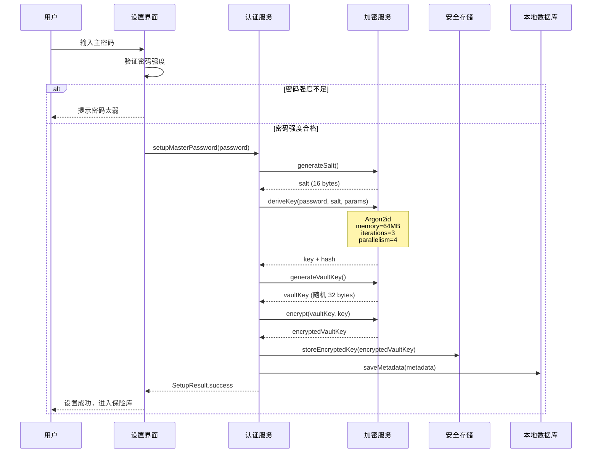
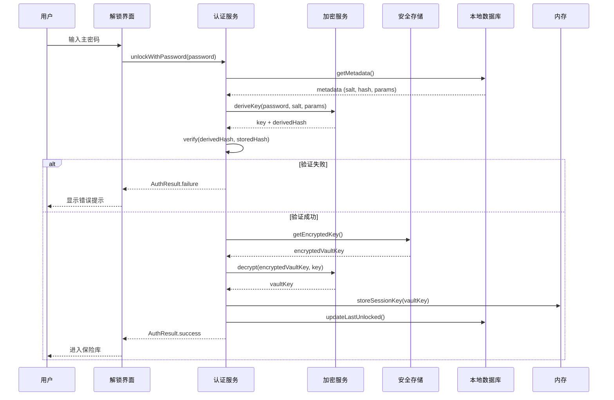
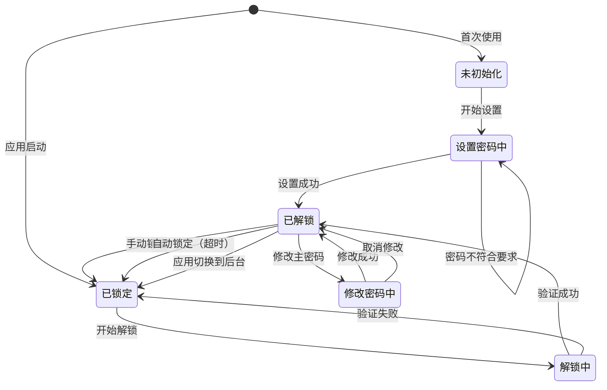

# 用户认证需求文档

> **版本**: v1.1.0  
> **更新日期**: 2026-02-21  
> **作者**: Vaultly Team  
> **文档类型**: 需求文档

---

## 版本历史

| 版本 | 日期 | 修改内容 | 作者 |
|------|------|----------|------|
| v1.0.0 | 2026-02-20 | 初始版本 | Vaultly Team |
| v1.1.0 | 2026-02-21 | 移除生物识别相关内容 | Vaultly Team |

---

## 一、数据模型

### 1.1 核心实体

#### VaultMetadata（保险库元数据）

```dart
class VaultMetadata {
  // 基础信息
  final String id;                    // Vault 唯一标识 (UUID)
  final int version;                  // 数据结构版本号
  final DateTime createdAt;           // 创建时间
  final DateTime updatedAt;           // 最后更新时间
  
  // 安全信息
  final String salt;                  // 主密码盐值 (Base64, 16 bytes)
  final String argon2Params;          // Argon2id 参数 (JSON)
  final String passwordHash;          // Argon2id 哈希 (用于验证)
  final int keyDerivationVersion;     // 密钥派生版本
  
  // 状态信息
  final DateTime? lastUnlockedAt;     // 最后解锁时间
  final DateTime? lastSyncedAt;       // 最后同步时间
  
  // 统计信息
  final int entryCount;               // 条目数量
  final String dataChecksum;          // 数据完整性校验
}
```

#### EncryptionKey（加密密钥）

```dart
class EncryptionKey {
  final Uint8List key;                // 32 bytes AES-256 密钥
  final Uint8List salt;               // 16 bytes 盐值
  final Argon2Parameters params;      // Argon2id 参数
  
  // 安全方法：使用后清除内存
  void dispose() {
    key.fillRange(0, key.length, 0);
  }
}
```

#### AuthSession（认证会话）

```dart
class AuthSession {
  final String sessionId;             // 会话 ID
  final DateTime createdAt;           // 创建时间
  final DateTime expiresAt;           // 过期时间
  final AuthMethod method;            // 认证方式
}

enum AuthMethod {
  masterPassword,    // 主密码
}
```

### 1.2 数据字典

| 字段名 | 类型 | 长度 | 必填 | 说明 |
|--------|------|------|------|------|
| id | String | 36 | ✅ | UUID v4 |
| version | int | - | ✅ | 当前为 1 |
| salt | String | 24 | ✅ | Base64 编码的 16 bytes |
| argon2Params | JSON | - | ✅ | 包含 memory, iterations, parallelism |
| passwordHash | String | - | ✅ | Argon2id 输出 |

---

## 二、数据流动

### 2.1 首次设置主密码数据流



### 2.2 主密码解锁数据流



---

## 三、状态管理

### 3.1 认证状态机



### 3.2 状态定义

| 状态 | 说明 | 允许的操作 |
|------|------|-----------|
| 未初始化 | 首次使用，未设置主密码 | 设置主密码 |
| 已锁定 | 保险库已加密，需要解锁 | 解锁 |
| 解锁中 | 正在验证主密码 | 取消 |
| 已解锁 | 保险库已解密，可访问 | 查看/编辑条目、修改密码、锁定 |
| 修改密码中 | 正在修改主密码 | 确认修改、取消 |

### 3.3 状态转换表

| 当前状态 | 事件 | 目标状态 | 动作 |
|---------|------|---------|------|
| 未初始化 | SETUP_PASSWORD | 已解锁 | 创建元数据、加密存储 |
| 已锁定 | UNLOCK_PASSWORD | 解锁中 | 验证密码 |
| 解锁中 | VERIFY_SUCCESS | 已解锁 | 加载保险库 |
| 解锁中 | VERIFY_FAILURE | 已锁定 | 显示错误 |
| 已解锁 | LOCK | 已锁定 | 清除内存密钥 |
| 已解锁 | AUTO_LOCK_TIMEOUT | 已锁定 | 自动锁定 |
| 已解锁 | CHANGE_PASSWORD | 修改密码中 | 验证当前密码 |
| 修改密码中 | CONFIRM_CHANGE | 已解锁 | 重新加密数据 |

---

## 四、接口设计

### 4.1 AuthService 接口

```dart
abstract class AuthService {
  // 初始化检查
  Future<bool> isInitialized();
  
  // 首次设置
  Future<SetupResult> setupMasterPassword(String password);
  
  // 解锁
  Future<AuthResult> unlockWithPassword(String password);
  
  // 锁定
  Future<void> lock();
  
  // 状态查询
  Stream<AuthState> get authStateStream;
  AuthState get currentState;
  bool get isUnlocked;
  
  // 修改密码
  Future<ChangePasswordResult> changeMasterPassword(
    String currentPassword,
    String newPassword,
  );
  
  // 获取加密密钥（用于数据加密/解密）
  Future<Uint8List?> getEncryptionKey();
}
```

### 4.2 结果类型定义

```dart
enum AuthResult {
  success,           // 认证成功
  failure,           // 认证失败
  lockedOut,         // 锁定（多次失败）
  error,             // 系统错误
}

enum SetupResult {
  success,
  passwordTooWeak,   // 密码强度不足
  alreadyInitialized, // 已初始化
  error,
}

enum ChangePasswordResult {
  success,
  currentPasswordIncorrect,
  newPasswordTooWeak,
  error,
}
```

---

## 五、缓存策略

### 5.1 内存缓存

| 数据 | 缓存位置 | 过期策略 | 说明 |
|------|---------|---------|------|
| vaultKey | 内存 (SecureMemory) | 锁定/超时清除 | 敏感数据，不持久化 |
| authState | Riverpod State | 应用生命周期 | 实时状态 |
| metadata | Isar + 内存 | 变更时更新 | 元数据缓存 |

### 5.2 存储策略

| 数据 | 存储位置 | 加密方式 |
|------|---------|---------|
| metadata | Isar | 明文（不含敏感信息） |
| encryptedVaultKey | Keychain/Keystore | 硬件加密 |
| biometricKey | Keychain/Keystore | 生物识别保护 |
| passwordHash | Isar | Argon2id 哈希 |

---

## 六、安全考虑

### 6.1 威胁模型

| 威胁 | 风险等级 | 缓解措施 |
|------|---------|---------|
| 暴力破解主密码 | 高 | Argon2id 慢哈希、失败延迟 |
| 内存转储攻击 | 中 | 敏感数据使用后清除 |
| 会话劫持 | 中 | 会话超时、自动锁定 |

### 6.2 安全要求

1. **密钥派生**：必须使用 Argon2id，参数可配置
2. **内存安全**：敏感数据（密钥、密码）使用后立即覆写
3. **存储安全**：加密密钥必须存储在系统安全存储中
4. **会话管理**：解锁状态必须有超时机制

---

## 七、相关文档

- [用户认证功能文档](../功能文档/用户认证功能.md) - 功能需求、用户场景
- [用户认证架构文档](../架构文档/用户认证架构.md) - 技术选型、实现方案
- [认证状态机](../状态机/认证状态机.md) - 状态转换设计
- [认证数据流](../数据流动/用户登录数据流.md) - 数据流动设计

---

## 八、变更记录

| 版本 | 日期 | 变更内容 | 作者 |
|------|------|---------|------|
| v1.1.0 | 2026-02-21 | 移除生物识别相关内容 | Vaultly Team |
| v1.0.0 | 2026-02-20 | 初始版本 | Vaultly Team |
